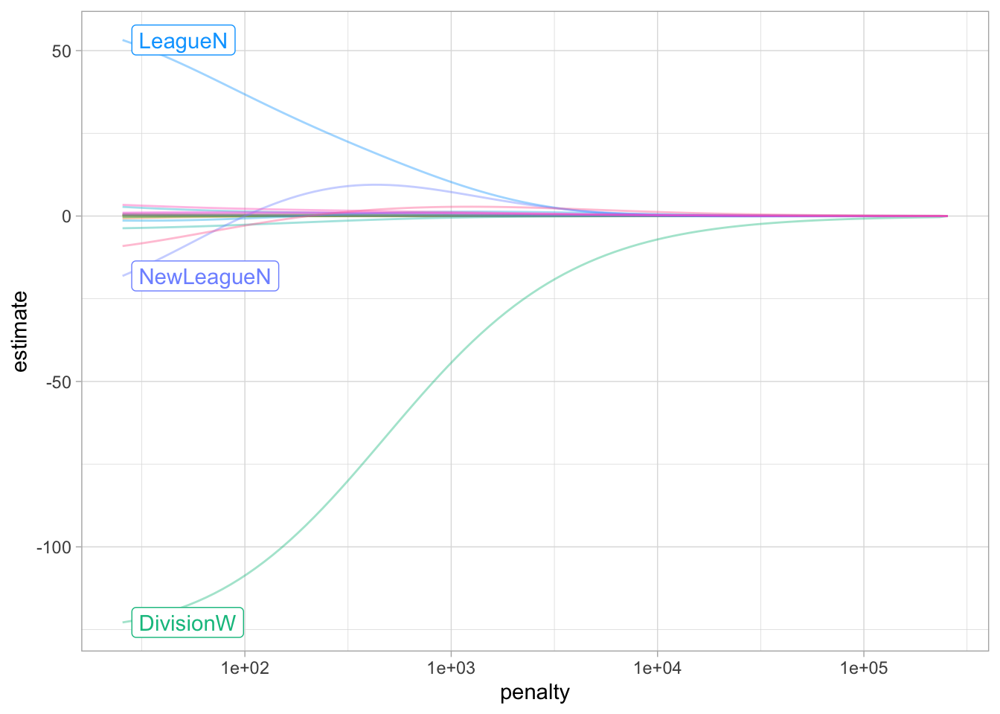
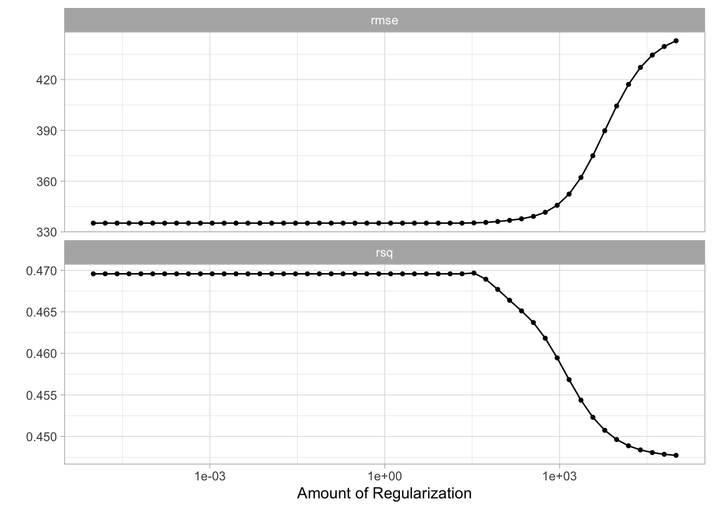
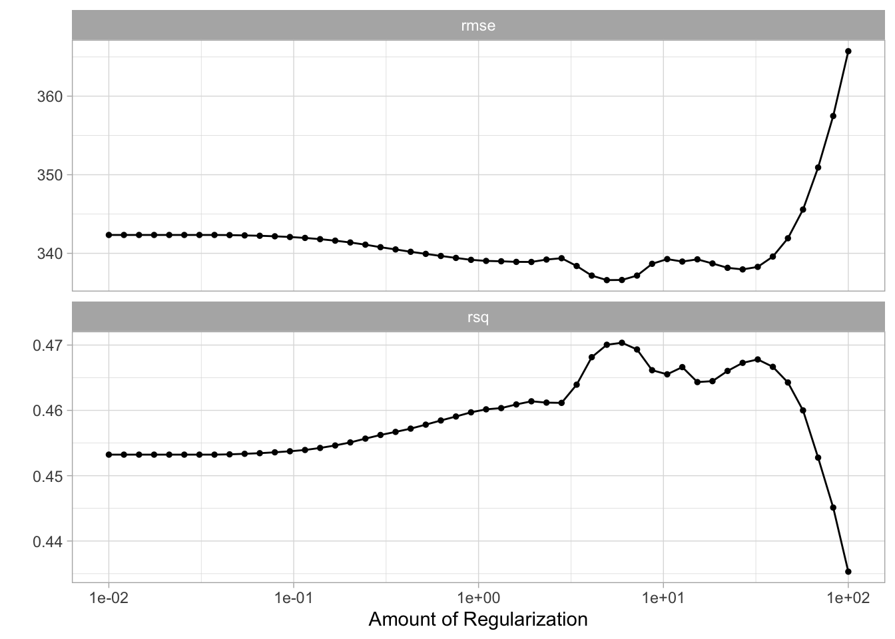
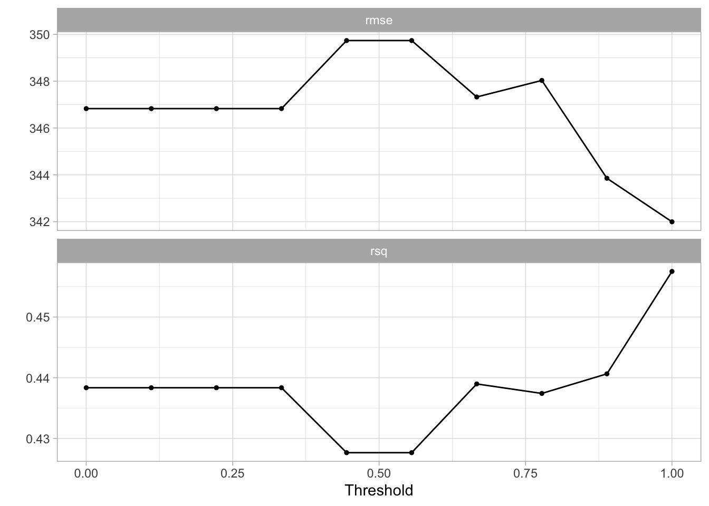

# Linear Model Selection and Regularization


::: {.cell}

:::


This lab will take a look at regularization models and hyperparameter tuning. These models are related to the models we saw in chapter 3 and 4, with the difference that they contain a regularization term.
This chapter will use [parsnip](https://www.tidymodels.org/start/models/) for model fitting and [recipes and workflows](https://www.tidymodels.org/start/recipes/) to perform the transformations, and [tune and dials](https://www.tidymodels.org/start/tuning/) to tune the hyperparameters of the model.

We will be using the `Hitters` data set from the `ISLR` package. We wish to predict the baseball players `Salary` based on several different characteristics which are included in the data set. Since we wish to predict `Salary`, then we need to remove any missing data from that column. Otherwise, we won't be able to run the models.


::: {.cell}

```{.r .cell-code}
library(tidymodels)
library(ISLR)

Hitters <- as_tibble(Hitters) %>%
  filter(!is.na(Salary))
```
:::


## Best Subset Selection

tidymodels does not currently support subset selection methods, and it unlikely to include it in the [near future](https://stackoverflow.com/questions/66651033/stepwise-algorithm-in-tidymodels#comment117845482_66651033).

## Forward and Backward Stepwise Selection

tidymodels does not currently support forward and backward stepwise selection methods, and it unlikely to include it in the [near future](https://stackoverflow.com/questions/66651033/stepwise-algorithm-in-tidymodels#comment117845482_66651033).

## Ridge Regression

We will use the `glmnet` package to perform ridge regression. `parsnip` does not have a dedicated function to create a ridge regression model specification. You need to use `linear_reg()` and set `mixture = 0` to specify a ridge model. The `mixture` argument specifies the amount of different types of regularization, `mixture = 0` specifies only ridge regularization and `mixture = 1` specifies only lasso regularization. Setting `mixture` to a value between 0 and 1 lets us use both. When using the `glmnet` engine we also need to set a `penalty` to be able to fit the model. We will set this value to `0` for now, it is not the best value, but we will look at how to select the best value in a little bit.


::: {.cell}

```{.r .cell-code}
ridge_spec <- linear_reg(mixture = 0, penalty = 0) %>%
  set_mode("regression") %>%
  set_engine("glmnet")
```
:::


Once the specification is created we can fit it to our data. We will use all the predictors.


::: {.cell}

```{.r .cell-code}
ridge_fit <- fit(ridge_spec, Salary ~ ., data = Hitters)
```
:::


The `glmnet` package will fit the model for all values of `penalty` at once, so let us see what the parameter estimate for the model is now that we have `penalty = 0`.


::: {.cell}

```{.r .cell-code}
tidy(ridge_fit)
```

::: {.cell-output .cell-output-stdout}
```
# A tibble: 20 × 3
   term          estimate penalty
   <chr>            <dbl>   <dbl>
 1 (Intercept)   81.1           0
 2 AtBat         -0.682         0
 3 Hits           2.77          0
 4 HmRun         -1.37          0
 5 Runs           1.01          0
 6 RBI            0.713         0
 7 Walks          3.38          0
 8 Years         -9.07          0
 9 CAtBat        -0.00120       0
10 CHits          0.136         0
11 CHmRun         0.698         0
12 CRuns          0.296         0
13 CRBI           0.257         0
14 CWalks        -0.279         0
15 LeagueN       53.2           0
16 DivisionW   -123.            0
17 PutOuts        0.264         0
18 Assists        0.170         0
19 Errors        -3.69          0
20 NewLeagueN   -18.1           0
```
:::
:::


Let us instead see what the estimates would be if the penalty was 11498.


::: {.cell}

```{.r .cell-code}
tidy(ridge_fit, penalty = 11498)
```

::: {.cell-output .cell-output-stdout}
```
# A tibble: 20 × 3
   term         estimate penalty
   <chr>           <dbl>   <dbl>
 1 (Intercept) 407.        11498
 2 AtBat         0.0370    11498
 3 Hits          0.138     11498
 4 HmRun         0.525     11498
 5 Runs          0.231     11498
 6 RBI           0.240     11498
 7 Walks         0.290     11498
 8 Years         1.11      11498
 9 CAtBat        0.00314   11498
10 CHits         0.0117    11498
11 CHmRun        0.0876    11498
12 CRuns         0.0234    11498
13 CRBI          0.0242    11498
14 CWalks        0.0250    11498
15 LeagueN       0.0866    11498
16 DivisionW    -6.23      11498
17 PutOuts       0.0165    11498
18 Assists       0.00262   11498
19 Errors       -0.0206    11498
20 NewLeagueN    0.303     11498
```
:::
:::


Notice how the estimates are decreasing when the amount of penalty goes up. Look below at the parameter estimates for `penalty = 705` and `penalty = 50`.


::: {.cell}

```{.r .cell-code}
tidy(ridge_fit, penalty = 705)
```

::: {.cell-output .cell-output-stdout}
```
# A tibble: 20 × 3
   term        estimate penalty
   <chr>          <dbl>   <dbl>
 1 (Intercept)  54.4        705
 2 AtBat         0.112      705
 3 Hits          0.656      705
 4 HmRun         1.18       705
 5 Runs          0.937      705
 6 RBI           0.847      705
 7 Walks         1.32       705
 8 Years         2.58       705
 9 CAtBat        0.0108     705
10 CHits         0.0468     705
11 CHmRun        0.338      705
12 CRuns         0.0937     705
13 CRBI          0.0979     705
14 CWalks        0.0718     705
15 LeagueN      13.7        705
16 DivisionW   -54.7        705
17 PutOuts       0.119      705
18 Assists       0.0161     705
19 Errors       -0.704      705
20 NewLeagueN    8.61       705
```
:::

```{.r .cell-code}
tidy(ridge_fit, penalty = 50)
```

::: {.cell-output .cell-output-stdout}
```
# A tibble: 20 × 3
   term          estimate penalty
   <chr>            <dbl>   <dbl>
 1 (Intercept)   48.2          50
 2 AtBat         -0.354        50
 3 Hits           1.95         50
 4 HmRun         -1.29         50
 5 Runs           1.16         50
 6 RBI            0.809        50
 7 Walks          2.71         50
 8 Years         -6.20         50
 9 CAtBat         0.00609      50
10 CHits          0.107        50
11 CHmRun         0.629        50
12 CRuns          0.217        50
13 CRBI           0.215        50
14 CWalks        -0.149        50
15 LeagueN       45.9          50
16 DivisionW   -118.           50
17 PutOuts        0.250        50
18 Assists        0.121        50
19 Errors        -3.28         50
20 NewLeagueN    -9.42         50
```
:::
:::


We can visualize how the magnitude of the coefficients are being regularized towards zero as the penalty goes up. 


::: {.cell}

```{.r .cell-code}
ridge_fit %>%
  autoplot()
```

::: {.cell-output-display}
{fig-alt='Multiple line chart. Log Lambda along the x-axis, Coefficients
along the y-axis. The curves starts at different places along
the y-axis but slowly converge towards 0 as the Log Lambda
value increase.' width=672}
:::
:::


Prediction is done like normal, if we use `predict()` by itself, then `penalty = 0` as we set in the model specification is used.


::: {.cell}

```{.r .cell-code}
predict(ridge_fit, new_data = Hitters)
```

::: {.cell-output .cell-output-stdout}
```
# A tibble: 263 × 1
    .pred
    <dbl>
 1  442. 
 2  676. 
 3 1059. 
 4  521. 
 5  543. 
 6  218. 
 7   74.7
 8   96.1
 9  809. 
10  865. 
# ℹ 253 more rows
```
:::
:::


but we can also get predictions for other values of `penalty` by specifying it in `predict()`


::: {.cell}

```{.r .cell-code}
predict(ridge_fit, new_data = Hitters, penalty = 500)
```

::: {.cell-output .cell-output-stdout}
```
# A tibble: 263 × 1
   .pred
   <dbl>
 1  525.
 2  620.
 3  895.
 4  425.
 5  589.
 6  179.
 7  147.
 8  187.
 9  841.
10  840.
# ℹ 253 more rows
```
:::
:::


We saw how we can fit a ridge model and make predictions for different values of `penalty`. But it would be nice if we could find the "best" value of the penalty. This is something we can use hyperparameter tuning for. Hyperparameter tuning is in its simplest form a way of fitting many models with different sets of hyperparameters trying to find one that performs "best". The complexity in hyperparameter tuning can come from how you try different models. We will keep it simple for this lab and only look at grid search, only looking at evenly spaced parameter values. This is a fine enough approach if you have one or two tunable parameters but can become computationally infeasible. See the chapter on [iterative search](https://www.tmwr.org/iterative-search.html) from [Tidy Modeling with R](https://www.tmwr.org/) for more information.

We start like normal by setting up a validation split. A K-fold cross-validation data set is created on the training data set with 10 folds.


::: {.cell}

```{.r .cell-code}
Hitters_split <- initial_split(Hitters, strata = "Salary")

Hitters_train <- training(Hitters_split)
Hitters_test <- testing(Hitters_split)

Hitters_fold <- vfold_cv(Hitters_train, v = 10)
```
:::


We can use the `tune_grid()` function to perform hyperparameter tuning using a grid search. `tune_grid()` needs 3 different thing;

- a `workflow` object containing the model and preprocessor,
- a `rset` object containing the resamples the `workflow` should be fitted within, and
- a tibble containing the parameter values to be evaluated.

Optionally a metric set of performance metrics can be supplied for evaluation. If you don't set one then a default set of performance metrics is used.

We already have a resample object created in `Hitters_fold`. Now we should create the workflow specification next.

We just used the data set as is when we fit the model earlier. But ridge regression is scale sensitive so we need to make sure that the variables are on the same scale. We can use `step_normalize()`. Secondly let us deal with the factor variables ourself using `step_novel()` and `step_dummy()`.


::: {.cell}

```{.r .cell-code}
ridge_recipe <- 
  recipe(formula = Salary ~ ., data = Hitters_train) %>% 
  step_novel(all_nominal_predictors()) %>% 
  step_dummy(all_nominal_predictors()) %>% 
  step_zv(all_predictors()) %>% 
  step_normalize(all_predictors())
```
:::


The model specification will look very similar to what we have seen earlier, but we will set `penalty = tune()`. This tells `tune_grid()` that the `penalty` parameter should be tuned.


::: {.cell}

```{.r .cell-code}
ridge_spec <- 
  linear_reg(penalty = tune(), mixture = 0) %>% 
  set_mode("regression") %>% 
  set_engine("glmnet")
```
:::


Now we combine to create a `workflow` object.


::: {.cell}

```{.r .cell-code}
ridge_workflow <- workflow() %>% 
  add_recipe(ridge_recipe) %>% 
  add_model(ridge_spec)
```
:::


The last thing we need is the values of `penalty` we are trying. This can be created using `grid_regular()` which creates a grid of evenly spaces parameter values. We use the `penalty()` function from the [dials](https://dials.tidymodels.org/) package to denote the parameter and set the range of the grid we are searching for. Note that this range is log-scaled.


::: {.cell}

```{.r .cell-code}
penalty_grid <- grid_regular(penalty(range = c(-5, 5)), levels = 50)
penalty_grid
```

::: {.cell-output .cell-output-stdout}
```
# A tibble: 50 × 1
     penalty
       <dbl>
 1 0.00001  
 2 0.0000160
 3 0.0000256
 4 0.0000409
 5 0.0000655
 6 0.000105 
 7 0.000168 
 8 0.000268 
 9 0.000429 
10 0.000687 
# ℹ 40 more rows
```
:::
:::


Using 50 levels for one parameter might seem overkill and in many applications it is. But remember that `glmnet` fits all the models in one go so adding more levels to `penalty` doesn't affect the computational speed much.

Now we have everything we need and we can fit all the models.


::: {.cell}

```{.r .cell-code}
tune_res <- tune_grid(
  ridge_workflow,
  resamples = Hitters_fold, 
  grid = penalty_grid
)

tune_res
```

::: {.cell-output .cell-output-stdout}
```
# Tuning results
# 10-fold cross-validation 
# A tibble: 10 × 4
   splits           id     .metrics           .notes          
   <list>           <chr>  <list>             <list>          
 1 <split [176/20]> Fold01 <tibble [100 × 5]> <tibble [0 × 3]>
 2 <split [176/20]> Fold02 <tibble [100 × 5]> <tibble [0 × 3]>
 3 <split [176/20]> Fold03 <tibble [100 × 5]> <tibble [0 × 3]>
 4 <split [176/20]> Fold04 <tibble [100 × 5]> <tibble [0 × 3]>
 5 <split [176/20]> Fold05 <tibble [100 × 5]> <tibble [0 × 3]>
 6 <split [176/20]> Fold06 <tibble [100 × 5]> <tibble [0 × 3]>
 7 <split [177/19]> Fold07 <tibble [100 × 5]> <tibble [0 × 3]>
 8 <split [177/19]> Fold08 <tibble [100 × 5]> <tibble [0 × 3]>
 9 <split [177/19]> Fold09 <tibble [100 × 5]> <tibble [0 × 3]>
10 <split [177/19]> Fold10 <tibble [100 × 5]> <tibble [0 × 3]>
```
:::
:::


The output of `tune_grid()` can be hard to read by itself unprocessed. `autoplot()` creates a great visualization 


::: {.cell}

```{.r .cell-code}
autoplot(tune_res)
```

::: {.cell-output-display}
{fig-alt='Facetted connected scatter chart. regularization along the
x-axis. Performance values along the y-axis. The facets are
rmse and rsq. Both are fairly constant for low values of
regularization, rmse starts moderately increasing and rsq
starts moderately decreasing once the regularization
gets larger.' width=672}
:::
:::

Here we see that the amount of regularization affects the performance metrics differently. Note how there are areas where the amount of regularization doesn't have any meaningful influence on the coefficient estimates. We can also see the raw metrics that created this chart by calling `collect_matrics()`. 


::: {.cell}

```{.r .cell-code}
collect_metrics(tune_res)
```

::: {.cell-output .cell-output-stdout}
```
# A tibble: 100 × 7
     penalty .metric .estimator    mean     n std_err .config              
       <dbl> <chr>   <chr>        <dbl> <int>   <dbl> <chr>                
 1 0.00001   rmse    standard   335.       10 31.2    Preprocessor1_Model01
 2 0.00001   rsq     standard     0.470    10  0.0615 Preprocessor1_Model01
 3 0.0000160 rmse    standard   335.       10 31.2    Preprocessor1_Model02
 4 0.0000160 rsq     standard     0.470    10  0.0615 Preprocessor1_Model02
 5 0.0000256 rmse    standard   335.       10 31.2    Preprocessor1_Model03
 6 0.0000256 rsq     standard     0.470    10  0.0615 Preprocessor1_Model03
 7 0.0000409 rmse    standard   335.       10 31.2    Preprocessor1_Model04
 8 0.0000409 rsq     standard     0.470    10  0.0615 Preprocessor1_Model04
 9 0.0000655 rmse    standard   335.       10 31.2    Preprocessor1_Model05
10 0.0000655 rsq     standard     0.470    10  0.0615 Preprocessor1_Model05
# ℹ 90 more rows
```
:::
:::


The "best" values of this can be selected using `select_best()`, this function requires you to specify a `matric` that it should select against. 


::: {.cell}

```{.r .cell-code}
best_penalty <- select_best(tune_res, metric = "rsq")
best_penalty
```

::: {.cell-output .cell-output-stdout}
```
# A tibble: 1 × 2
  penalty .config              
    <dbl> <chr>                
1    33.9 Preprocessor1_Model33
```
:::
:::


This value of `penalty` can then be used with `finalize_workflow()` to update/finalize the recipe by replacing `tune()` with the value of `best_penalty`. Now, this model should be fit again, this time using the whole training data set.


::: {.cell}

```{.r .cell-code}
ridge_final <- finalize_workflow(ridge_workflow, best_penalty)

ridge_final_fit <- fit(ridge_final, data = Hitters_train)
```
:::


This final model can now be applied on our testing data set to validate the performance


::: {.cell}

```{.r .cell-code}
augment(ridge_final_fit, new_data = Hitters_test) %>%
  rsq(truth = Salary, estimate = .pred)
```

::: {.cell-output .cell-output-stdout}
```
# A tibble: 1 × 3
  .metric .estimator .estimate
  <chr>   <chr>          <dbl>
1 rsq     standard       0.461
```
:::
:::


And it performs fairly well given what we saw earlier.

## The Lasso

We will use the `glmnet` package to perform lasso regression. `parsnip` does not have a dedicated function to create a ridge regression model specification. You need to use `linear_reg()` and set `mixture = 1` to specify a lasso model. The `mixture` argument specifies the amount of different types of regularization, `mixture = 0` specifies only ridge regularization and `mixture = 1` specifies only lasso regularization. Setting `mixture` to a value between 0 and 1 lets us use both.

The following procedure will be very similar to what we saw in the ridge regression section. The preprocessing needed is the same, but let us write it out one more time. 


::: {.cell}

```{.r .cell-code}
lasso_recipe <- 
  recipe(formula = Salary ~ ., data = Hitters_train) %>% 
  step_novel(all_nominal_predictors()) %>% 
  step_dummy(all_nominal_predictors()) %>% 
  step_zv(all_predictors()) %>% 
  step_normalize(all_predictors())
```
:::


Next, we finish the lasso regression `workflow`.


::: {.cell}

```{.r .cell-code}
lasso_spec <- 
  linear_reg(penalty = tune(), mixture = 1) %>% 
  set_mode("regression") %>% 
  set_engine("glmnet") 

lasso_workflow <- workflow() %>% 
  add_recipe(lasso_recipe) %>% 
  add_model(lasso_spec)
```
:::


While we are doing a different kind of regularization we still use the same `penalty` argument. I have picked a different range for the values of penalty since I know it will be a good range. You would in practice have to cast a wide net at first and then narrow on the range of interest.


::: {.cell}

```{.r .cell-code}
penalty_grid <- grid_regular(penalty(range = c(-2, 2)), levels = 50)
```
:::


And we can use `tune_grid()` again.


::: {.cell}

```{.r .cell-code}
tune_res <- tune_grid(
  lasso_workflow,
  resamples = Hitters_fold, 
  grid = penalty_grid
)

autoplot(tune_res)
```

::: {.cell-output-display}
{fig-alt='Facetted connected scatter chart. regularization along the
x-axis. Performance values along the y-axis. The facets are
rmse and rsq. Both are fairly constant for low values of
regularization, rmse starts moderately increasing and rsq
starts moderately decreasing once the regularization
gets larger.' width=672}
:::
:::


We select the best value of `penalty` using `select_best()`


::: {.cell}

```{.r .cell-code}
best_penalty <- select_best(tune_res, metric = "rsq")
```
:::


And refit the using the whole training data set.


::: {.cell}

```{.r .cell-code}
lasso_final <- finalize_workflow(lasso_workflow, best_penalty)

lasso_final_fit <- fit(lasso_final, data = Hitters_train)
```
:::


And we are done, by calculating the `rsq` value for the lasso model can we see that for this data ridge regression outperform lasso regression.


::: {.cell}

```{.r .cell-code}
augment(lasso_final_fit, new_data = Hitters_test) %>%
  rsq(truth = Salary, estimate = .pred)
```

::: {.cell-output .cell-output-stdout}
```
# A tibble: 1 × 3
  .metric .estimator .estimate
  <chr>   <chr>          <dbl>
1 rsq     standard       0.446
```
:::
:::


## Principal Components Regression

We will talk more about principal components analysis in chapter 10. This section will show how principal components can be used as a dimensionality reduction preprocessing step.

I will treat principal component regression as a linear model with PCA transformations in the preprocessing. But using the tidymodels framework then this is still mostly one model. 


::: {.cell}

```{.r .cell-code}
lm_spec <- 
  linear_reg() %>% 
  set_mode("regression") %>% 
  set_engine("lm")
```
:::


The preprocessing recipe will closely resemble the recipe we saw in the ridge and lasso sections. The main difference is that we end the recipe with `step_pca()` which will perform principal component analysis on all the predictors, and return the components that explain `threshold` percent of the variance. We have set `threshold = tune()` so we can treat the threshold as a hyperparameter to be tuned. By using workflows and tune together can be tune parameters in the preprocessing as well as parameters in the models.


::: {.cell}

```{.r .cell-code}
pca_recipe <- 
  recipe(formula = Salary ~ ., data = Hitters_train) %>% 
  step_novel(all_nominal_predictors()) %>% 
  step_dummy(all_nominal_predictors()) %>% 
  step_zv(all_predictors()) %>% 
  step_normalize(all_predictors()) %>%
  step_pca(all_predictors(), threshold = tune())

pca_workflow <- 
  workflow() %>% 
  add_recipe(pca_recipe) %>% 
  add_model(lm_spec)
```
:::


We create a smaller grid for `threshold` and we don't need to modify the range since `[0, 1]` is an acceptable range.


::: {.cell}

```{.r .cell-code}
threshold_grid <- grid_regular(threshold(), levels = 10)
threshold_grid
```

::: {.cell-output .cell-output-stdout}
```
# A tibble: 10 × 1
   threshold
       <dbl>
 1     0    
 2     0.111
 3     0.222
 4     0.333
 5     0.444
 6     0.556
 7     0.667
 8     0.778
 9     0.889
10     1    
```
:::
:::


And now we fit using `tune_grid()`. This time we will actually perform 100 fits since we need to fit a model for each value of `threshold` within each fold.


::: {.cell}

```{.r .cell-code}
tune_res <- tune_grid(
  pca_workflow,
  resamples = Hitters_fold, 
  grid = threshold_grid
)
```
:::


The results look a little shaky here.


::: {.cell}

```{.r .cell-code}
autoplot(tune_res)
```

::: {.cell-output-display}
{fig-alt='Facetted connected scatter chart. regularization along the
x-axis. Performance values along the y-axis. The facets are
rmse and rsq. Very variable, appears to produce best values
for threshold == 0.5.' width=672}
:::
:::


But we can still select the best model.


::: {.cell}

```{.r .cell-code}
best_threshold <- select_best(tune_res, metric = "rmse")
```
:::


And fit the model much like have done a couple of times by now. The workflow is finalized using the value we selected with `select_best()`, and training using the full training data set.


::: {.cell}

```{.r .cell-code}
pca_final <- finalize_workflow(pca_workflow, best_threshold)

pca_final_fit <- fit(pca_final, data = Hitters_train)
```
:::


## Partial Least Squares

Lastly, we have a partial least squares model. We will treat this much like the PCA section and say that partial least squares calculations will be done as a preprocessing that we tune. The following code is almost identical to previous chapters and will be shown in full without many explanations to avoid repetition. If you skipped to this section, go back and read the previous sections for more commentary.


::: {.cell}

```{.r .cell-code}
pls_recipe <- 
  recipe(formula = Salary ~ ., data = Hitters_train) %>% 
  step_novel(all_nominal_predictors()) %>% 
  step_dummy(all_nominal_predictors()) %>% 
  step_zv(all_predictors()) %>% 
  step_normalize(all_predictors()) %>%
  step_pls(all_predictors(), num_comp = tune(), outcome = "Salary")

lm_spec <- linear_reg() %>% 
  set_mode("regression") %>% 
  set_engine("lm") 

pls_workflow <- workflow() %>% 
  add_recipe(pls_recipe) %>% 
  add_model(lm_spec) 

num_comp_grid <- grid_regular(num_comp(c(1, 20)), levels = 10)

tune_res <- tune_grid(
  pls_workflow,
  resamples = Hitters_fold, 
  grid = num_comp_grid
)

best_threshold <- select_best(tune_res, metric = "rmse")

pls_final <- finalize_workflow(pls_workflow, best_threshold)

pls_final_fit <- fit(pls_final, data = Hitters_train)
```
:::
