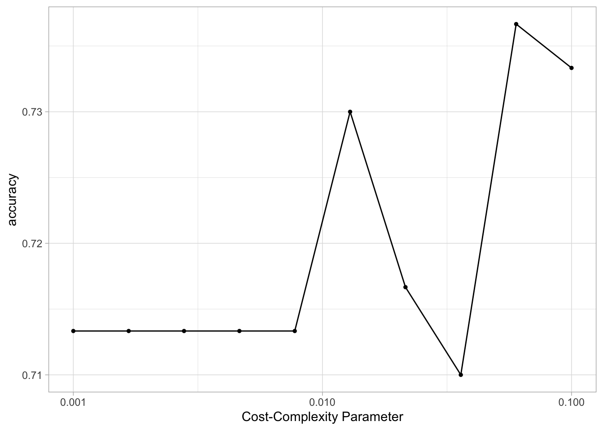
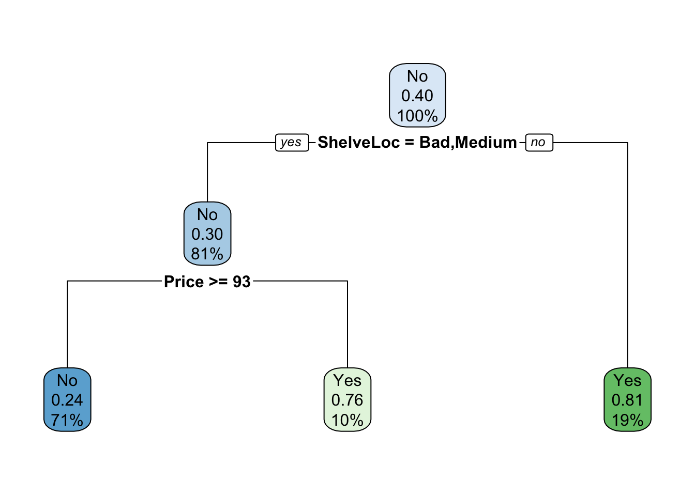
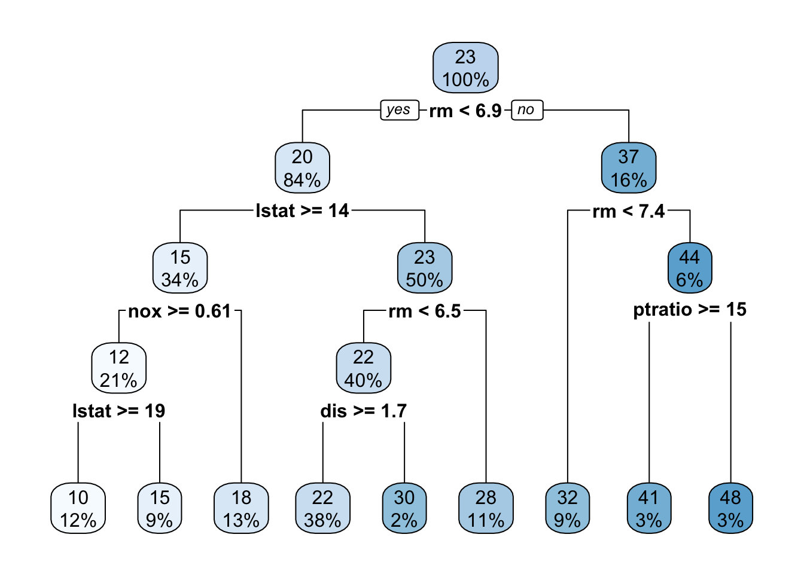
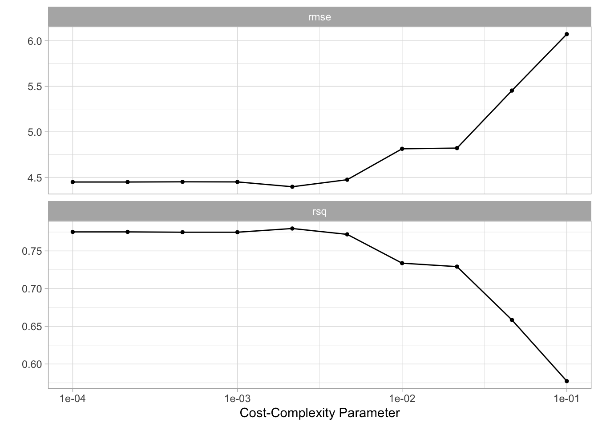
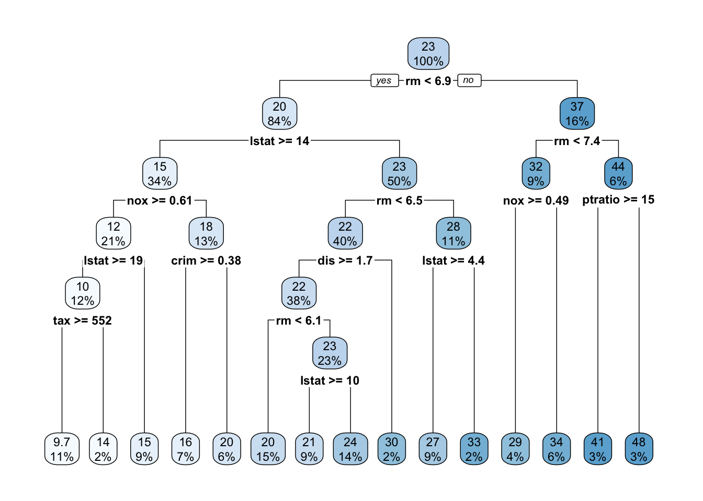
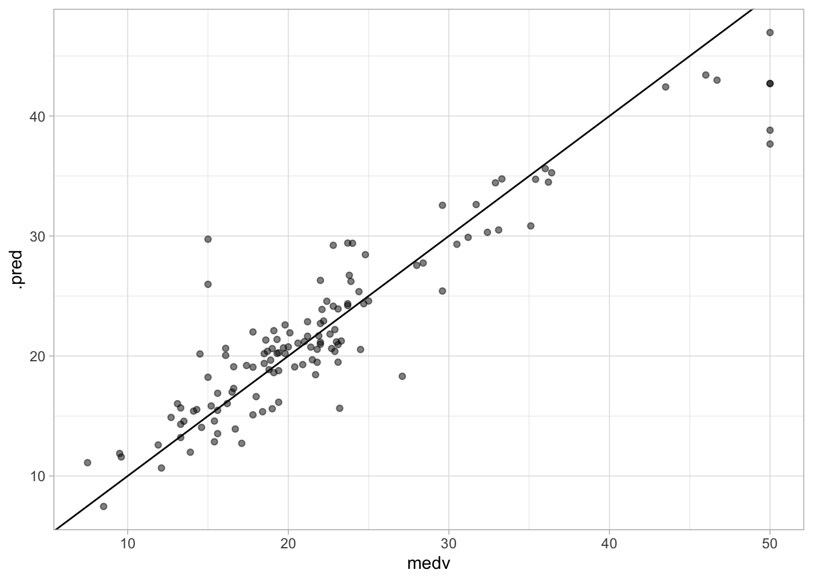
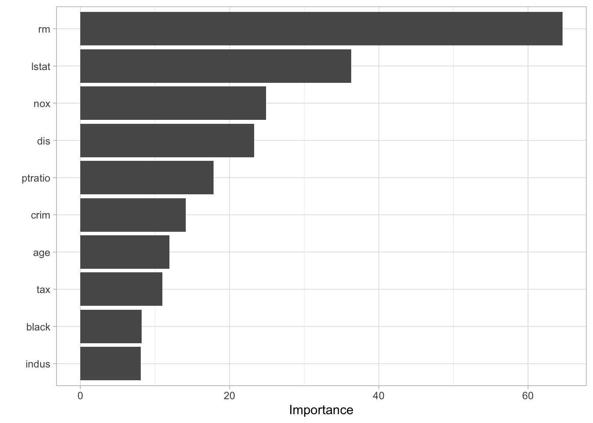
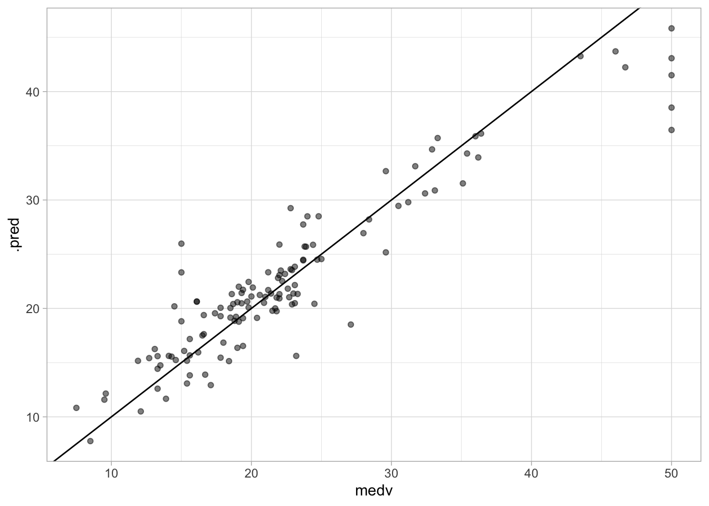
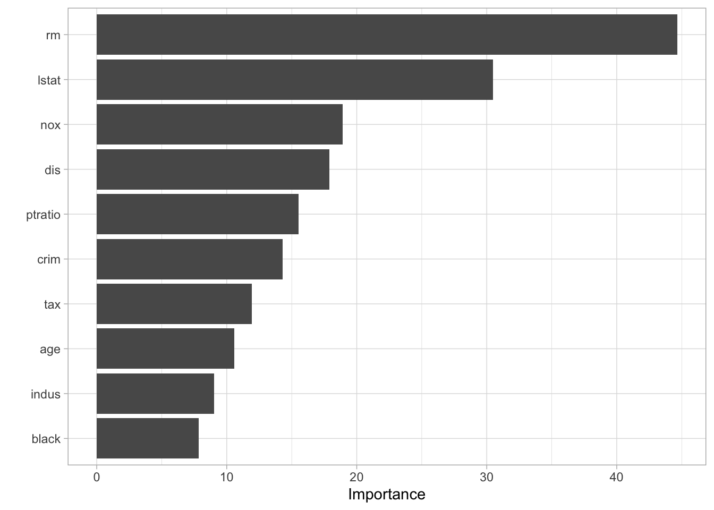
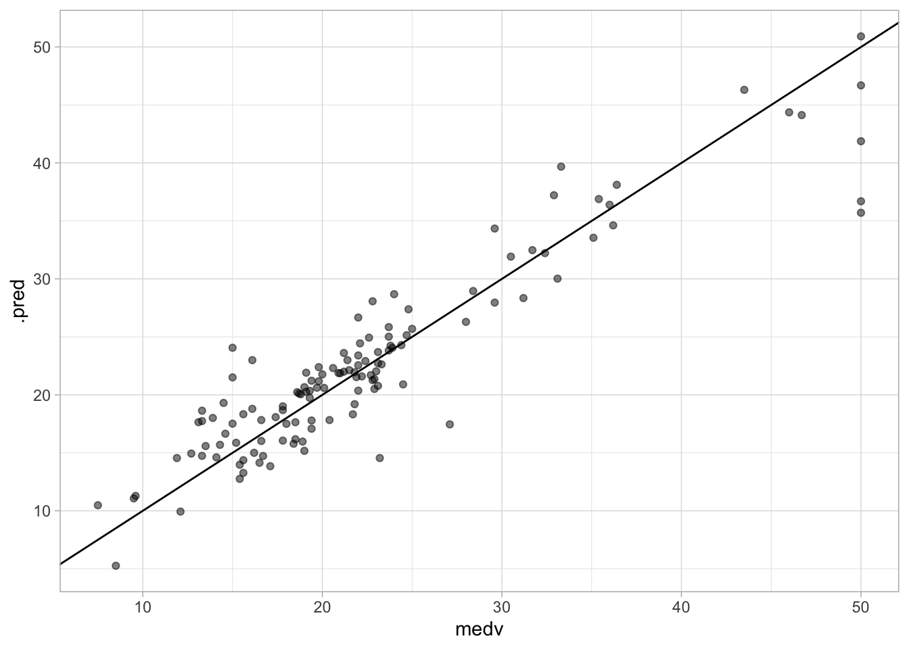

# Tree-Based Methods


::: {.cell}

:::


This lab will take a look at different tree-based models, in doing so we will explore how changing the hyperparameters can help improve performance. 
This chapter will use [parsnip](https://www.tidymodels.org/start/models/) for model fitting and [recipes and workflows](https://www.tidymodels.org/start/recipes/) to perform the transformations, and [tune and dials](https://www.tidymodels.org/start/tuning/) to tune the hyperparameters of the model. `rpart.plot` is used to visualize the decision trees created using the `rpart` package as engine, and `vip` is used to visualize variable importance for later models.


::: {.cell}

```{.r .cell-code}
library(tidymodels)
library(ISLR)
library(rpart.plot)
library(vip)

data("Boston", package = "MASS")

Boston <- as_tibble(Boston)
```
:::


The `Boston` data set contain various statistics for 506 neighborhoods in Boston. We will build a regression model that related the median value of owner-occupied homes (`medv`) as the response with the remaining variables as predictors. 

:::{.callout-important}
The `Boston` data set is quite outdated and contains some really unfortunate variables.
:::

We will also use the `Carseats` data set from the `ISLR` package to demonstrate a classification model. We create a new variable `High` to denote if `Sales <= 8`, then the `Sales` predictor is removed as it is a perfect predictor of `High`.


::: {.cell}

```{.r .cell-code}
Carseats <- as_tibble(Carseats) %>%
  mutate(High = factor(if_else(Sales <= 8, "No", "Yes"))) %>%
  select(-Sales)
```
:::


## Fitting Classification Trees

We will both be fitting a classification and regression tree in this section, so we can save a little bit of typing by creating a general decision tree specification using `rpart` as the engine.


::: {.cell}

```{.r .cell-code}
tree_spec <- decision_tree() %>%
  set_engine("rpart")
```
:::


Then this decision tree specification can be used to create a classification decision tree engine. This is a good example of how the flexible composition system created by parsnip can be used to create multiple model specifications.


::: {.cell}

```{.r .cell-code}
class_tree_spec <- tree_spec %>%
  set_mode("classification")
```
:::


With both a model specification and our data are we ready to fit the model.


::: {.cell}

```{.r .cell-code}
class_tree_fit <- class_tree_spec %>%
  fit(High ~ ., data = Carseats)
```
:::


When we look at the model output we see a quite informative summary of the model. It tries to give a written description of the tree that is created.


::: {.cell}

```{.r .cell-code}
class_tree_fit
```

::: {.cell-output .cell-output-stdout}
```
parsnip model object

n= 400 

node), split, n, loss, yval, (yprob)
      * denotes terminal node

  1) root 400 164 No (0.59000000 0.41000000)  
    2) ShelveLoc=Bad,Medium 315  98 No (0.68888889 0.31111111)  
      4) Price>=92.5 269  66 No (0.75464684 0.24535316)  
        8) Advertising< 13.5 224  41 No (0.81696429 0.18303571)  
         16) CompPrice< 124.5 96   6 No (0.93750000 0.06250000) *
         17) CompPrice>=124.5 128  35 No (0.72656250 0.27343750)  
           34) Price>=109.5 107  20 No (0.81308411 0.18691589)  
             68) Price>=126.5 65   6 No (0.90769231 0.09230769) *
             69) Price< 126.5 42  14 No (0.66666667 0.33333333)  
              138) Age>=49.5 22   2 No (0.90909091 0.09090909) *
              139) Age< 49.5 20   8 Yes (0.40000000 0.60000000) *
           35) Price< 109.5 21   6 Yes (0.28571429 0.71428571) *
        9) Advertising>=13.5 45  20 Yes (0.44444444 0.55555556)  
         18) Age>=54.5 20   5 No (0.75000000 0.25000000) *
         19) Age< 54.5 25   5 Yes (0.20000000 0.80000000) *
      5) Price< 92.5 46  14 Yes (0.30434783 0.69565217)  
       10) Income< 57 10   3 No (0.70000000 0.30000000) *
       11) Income>=57 36   7 Yes (0.19444444 0.80555556) *
    3) ShelveLoc=Good 85  19 Yes (0.22352941 0.77647059)  
      6) Price>=142.5 12   3 No (0.75000000 0.25000000) *
      7) Price< 142.5 73  10 Yes (0.13698630 0.86301370) *
```
:::
:::


Once the tree gets more than a couple of nodes it can become hard to read the printed diagram. The `rpart.plot` package provides functions to let us easily visualize the decision tree. As the name implies, it only works with `rpart` trees.


::: {.cell}

```{.r .cell-code}
class_tree_fit %>%
  extract_fit_engine() %>%
  rpart.plot()
```

::: {.cell-output-display}
{fig-alt='Decision tree chart. A total of 10 splits. Color is used to
represent the prediction of High, blue values represent No
green represent Yes.' width=672}
:::
:::


We can see that the most important variable to predict high sales appears to be shelving location as it forms the first node.

The training accuracy of this model is 85%


::: {.cell}

```{.r .cell-code}
augment(class_tree_fit, new_data = Carseats) %>%
  accuracy(truth = High, estimate = .pred_class)
```

::: {.cell-output .cell-output-stdout}
```
# A tibble: 1 × 3
  .metric  .estimator .estimate
  <chr>    <chr>          <dbl>
1 accuracy binary         0.848
```
:::
:::


Let us take a look at the confusion matrix to see if the balance is there


::: {.cell}

```{.r .cell-code}
augment(class_tree_fit, new_data = Carseats) %>%
  conf_mat(truth = High, estimate = .pred_class)
```

::: {.cell-output .cell-output-stdout}
```
          Truth
Prediction  No Yes
       No  200  25
       Yes  36 139
```
:::
:::


And the model appears to work well overall. But this model was fit on the whole data set so we only get the training accuracy which could be misleading if the model is overfitting. Let us redo the fitting by creating a validation split and fit the model on the training data set.


::: {.cell}

```{.r .cell-code}
set.seed(1234)
Carseats_split <- initial_split(Carseats)

Carseats_train <- training(Carseats_split)
Carseats_test <- testing(Carseats_split)
```
:::


Now we can fit the model on the training data set.


::: {.cell}

```{.r .cell-code}
class_tree_fit <- fit(class_tree_spec, High ~ ., data = Carseats_train)
```
:::


Let us take a look at the confusion matrix for the training data set and testing data set.


::: {.cell}

```{.r .cell-code}
augment(class_tree_fit, new_data = Carseats_train) %>%
  conf_mat(truth = High, estimate = .pred_class)
```

::: {.cell-output .cell-output-stdout}
```
          Truth
Prediction  No Yes
       No  159  21
       Yes  21  99
```
:::
:::


The training data set performs well as we would expect


::: {.cell}

```{.r .cell-code}
augment(class_tree_fit, new_data = Carseats_test) %>%
  conf_mat(truth = High, estimate = .pred_class)
```

::: {.cell-output .cell-output-stdout}
```
          Truth
Prediction No Yes
       No  41   8
       Yes 15  36
```
:::
:::


but the testing data set doesn't perform just as well and get a smaller accuracy of 77%


::: {.cell}

```{.r .cell-code}
augment(class_tree_fit, new_data = Carseats_test) %>%
  accuracy(truth = High, estimate = .pred_class)
```

::: {.cell-output .cell-output-stdout}
```
# A tibble: 1 × 3
  .metric  .estimator .estimate
  <chr>    <chr>          <dbl>
1 accuracy binary          0.77
```
:::
:::


Let us try to tune the `cost_complexity` of the decision tree to find a more optimal complexity. We use the `class_tree_spec` object and use the `set_args()` function to specify that we want to tune `cost_complexity`. This is then passed directly into the workflow object to avoid creating an intermediate object.


::: {.cell}

```{.r .cell-code}
class_tree_wf <- workflow() %>%
  add_model(class_tree_spec %>% set_args(cost_complexity = tune())) %>%
  add_formula(High ~ .)
```
:::


To be able to tune the variable we need 2 more objects. S `resamples` object, we will use a k-fold cross-validation data set, and a `grid` of values to try. Since we are only tuning 1 hyperparameter it is fine to stay with a regular grid.


::: {.cell}

```{.r .cell-code}
set.seed(1234)
Carseats_fold <- vfold_cv(Carseats_train)

param_grid <- grid_regular(cost_complexity(range = c(-3, -1)), levels = 10)

tune_res <- tune_grid(
  class_tree_wf, 
  resamples = Carseats_fold, 
  grid = param_grid, 
  metrics = metric_set(accuracy)
)
```
:::


using `autoplot()` shows which values of `cost_complexity` appear to produce the highest accuracy


::: {.cell}

```{.r .cell-code}
autoplot(tune_res)
```

::: {.cell-output-display}
{fig-alt='Connected scatter chart. Cost-complexity along the x-axis,
accuracy along the y-axis. The accuracy stays constant for
low values of cost-complexity. When cost-complexity is larger
than 0.01 the accuracy shoots up and down rapidly.' width=672}
:::
:::


We can now select the best performing value with `select_best()`, finalize the workflow by updating the value of `cost_complexity` and fit the model on the full training data set.


::: {.cell}

```{.r .cell-code}
best_complexity <- select_best(tune_res)

class_tree_final <- finalize_workflow(class_tree_wf, best_complexity)

class_tree_final_fit <- fit(class_tree_final, data = Carseats_train)
class_tree_final_fit
```

::: {.cell-output .cell-output-stdout}
```
══ Workflow [trained] ══════════════════════════════════════════════════════════
Preprocessor: Formula
Model: decision_tree()

── Preprocessor ────────────────────────────────────────────────────────────────
High ~ .

── Model ───────────────────────────────────────────────────────────────────────
n= 300 

node), split, n, loss, yval, (yprob)
      * denotes terminal node

1) root 300 120 No (0.6000000 0.4000000)  
  2) ShelveLoc=Bad,Medium 242  73 No (0.6983471 0.3016529)  
    4) Price>=92.5 213  51 No (0.7605634 0.2394366) *
    5) Price< 92.5 29   7 Yes (0.2413793 0.7586207) *
  3) ShelveLoc=Good 58  11 Yes (0.1896552 0.8103448) *
```
:::
:::


At last, we can visualize the model, and we see that the better-performing model is less complex than the original model we fit. 


::: {.cell}

```{.r .cell-code}
class_tree_final_fit %>%
  extract_fit_engine() %>%
  rpart.plot()
```

::: {.cell-output-display}
{fig-alt='Decision tree chart. A total of 2 splits. Color is used to
represent the prediction of High, blue values represent No
green represent Yes.' width=672}
:::
:::


## Fitting Regression Trees

We will now show how we fit a regression tree. This is very similar to what we saw in the last section. The main difference here is that the response we are looking at will be continuous instead of categorical. We can reuse `tree_spec` as a base for the regression decision tree specification.


::: {.cell}

```{.r .cell-code}
reg_tree_spec <- tree_spec %>%
  set_mode("regression")
```
:::


We are using the `Boston` data set here so we will do a validation split here.


::: {.cell}

```{.r .cell-code}
set.seed(1234)
Boston_split <- initial_split(Boston)

Boston_train <- training(Boston_split)
Boston_test <- testing(Boston_split)
```
:::


fitting the model to the training data set


::: {.cell}

```{.r .cell-code}
reg_tree_fit <- fit(reg_tree_spec, medv ~ ., Boston_train)
reg_tree_fit
```

::: {.cell-output .cell-output-stdout}
```
parsnip model object

n= 379 

node), split, n, deviance, yval
      * denotes terminal node

 1) root 379 32622.9500 22.54802  
   2) rm< 6.941 320 13602.3100 19.86281  
     4) lstat>=14.395 129  2582.1090 14.51550  
       8) nox>=0.607 80   984.7339 12.35875  
        16) lstat>=19.34 47   388.6332 10.35957 *
        17) lstat< 19.34 33   140.7188 15.20606 *
       9) nox< 0.607 49   617.6939 18.03673 *
     5) lstat< 14.395 191  4840.3640 23.47435  
      10) rm< 6.543 151  2861.3990 22.21192  
        20) dis>=1.68515 144  1179.5970 21.82083 *
        21) dis< 1.68515 7  1206.6970 30.25714 *
      11) rm>=6.543 40   829.8560 28.24000 *
   3) rm>=6.941 59  4199.1020 37.11186  
     6) rm< 7.437 35  1012.4100 32.08286 *
     7) rm>=7.437 24  1010.6200 44.44583  
      14) ptratio>=15.4 12   585.0767 40.71667 *
      15) ptratio< 15.4 12    91.7825 48.17500 *
```
:::
:::

::: {.cell}

```{.r .cell-code}
augment(reg_tree_fit, new_data = Boston_test) %>%
  rmse(truth = medv, estimate = .pred)
```

::: {.cell-output .cell-output-stdout}
```
# A tibble: 1 × 3
  .metric .estimator .estimate
  <chr>   <chr>          <dbl>
1 rmse    standard        4.78
```
:::
:::


and the `rpart.plot()` function works for the regression decision tree as well


::: {.cell}

```{.r .cell-code}
reg_tree_fit %>%
  extract_fit_engine() %>%
  rpart.plot()
```

::: {.cell-output-display}
{fig-alt='Decision tree chart. A total of 8 splits. Color is used to
represent medv. Light blue colors represent small values, dark
blue represent high values.' width=672}
:::
:::


Notice how the result is a numeric variable instead of a class.

Now let us again try to tune the `cost_complexity` to find the best performing model.


::: {.cell}

```{.r .cell-code}
reg_tree_wf <- workflow() %>%
  add_model(reg_tree_spec %>% set_args(cost_complexity = tune())) %>%
  add_formula(medv ~ .)

set.seed(1234)
Boston_fold <- vfold_cv(Boston_train)

param_grid <- grid_regular(cost_complexity(range = c(-4, -1)), levels = 10)

tune_res <- tune_grid(
  reg_tree_wf, 
  resamples = Boston_fold, 
  grid = param_grid
)
```
:::


And it appears that higher complexity works are to be preferred according to our cross-validation


::: {.cell}

```{.r .cell-code}
autoplot(tune_res)
```

::: {.cell-output-display}
{fig-alt='Facetted connected scatter chart. Cost-complexity along the
x-axis. Performance values along the y-axis. The facets are
rmse and rsq. Both are fairly constant for low values of
cost-complexity, rmse starts moderately increasing and rsq
starts moderately decreasing once the cost-complexity
gets larger.' width=672}
:::
:::


We select the best-performing model according to `"rmse"` and fit the final model on the whole training data set.


::: {.cell}

```{.r .cell-code}
best_complexity <- select_best(tune_res, metric = "rmse")

reg_tree_final <- finalize_workflow(reg_tree_wf, best_complexity)

reg_tree_final_fit <- fit(reg_tree_final, data = Boston_train)
reg_tree_final_fit
```

::: {.cell-output .cell-output-stdout}
```
══ Workflow [trained] ══════════════════════════════════════════════════════════
Preprocessor: Formula
Model: decision_tree()

── Preprocessor ────────────────────────────────────────────────────────────────
medv ~ .

── Model ───────────────────────────────────────────────────────────────────────
n= 379 

node), split, n, deviance, yval
      * denotes terminal node

 1) root 379 32622.95000 22.54802  
   2) rm< 6.941 320 13602.31000 19.86281  
     4) lstat>=14.395 129  2582.10900 14.51550  
       8) nox>=0.607 80   984.73390 12.35875  
        16) lstat>=19.34 47   388.63320 10.35957  
          32) tax>=551.5 40   243.94980  9.67750 *
          33) tax< 551.5 7    19.73714 14.25714 *
        17) lstat< 19.34 33   140.71880 15.20606 *
       9) nox< 0.607 49   617.69390 18.03673  
        18) crim>=0.381565 25   313.20000 16.20000 *
        19) crim< 0.381565 24   132.30000 19.95000 *
     5) lstat< 14.395 191  4840.36400 23.47435  
      10) rm< 6.543 151  2861.39900 22.21192  
        20) dis>=1.68515 144  1179.59700 21.82083  
          40) rm< 6.062 56   306.22860 20.28571 *
          41) rm>=6.062 88   657.41950 22.79773  
            82) lstat>=9.98 35    98.32686 21.02571 *
            83) lstat< 9.98 53   376.61550 23.96792 *
        21) dis< 1.68515 7  1206.69700 30.25714 *
      11) rm>=6.543 40   829.85600 28.24000  
        22) lstat>=4.44 33   274.06180 27.15455 *
        23) lstat< 4.44 7   333.61710 33.35714 *
   3) rm>=6.941 59  4199.10200 37.11186  
     6) rm< 7.437 35  1012.41000 32.08286  
      12) nox>=0.4885 14   673.46930 28.89286 *
      13) nox< 0.4885 21   101.49810 34.20952 *
     7) rm>=7.437 24  1010.62000 44.44583  
      14) ptratio>=15.4 12   585.07670 40.71667 *
      15) ptratio< 15.4 12    91.78250 48.17500 *
```
:::
:::


Visualizing the model reveals a much more complex tree than what we saw in the last section.


::: {.cell}

```{.r .cell-code}
reg_tree_final_fit %>%
  extract_fit_engine() %>%
  rpart.plot()
```

::: {.cell-output-display}
{fig-alt='Decision tree chart. A total of 14 splits. Color is used to
represent medv. Light blue colors represent small values, dark
blue represent high values.' width=672}
:::
:::


## Bagging and Random Forests

Here we apply bagging and random forests to the `Boston` data set. We will be using the `randomForest` package as the engine. A bagging model is the same as a random forest where `mtry` is equal to the number of predictors. We can specify the `mtry` to be `.cols()` which means that the number of columns in the predictor matrix is used. This is useful if you want to make the specification more general and useable to many different data sets. `.cols()` is one of many [descriptors](https://parsnip.tidymodels.org/reference/descriptors.html) in the parsnip package.
We also set `importance = TRUE` in `set_engine()` to tell the engine to save the information regarding variable importance. This is needed for this engine if we want to use the `vip` package later.


::: {.cell}

```{.r .cell-code}
bagging_spec <- rand_forest(mtry = .cols()) %>%
  set_engine("randomForest", importance = TRUE) %>%
  set_mode("regression")
```
:::


We fit the model like normal


::: {.cell}

```{.r .cell-code}
bagging_fit <- fit(bagging_spec, medv ~ ., data = Boston_train)
```
:::


and we take a look at the testing performance. Which we see is an improvement over the decision tree.


::: {.cell}

```{.r .cell-code}
augment(bagging_fit, new_data = Boston_test) %>%
  rmse(truth = medv, estimate = .pred)
```

::: {.cell-output .cell-output-stdout}
```
# A tibble: 1 × 3
  .metric .estimator .estimate
  <chr>   <chr>          <dbl>
1 rmse    standard        3.43
```
:::
:::


We can also create a quick scatterplot between the true and predicted value to see if we can make any diagnostics.


::: {.cell}

```{.r .cell-code}
augment(bagging_fit, new_data = Boston_test) %>%
  ggplot(aes(medv, .pred)) +
  geom_abline() +
  geom_point(alpha = 0.5)
```

::: {.cell-output-display}
{fig-alt='Scatter chart. medv along the x-axis and .pred along the
y-axis. A diagonal line have been added, most of the points
follows fairly close to the line, with points for high values
of medv being under the line.' width=672}
:::
:::


There isn't anything weird going on here so we are happy. Next, let us take a look at the variable importance


::: {.cell}

```{.r .cell-code}
vip(bagging_fit)
```

::: {.cell-output-display}
{fig-alt='Horizontal bar chart. Importance along the x-axis, predictors
along the y-axis. Highest values are rm, lstat, nox and dis.
Lowest are indus, black and age.' width=672}
:::
:::


Next, let us take a look at a random forest. By default, `randomForest()` `p / 3` variables when building a random forest of regression trees, and `sqrt(p)` variables when building a random forest of classification trees. Here we use `mtry = 6`.


::: {.cell}

```{.r .cell-code}
rf_spec <- rand_forest(mtry = 6) %>%
  set_engine("randomForest", importance = TRUE) %>%
  set_mode("regression")
```
:::


and fitting the model like normal


::: {.cell}

```{.r .cell-code}
rf_fit <- fit(rf_spec, medv ~ ., data = Boston_train)
```
:::


this model has a slightly better performance than the bagging model


::: {.cell}

```{.r .cell-code}
augment(rf_fit, new_data = Boston_test) %>%
  rmse(truth = medv, estimate = .pred)
```

::: {.cell-output .cell-output-stdout}
```
# A tibble: 1 × 3
  .metric .estimator .estimate
  <chr>   <chr>          <dbl>
1 rmse    standard        3.26
```
:::
:::


We can likewise plot the true value against the predicted value


::: {.cell}

```{.r .cell-code}
augment(rf_fit, new_data = Boston_test) %>%
  ggplot(aes(medv, .pred)) +
  geom_abline() +
  geom_point(alpha = 0.5)
```

::: {.cell-output-display}
{fig-alt='Scatter chart. medv along the x-axis and .pred along the
y-axis. A diagonal line have been added, most of the points
follows fairly close to the line, with points for high values
of medv being under the line.' width=672}
:::
:::


it looks fine. No discernible difference between this chart and the one we created for the bagging model. 

The variable importance plot is also quite similar to what we saw for the bagging model which isn't surprising. 


::: {.cell}

```{.r .cell-code}
vip(rf_fit)
```

::: {.cell-output-display}
{fig-alt='Horizontal bar chart. Importance along the x-axis, predictors
along the y-axis. Highest values are rm, lstat, nox and dis.
Lowest are black, indus and age.' width=672}
:::
:::


you would normally want to perform hyperparameter tuning for the random forest model to get the best out of your forest. This exercise is left for the reader.

## Boosting

We will now fit a boosted tree model. The `xgboost` packages give a good implementation of boosted trees. It has many parameters to tune and we know that setting `trees` too high can lead to overfitting. Nevertheless, let us try fitting a boosted tree. We set `tree = 5000` to grow 5000 trees with a maximal depth of 4 by setting `tree_depth = 4`.


::: {.cell}

```{.r .cell-code}
boost_spec <- boost_tree(trees = 5000, tree_depth = 4) %>%
  set_engine("xgboost") %>%
  set_mode("regression")
```
:::


fitting the model like normal


::: {.cell}

```{.r .cell-code}
boost_fit <- fit(boost_spec, medv ~ ., data = Boston_train)
```
:::


and the `rmse` is a little high in this case which is properly because we didn't tune any of the parameters.


::: {.cell}

```{.r .cell-code}
augment(boost_fit, new_data = Boston_test) %>%
  rmse(truth = medv, estimate = .pred)
```

::: {.cell-output .cell-output-stdout}
```
# A tibble: 1 × 3
  .metric .estimator .estimate
  <chr>   <chr>          <dbl>
1 rmse    standard        3.34
```
:::
:::


We can look at the scatterplot and we don't see anything weird going on.


::: {.cell}

```{.r .cell-code}
augment(boost_fit, new_data = Boston_test) %>%
  ggplot(aes(medv, .pred)) +
  geom_abline() +
  geom_point(alpha = 0.5)
```

::: {.cell-output-display}
{fig-alt='Scatter chart. medv along the x-axis and .pred along the
y-axis. A diagonal line have been added, most of the points
follows fairly close to the line, with points for high values
of medv being under the line.' width=672}
:::
:::


You would normally want to perform hyperparameter tuning for the boosted tree model to get the best out of your model. This exercise is left for the reader. Look at the [Iterative search](https://www.tmwr.org/iterative-search.html) chapter of [Tidy Modeling with R](https://www.tmwr.org/) for inspiration.

## Bayesian Additive Regression Trees

This section is WIP.
