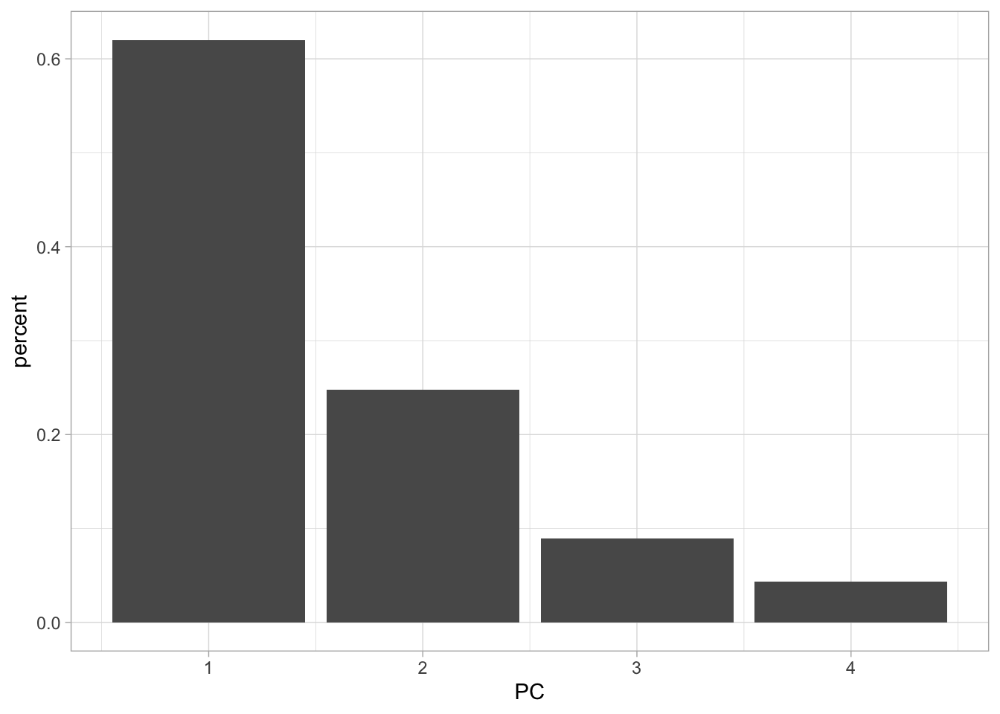
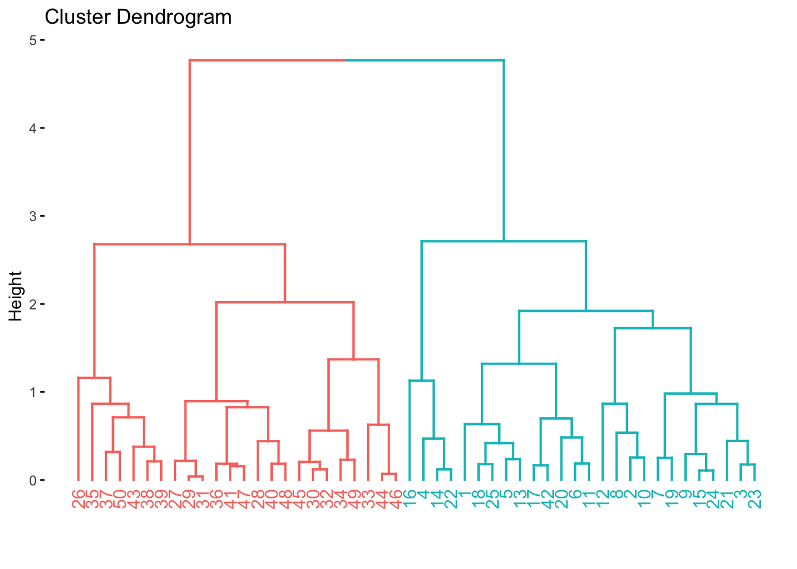
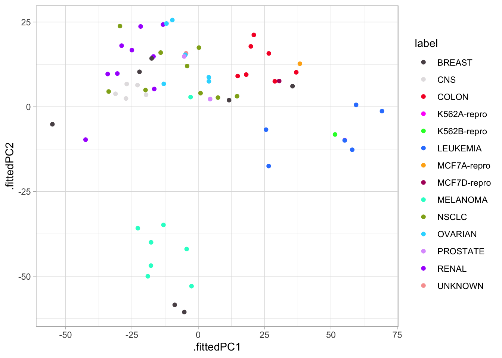
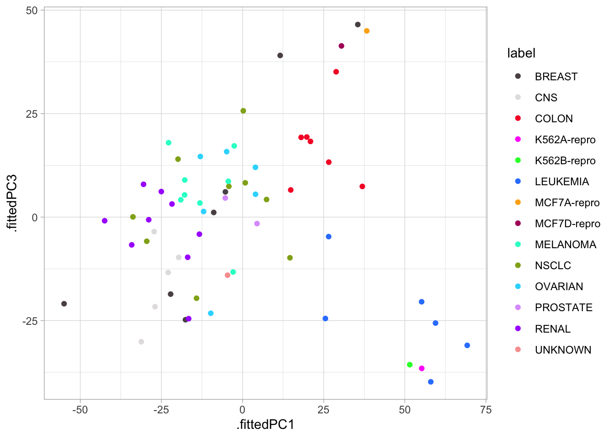
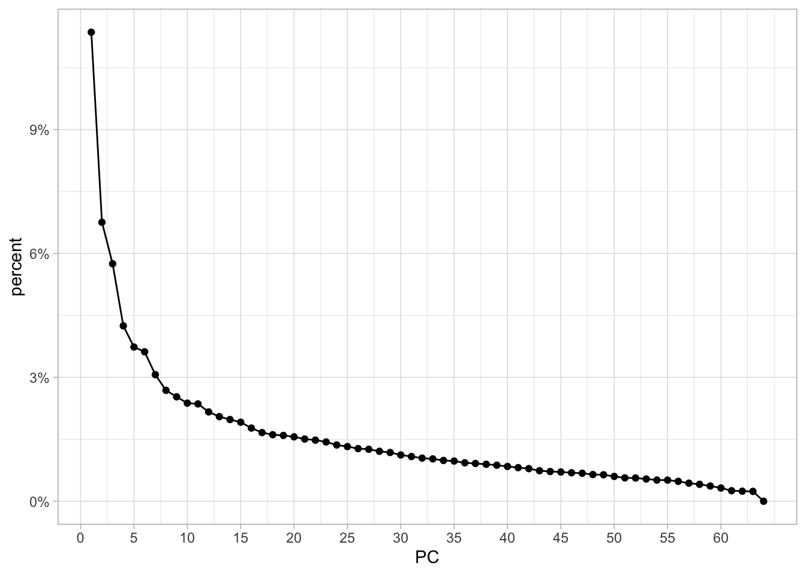
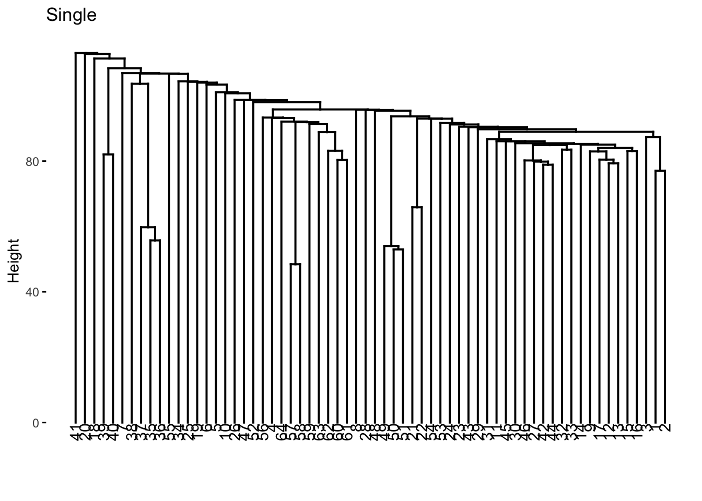
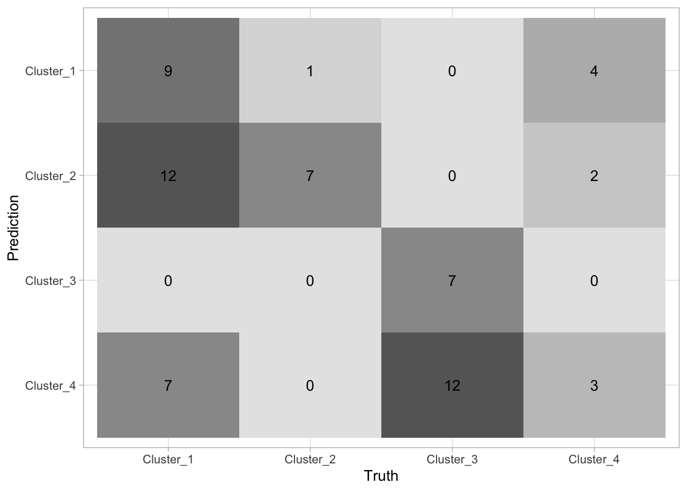
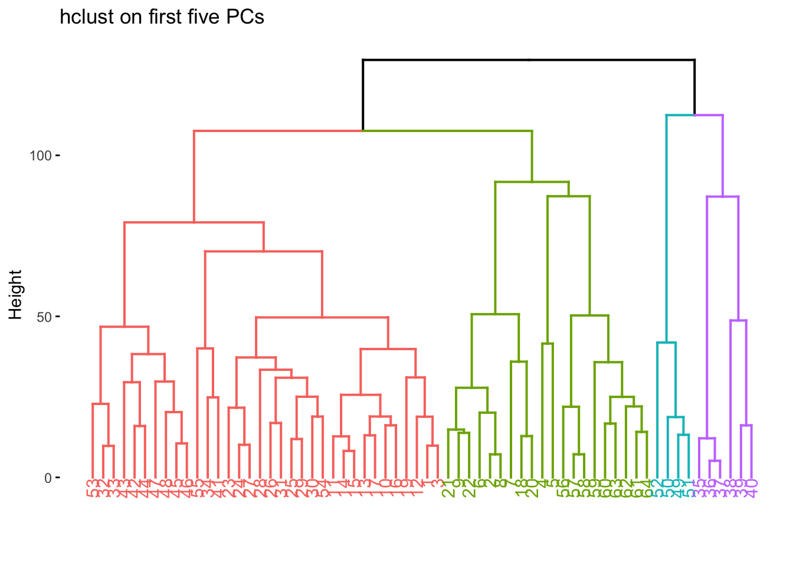

# Unsupervised Learning


::: {.cell}

:::


This final chapter talks about unsupervised learning. This is broken into two parts. Dimensionality reduction and clustering. Dimensionality reduction will be handled mostly as a preprocessor which is done with [recipes](https://recipes.tidymodels.org/) package, and clustering is done with the [tidyclust](https://github.com/emilhvitfeldt/tidyclust) package.


::: {.cell}

```{.r .cell-code}
library(tidymodels)
library(tidyclust)
library(factoextra)
library(patchwork)
library(proxy)
library(ISLR)
```
:::


## Principal Components Analysis

This section will be used to explore the `USArrests` data set using PCA. Before we move on, let is turn `USArrests` into a tibble and move the rownames into a column.


::: {.cell}

```{.r .cell-code}
USArrests <- as_tibble(USArrests, rownames = "state")
USArrests
```

::: {.cell-output .cell-output-stdout}
```
# A tibble: 50 × 5
   state       Murder Assault UrbanPop  Rape
   <chr>        <dbl>   <int>    <int> <dbl>
 1 Alabama       13.2     236       58  21.2
 2 Alaska        10       263       48  44.5
 3 Arizona        8.1     294       80  31  
 4 Arkansas       8.8     190       50  19.5
 5 California     9       276       91  40.6
 6 Colorado       7.9     204       78  38.7
 7 Connecticut    3.3     110       77  11.1
 8 Delaware       5.9     238       72  15.8
 9 Florida       15.4     335       80  31.9
10 Georgia       17.4     211       60  25.8
# ℹ 40 more rows
```
:::
:::


Notice how the mean of each of the variables is quite different. if we were to apply PCA directly to the data set then `Murder` would have a very small influence.


::: {.cell}

```{.r .cell-code}
USArrests %>%
  select(-state) %>%
  map_dfr(mean)
```

::: {.cell-output .cell-output-stdout}
```
# A tibble: 1 × 4
  Murder Assault UrbanPop  Rape
   <dbl>   <dbl>    <dbl> <dbl>
1   7.79    171.     65.5  21.2
```
:::
:::


We will show how to perform PCA in two different ways in this section. Firstly, by using `prcomp()` directly, using `broom::tidy()` to extract the information we need, and secondly by using recipes.
`prcomp()` takes 1 required argument `x` which much be a fully numeric data.frame or matrix. Then we pass that to `prcomp()`. We also set `scale = TRUE` in `prcomp()` which will perform the scaling we need.


::: {.cell}

```{.r .cell-code}
USArrests_pca <- USArrests %>%
  select(-state) %>%
  prcomp(scale = TRUE)

USArrests_pca
```

::: {.cell-output .cell-output-stdout}
```
Standard deviations (1, .., p=4):
[1] 1.5748783 0.9948694 0.5971291 0.4164494

Rotation (n x k) = (4 x 4):
                PC1        PC2        PC3         PC4
Murder   -0.5358995 -0.4181809  0.3412327  0.64922780
Assault  -0.5831836 -0.1879856  0.2681484 -0.74340748
UrbanPop -0.2781909  0.8728062  0.3780158  0.13387773
Rape     -0.5434321  0.1673186 -0.8177779  0.08902432
```
:::
:::


Now we can use our favorite broom function to extract information from this `prcomp` object. 
We start with `tidy()`. `tidy()` can be used to extract a couple of different things, see `?broom:::tidy.prcomp()` for more information. `tidy()` will by default extract the scores of a PCA object in long tidy format. The score is the location of the observation in PCA space. So we can 


::: {.cell}

```{.r .cell-code}
tidy(USArrests_pca)
```

::: {.cell-output .cell-output-stdout}
```
# A tibble: 200 × 3
     row    PC  value
   <int> <dbl>  <dbl>
 1     1     1 -0.976
 2     1     2 -1.12 
 3     1     3  0.440
 4     1     4  0.155
 5     2     1 -1.93 
 6     2     2 -1.06 
 7     2     3 -2.02 
 8     2     4 -0.434
 9     3     1 -1.75 
10     3     2  0.738
# ℹ 190 more rows
```
:::
:::


We can also explicitly say we want the scores by setting `matrix = "scores"`.


::: {.cell}

```{.r .cell-code}
tidy(USArrests_pca, matrix = "scores")
```

::: {.cell-output .cell-output-stdout}
```
# A tibble: 200 × 3
     row    PC  value
   <int> <dbl>  <dbl>
 1     1     1 -0.976
 2     1     2 -1.12 
 3     1     3  0.440
 4     1     4  0.155
 5     2     1 -1.93 
 6     2     2 -1.06 
 7     2     3 -2.02 
 8     2     4 -0.434
 9     3     1 -1.75 
10     3     2  0.738
# ℹ 190 more rows
```
:::
:::


Next, we can get the loadings of the PCA.


::: {.cell}

```{.r .cell-code}
tidy(USArrests_pca, matrix = "loadings")
```

::: {.cell-output .cell-output-stdout}
```
# A tibble: 16 × 3
   column      PC   value
   <chr>    <dbl>   <dbl>
 1 Murder       1 -0.536 
 2 Murder       2 -0.418 
 3 Murder       3  0.341 
 4 Murder       4  0.649 
 5 Assault      1 -0.583 
 6 Assault      2 -0.188 
 7 Assault      3  0.268 
 8 Assault      4 -0.743 
 9 UrbanPop     1 -0.278 
10 UrbanPop     2  0.873 
11 UrbanPop     3  0.378 
12 UrbanPop     4  0.134 
13 Rape         1 -0.543 
14 Rape         2  0.167 
15 Rape         3 -0.818 
16 Rape         4  0.0890
```
:::
:::


This information tells us how each variable contributes to each principal component. If you don't have too many principal components you can visualize the contribution without filtering


::: {.cell}

```{.r .cell-code}
tidy(USArrests_pca, matrix = "loadings") %>%
  ggplot(aes(value, column)) +
  facet_wrap(~ PC) +
  geom_col() +
  scale_x_continuous(labels = scales::percent)
```

::: {.cell-output-display}
{fig-alt='Facetted barchart of the principal component loadings.
The 4 variables are shown across the y-axis and the amount
of the loading is show as the bar height across the x-axis.
The 4 variables: UnbanPop, Rape, Murder and Assault are more
or less evenly represented in the first loading, with
UnbanPop least. Second loading has UnbanPop highest, third
loading has Rape highest. Murder and Assult highest in forth
and final loading.' width=672}
:::
:::


Lastly, we can set `matrix = "eigenvalues"` and get back the explained standard deviation for each PC including as a percent and cumulative which is quite handy for plotting.


::: {.cell}

```{.r .cell-code}
tidy(USArrests_pca, matrix = "eigenvalues")
```

::: {.cell-output .cell-output-stdout}
```
# A tibble: 4 × 4
     PC std.dev percent cumulative
  <dbl>   <dbl>   <dbl>      <dbl>
1     1   1.57   0.620       0.620
2     2   0.995  0.247       0.868
3     3   0.597  0.0891      0.957
4     4   0.416  0.0434      1    
```
:::
:::


If we want to see how the percent standard deviation explained drops off for each PC we can easily get that by using `tidy()` with `matrix = "eigenvalues"`.


::: {.cell}

```{.r .cell-code}
tidy(USArrests_pca, matrix = "eigenvalues") %>%
  ggplot(aes(PC, percent)) +
  geom_col()
```

::: {.cell-output-display}
{fig-alt='Bar chart of percent standard deviation explained for the
4 principal components. First PC is a little over 60%, second
is at around 25%, third is a little under 10% and forth is at
around 5%.' width=672}
:::
:::


Lastly, we have the `augment()` function which will give you back the fitted PC transformation if you apply it to the `prcomp()` object directly


::: {.cell}

```{.r .cell-code}
augment(USArrests_pca)
```

::: {.cell-output .cell-output-stdout}
```
# A tibble: 50 × 5
   .rownames .fittedPC1 .fittedPC2 .fittedPC3 .fittedPC4
   <chr>          <dbl>      <dbl>      <dbl>      <dbl>
 1 1            -0.976     -1.12       0.440     0.155  
 2 2            -1.93      -1.06      -2.02     -0.434  
 3 3            -1.75       0.738     -0.0542   -0.826  
 4 4             0.140     -1.11      -0.113    -0.181  
 5 5            -2.50       1.53      -0.593    -0.339  
 6 6            -1.50       0.978     -1.08      0.00145
 7 7             1.34       1.08       0.637    -0.117  
 8 8            -0.0472     0.322      0.711    -0.873  
 9 9            -2.98      -0.0388     0.571    -0.0953 
10 10           -1.62      -1.27       0.339     1.07   
# ℹ 40 more rows
```
:::
:::


and will apply this transformation to new data by passing the new data to `newdata`


::: {.cell}

```{.r .cell-code}
augment(USArrests_pca, newdata = USArrests[1:5, ])
```

::: {.cell-output .cell-output-stdout}
```
# A tibble: 5 × 10
  .rownames state Murder Assault UrbanPop  Rape .fittedPC1 .fittedPC2 .fittedPC3
  <chr>     <chr>  <dbl>   <int>    <int> <dbl>      <dbl>      <dbl>      <dbl>
1 1         Alab…   13.2     236       58  21.2     -0.976     -1.12      0.440 
2 2         Alas…   10       263       48  44.5     -1.93      -1.06     -2.02  
3 3         Ariz…    8.1     294       80  31       -1.75       0.738    -0.0542
4 4         Arka…    8.8     190       50  19.5      0.140     -1.11     -0.113 
5 5         Cali…    9       276       91  40.6     -2.50       1.53     -0.593 
# ℹ 1 more variable: .fittedPC4 <dbl>
```
:::
:::


If you are using PCA as a preprocessing method I recommend you use recipes to apply the PCA transformation. This is a good way of doing it since recipe will correctly apply the same transformation to new data that the recipe is used on.

We `step_normalize()` to make sure all the variables are on the same scale. By using `all_numeric()` we are able to apply PCA on the variables we want without having to remove `state`. We are also setting an `id` for `step_pca()` to make it easier to `tidy()` later.


::: {.cell}

```{.r .cell-code}
pca_rec <- recipe(~., data = USArrests) %>%
  step_normalize(all_numeric()) %>%
  step_pca(all_numeric(), id = "pca") %>%
  prep()
```
:::


By calling `bake(new_data = NULL)` we can get the fitted PC transformation of our numerical variables


::: {.cell}

```{.r .cell-code}
pca_rec %>%
  bake(new_data = NULL)
```

::: {.cell-output .cell-output-stdout}
```
# A tibble: 50 × 5
   state           PC1     PC2     PC3      PC4
   <fct>         <dbl>   <dbl>   <dbl>    <dbl>
 1 Alabama     -0.976  -1.12    0.440   0.155  
 2 Alaska      -1.93   -1.06   -2.02   -0.434  
 3 Arizona     -1.75    0.738  -0.0542 -0.826  
 4 Arkansas     0.140  -1.11   -0.113  -0.181  
 5 California  -2.50    1.53   -0.593  -0.339  
 6 Colorado    -1.50    0.978  -1.08    0.00145
 7 Connecticut  1.34    1.08    0.637  -0.117  
 8 Delaware    -0.0472  0.322   0.711  -0.873  
 9 Florida     -2.98   -0.0388  0.571  -0.0953 
10 Georgia     -1.62   -1.27    0.339   1.07   
# ℹ 40 more rows
```
:::
:::


but we can also supply our own data to `new_data`.


::: {.cell}

```{.r .cell-code}
pca_rec %>%
  bake(new_data = USArrests[40:45, ])
```

::: {.cell-output .cell-output-stdout}
```
# A tibble: 6 × 5
  state             PC1    PC2    PC3     PC4
  <fct>           <dbl>  <dbl>  <dbl>   <dbl>
1 South Carolina -1.31  -1.91   0.298 -0.130 
2 South Dakota    1.97  -0.815 -0.385 -0.108 
3 Tennessee      -0.990 -0.852 -0.186  0.646 
4 Texas          -1.34   0.408  0.487  0.637 
5 Utah            0.545  1.46  -0.291 -0.0815
6 Vermont         2.77  -1.39  -0.833 -0.143 
```
:::
:::


We can get back the same information as we could for `prcomp()` but we have to specify the slightly different inside `tidy()`. Here `id = "pca"` refers to the second step of `pca_rec`. We get the `scores` with `type = "coef"`.


::: {.cell}

```{.r .cell-code}
tidy(pca_rec, id = "pca", type = "coef")
```

::: {.cell-output .cell-output-stdout}
```
# A tibble: 16 × 4
   terms      value component id   
   <chr>      <dbl> <chr>     <chr>
 1 Murder   -0.536  PC1       pca  
 2 Assault  -0.583  PC1       pca  
 3 UrbanPop -0.278  PC1       pca  
 4 Rape     -0.543  PC1       pca  
 5 Murder   -0.418  PC2       pca  
 6 Assault  -0.188  PC2       pca  
 7 UrbanPop  0.873  PC2       pca  
 8 Rape      0.167  PC2       pca  
 9 Murder    0.341  PC3       pca  
10 Assault   0.268  PC3       pca  
11 UrbanPop  0.378  PC3       pca  
12 Rape     -0.818  PC3       pca  
13 Murder    0.649  PC4       pca  
14 Assault  -0.743  PC4       pca  
15 UrbanPop  0.134  PC4       pca  
16 Rape      0.0890 PC4       pca  
```
:::
:::


And the eigenvalues with `type = "variance"`.


::: {.cell}

```{.r .cell-code}
tidy(pca_rec, id = "pca", type = "variance")
```

::: {.cell-output .cell-output-stdout}
```
# A tibble: 16 × 4
   terms                         value component id   
   <chr>                         <dbl>     <int> <chr>
 1 variance                      2.48          1 pca  
 2 variance                      0.990         2 pca  
 3 variance                      0.357         3 pca  
 4 variance                      0.173         4 pca  
 5 cumulative variance           2.48          1 pca  
 6 cumulative variance           3.47          2 pca  
 7 cumulative variance           3.83          3 pca  
 8 cumulative variance           4             4 pca  
 9 percent variance             62.0           1 pca  
10 percent variance             24.7           2 pca  
11 percent variance              8.91          3 pca  
12 percent variance              4.34          4 pca  
13 cumulative percent variance  62.0           1 pca  
14 cumulative percent variance  86.8           2 pca  
15 cumulative percent variance  95.7           3 pca  
16 cumulative percent variance 100             4 pca  
```
:::
:::


Sometimes you don't want to get back all the principal components of the data. We can either specify how many components we want with `num_comp` (or `rank.` in `prcomp()`)


::: {.cell}

```{.r .cell-code}
recipe(~., data = USArrests) %>%
  step_normalize(all_numeric()) %>%
  step_pca(all_numeric(), num_comp = 3) %>%
  prep() %>%
  bake(new_data = NULL)
```

::: {.cell-output .cell-output-stdout}
```
# A tibble: 50 × 4
   state           PC1     PC2     PC3
   <fct>         <dbl>   <dbl>   <dbl>
 1 Alabama     -0.976  -1.12    0.440 
 2 Alaska      -1.93   -1.06   -2.02  
 3 Arizona     -1.75    0.738  -0.0542
 4 Arkansas     0.140  -1.11   -0.113 
 5 California  -2.50    1.53   -0.593 
 6 Colorado    -1.50    0.978  -1.08  
 7 Connecticut  1.34    1.08    0.637 
 8 Delaware    -0.0472  0.322   0.711 
 9 Florida     -2.98   -0.0388  0.571 
10 Georgia     -1.62   -1.27    0.339 
# ℹ 40 more rows
```
:::
:::


or using a `threshold` to specify how many components to keep by the variance explained. So by setting `threshold = 0.7`, `step_pca()` will generate enough principal components to explain 70% of the variance.


::: {.cell}

```{.r .cell-code}
recipe(~., data = USArrests) %>%
  step_normalize(all_numeric()) %>%
  step_pca(all_numeric(), threshold = 0.7) %>%
  prep() %>%
  bake(new_data = NULL)
```

::: {.cell-output .cell-output-stdout}
```
# A tibble: 50 × 3
   state           PC1     PC2
   <fct>         <dbl>   <dbl>
 1 Alabama     -0.976  -1.12  
 2 Alaska      -1.93   -1.06  
 3 Arizona     -1.75    0.738 
 4 Arkansas     0.140  -1.11  
 5 California  -2.50    1.53  
 6 Colorado    -1.50    0.978 
 7 Connecticut  1.34    1.08  
 8 Delaware    -0.0472  0.322 
 9 Florida     -2.98   -0.0388
10 Georgia     -1.62   -1.27  
# ℹ 40 more rows
```
:::
:::


## Matrix Completion

This section is WIP.

## Kmeans Clustering

We will be using the tidyclust package to perform these clustering tasks. It was a similar interface to parsnip, and it interfaces well with the rest of tidymodels.

Before we get going let us create a synthetic data set that we know has groups.


::: {.cell}

```{.r .cell-code}
set.seed(2)

x_df <- tibble(
  V1 = rnorm(n = 50, mean = rep(c(0, 3), each = 25)),
  V2 = rnorm(n = 50, mean = rep(c(0, -4), each = 25))
)
```
:::


And we can plot it with ggplot2 to see that the groups are really there. Note that we didn't include this grouping information in `x_df` as we are trying to emulate a situation where we don't know of the possible underlying clusters.


::: {.cell}

```{.r .cell-code}
x_df %>%
  ggplot(aes(V1, V2, color = rep(c("A", "B"), each = 25))) +
  geom_point() +
  labs(color = "groups")
```

::: {.cell-output-display}
{fig-alt='Scatter chart of x_df data set with V1 on the x-axis and V2
on the y-axis. Colors correspending to the two groups in the
data. The data neatly seperates into gaussian clusters.' width=672}
:::
:::


Now that we have the data, it is time to create a cluster specification. Since we want to perform K-means clustering, we will use the `k_means()` function from tidyclust. We use the `num_clusters` argument to specify how many centroids the K-means algorithm need to use. We also set a mode and engine, which this time are set to the same as the defaults. We also set `nstart = 20`, this allows the algorithm to have multiple initial starting positions, which we use in the hope of finding global maxima instead of local maxima.


::: {.cell}

```{.r .cell-code}
kmeans_spec <- k_means(num_clusters = 3) %>%
  set_mode("partition") %>%
  set_engine("stats") %>%
  set_args(nstart = 20)

kmeans_spec
```

::: {.cell-output .cell-output-stdout}
```
K Means Cluster Specification (partition)

Main Arguments:
  num_clusters = 3

Engine-Specific Arguments:
  nstart = 20

Computational engine: stats 
```
:::
:::


Once we have this specification we can fit it to our data. We remember to set a seed because the K-means algorithm starts with random initialization


::: {.cell}

```{.r .cell-code}
set.seed(1234)
kmeans_fit <- kmeans_spec %>%
  fit(~., data = x_df)
```
:::


This fitted model has a lot of different kinds of information.


::: {.cell}

```{.r .cell-code}
kmeans_fit
```

::: {.cell-output .cell-output-stdout}
```
tidyclust cluster object

K-means clustering with 3 clusters of sizes 11, 23, 16

Cluster means:
         V1          V2
1 2.5355362 -2.48605364
2 0.2339095  0.04414551
3 2.8241300 -5.01221675

Clustering vector:
 1  2  3  4  5  6  7  8  9 10 11 12 13 14 15 16 17 18 19 20 21 22 23 24 25 26 
 2  2  2  2  2  2  2  2  2  2  2  2  2  2  2  2  1  2  2  2  1  2  2  2  2  3 
27 28 29 30 31 32 33 34 35 36 37 38 39 40 41 42 43 44 45 46 47 48 49 50 
 1  1  1  3  1  3  3  3  3  1  3  3  3  1  1  1  3  3  3  3  1  3  3  3 

Within cluster sum of squares by cluster:
[1] 14.56698 54.84869 26.98215
 (between_SS / total_SS =  76.8 %)

Available components:

[1] "cluster"      "centers"      "totss"        "withinss"     "tot.withinss"
[6] "betweenss"    "size"         "iter"         "ifault"      
```
:::
:::


An otherall function to inspect your fitted tidyclust models is `extract_fit_summary()` which returns all different kind of information


::: {.cell}

```{.r .cell-code}
extract_fit_summary(kmeans_fit)
```

::: {.cell-output .cell-output-stdout}
```
$cluster_names
[1] Cluster_1 Cluster_2 Cluster_3
Levels: Cluster_1 Cluster_2 Cluster_3

$centroids
# A tibble: 3 × 2
     V1      V2
  <dbl>   <dbl>
1 0.234  0.0441
2 2.54  -2.49  
3 2.82  -5.01  

$n_members
[1] 23 11 16

$sse_within_total_total
[1] 54.84869 14.56698 26.98215

$sse_total
[1] 415.9045

$orig_labels
 [1] 2 2 2 2 2 2 2 2 2 2 2 2 2 2 2 2 1 2 2 2 1 2 2 2 2 3 1 1 1 3 1 3 3 3 3 1 3 3
[39] 3 1 1 1 3 3 3 3 1 3 3 3

$cluster_assignments
 [1] Cluster_1 Cluster_1 Cluster_1 Cluster_1 Cluster_1 Cluster_1 Cluster_1
 [8] Cluster_1 Cluster_1 Cluster_1 Cluster_1 Cluster_1 Cluster_1 Cluster_1
[15] Cluster_1 Cluster_1 Cluster_2 Cluster_1 Cluster_1 Cluster_1 Cluster_2
[22] Cluster_1 Cluster_1 Cluster_1 Cluster_1 Cluster_3 Cluster_2 Cluster_2
[29] Cluster_2 Cluster_3 Cluster_2 Cluster_3 Cluster_3 Cluster_3 Cluster_3
[36] Cluster_2 Cluster_3 Cluster_3 Cluster_3 Cluster_2 Cluster_2 Cluster_2
[43] Cluster_3 Cluster_3 Cluster_3 Cluster_3 Cluster_2 Cluster_3 Cluster_3
[50] Cluster_3
Levels: Cluster_1 Cluster_2 Cluster_3
```
:::
:::


We can also extract some of these quantities directly using `extract_centroids()`


::: {.cell}

```{.r .cell-code}
extract_centroids(kmeans_fit)
```

::: {.cell-output .cell-output-stdout}
```
# A tibble: 3 × 3
  .cluster     V1      V2
  <fct>     <dbl>   <dbl>
1 Cluster_1 0.234  0.0441
2 Cluster_2 2.54  -2.49  
3 Cluster_3 2.82  -5.01  
```
:::
:::


and `extract_cluster_assignment()`


::: {.cell}

```{.r .cell-code}
extract_cluster_assignment(kmeans_fit)
```

::: {.cell-output .cell-output-stdout}
```
# A tibble: 50 × 1
   .cluster 
   <fct>    
 1 Cluster_1
 2 Cluster_1
 3 Cluster_1
 4 Cluster_1
 5 Cluster_1
 6 Cluster_1
 7 Cluster_1
 8 Cluster_1
 9 Cluster_1
10 Cluster_1
# ℹ 40 more rows
```
:::
:::


prediction in a clustering model isn't well defined. But we can think of it as "what cluster would these observations be in if they were part of the data set". For the k-means case, it looks at which centroid these observations are closest to.


::: {.cell}

```{.r .cell-code}
predict(kmeans_fit, new_data = x_df)
```

::: {.cell-output .cell-output-stdout}
```
# A tibble: 50 × 1
   .pred_cluster
   <fct>        
 1 Cluster_1    
 2 Cluster_1    
 3 Cluster_1    
 4 Cluster_1    
 5 Cluster_1    
 6 Cluster_1    
 7 Cluster_1    
 8 Cluster_1    
 9 Cluster_1    
10 Cluster_1    
# ℹ 40 more rows
```
:::
:::


Lastly, we can see what cluster each observation belongs to by using `augment()`, which does the same thing as `predict()` but add it to the orginial data set. This makes it handy for EDA and plotting the results.


::: {.cell}

```{.r .cell-code}
augment(kmeans_fit, new_data = x_df)
```

::: {.cell-output .cell-output-stdout}
```
# A tibble: 50 × 3
        V1     V2 .pred_cluster
     <dbl>  <dbl> <fct>        
 1 -0.897  -0.838 Cluster_1    
 2  0.185   2.07  Cluster_1    
 3  1.59   -0.562 Cluster_1    
 4 -1.13    1.28  Cluster_1    
 5 -0.0803 -1.05  Cluster_1    
 6  0.132  -1.97  Cluster_1    
 7  0.708  -0.323 Cluster_1    
 8 -0.240   0.936 Cluster_1    
 9  1.98    1.14  Cluster_1    
10 -0.139   1.67  Cluster_1    
# ℹ 40 more rows
```
:::
:::


We can visualize the result of `augment()` to see how well the clustering performed.


::: {.cell}

```{.r .cell-code}
augment(kmeans_fit, new_data = x_df) %>%
  ggplot(aes(V1, V2, color = .pred_cluster)) +
  geom_point()
```

::: {.cell-output-display}
{fig-alt='Scatter chart of augmented data set with V1 on the x-axis and V2
on the y-axis. Colors correspending to the .pred_cluster variables.
Left-most cluster is one color, right-most cluster is another
color and the points between them in each real cluster is
contained in a third color.' width=672}
:::
:::


This is all well and good, but it would be nice if we could try out a number of different clusters and then find the best one. For this we will use `tune_cluster()`. `tune_cluster()` works pretty much like `tune_grid()` expect that it works with cluster models.


::: {.cell}

```{.r .cell-code}
kmeans_spec_tuned <- kmeans_spec %>% 
  set_args(num_clusters = tune())

kmeans_wf <- workflow() %>%
  add_model(kmeans_spec_tuned) %>%
  add_formula(~.)
```
:::


now we can use this workflow with `tune_cluster()` to fit it many times for different values of `num_clusters`.


::: {.cell}

```{.r .cell-code}
set.seed(1234)
x_boots <- bootstraps(x_df, times = 10)

num_clusters_grid <- tibble(num_clusters = seq(1, 10))

tune_res <- tune_cluster(
  object = kmeans_wf,
  resamples = x_boots,
  grid = num_clusters_grid
)
```
:::


And we can use `collect_metrics()` as before


::: {.cell}

```{.r .cell-code}
tune_res %>%
  collect_metrics()
```

::: {.cell-output .cell-output-stdout}
```
# A tibble: 20 × 7
   num_clusters .metric          .estimator  mean     n std_err .config         
          <int> <chr>            <chr>      <dbl> <int>   <dbl> <chr>           
 1            1 sse_total        standard   387.     10   8.86  Preprocessor1_M…
 2            1 sse_within_total standard   387.     10   8.86  Preprocessor1_M…
 3            2 sse_total        standard   387.     10   8.86  Preprocessor1_M…
 4            2 sse_within_total standard   121.     10   4.00  Preprocessor1_M…
 5            3 sse_total        standard   387.     10   8.86  Preprocessor1_M…
 6            3 sse_within_total standard    82.6    10   2.29  Preprocessor1_M…
 7            4 sse_total        standard   387.     10   8.86  Preprocessor1_M…
 8            4 sse_within_total standard    59.0    10   2.07  Preprocessor1_M…
 9            5 sse_total        standard   387.     10   8.86  Preprocessor1_M…
10            5 sse_within_total standard    43.8    10   1.99  Preprocessor1_M…
11            6 sse_total        standard   387.     10   8.86  Preprocessor1_M…
12            6 sse_within_total standard    33.3    10   1.48  Preprocessor1_M…
13            7 sse_total        standard   387.     10   8.86  Preprocessor1_M…
14            7 sse_within_total standard    25.0    10   1.25  Preprocessor1_M…
15            8 sse_total        standard   387.     10   8.86  Preprocessor1_M…
16            8 sse_within_total standard    20.8    10   1.10  Preprocessor1_M…
17            9 sse_total        standard   387.     10   8.86  Preprocessor1_M…
18            9 sse_within_total standard    17.0    10   1.00  Preprocessor1_M…
19           10 sse_total        standard   387.     10   8.86  Preprocessor1_M…
20           10 sse_within_total standard    13.9    10   0.695 Preprocessor1_M…
```
:::
:::


Now that we have the total within-cluster sum-of-squares we can plot them against `k` so we can use the [elbow method](https://en.wikipedia.org/wiki/Elbow_method_(clustering)) to find the optimal number of clusters. This actually pops right out if we use `autoplot()` on the results.


::: {.cell}

```{.r .cell-code}
tune_res %>%
  autoplot()
```

::: {.cell-output-display}
{width=672}
:::
:::


We see an elbow when the number of clusters is equal to 2 which makes us happy since the data set is specifically created to have 2 clusters. We can now construct the final kmeans model


::: {.cell}

```{.r .cell-code}
final_kmeans <- kmeans_wf %>%
  update_model(kmeans_spec %>% set_args(num_clusters = 2)) %>%
  fit(x_df)
```
:::


And we can finish by visualizing the clusters it found.


::: {.cell}

```{.r .cell-code}
augment(final_kmeans, new_data = x_df) %>%
  ggplot(aes(V1, V2, color = .pred_cluster)) +
  geom_point()
```

::: {.cell-output-display}
{fig-alt='Scatter chart of augmented data set with V1 on the x-axis and V2
on the y-axis. Colors correspending to the two cluster in the
data. These results align closely with the true clusters.' width=672}
:::
:::


## Hierarchical Clustering

The `hclust()` function is one way to perform hierarchical clustering in R. It only needs one input and that is a dissimilarity structure as produced by `dist()`. Furthermore, we can specify a couple of things,

We will use the `hier_clust()` function from tidyclust to perform hierarchical clustering. We will keep all the defaults except for the agglomeration method. Let us cluster this data in a couple of different ways to see how the choice of agglomeration method changes the clustering. 


::: {.cell}

```{.r .cell-code}
res_hclust_complete <- hier_clust(linkage_method = "complete") %>%
  fit(~., data = x_df)

res_hclust_average <- hier_clust(linkage_method = "average") %>%
  fit(~., data = x_df)

res_hclust_single <- hier_clust(linkage_method = "single") %>%
  fit(~., data = x_df)
```
:::


The [factoextra](https://rpkgs.datanovia.com/factoextra/index.html) package provides functions (`fviz_dend()`) to visualize the clustering created using `hclust()`. We use `fviz_dend()` to show the dendrogram. We need to use the `extract_fit_engine()` to extract the underlying model object that `fviz_dend()` expects.


::: {.cell}

```{.r .cell-code}
res_hclust_complete %>%
  extract_fit_engine() %>%
  fviz_dend(main = "complete", k = 2)
```

::: {.cell-output-display}
{fig-alt='Dendrogram visualization. Both left and right side looks more
or less even.' width=672}
:::
:::

::: {.cell}

```{.r .cell-code}
res_hclust_average %>%
  extract_fit_engine() %>%
  fviz_dend(main = "average", k = 2)
```

::: {.cell-output-display}
{fig-alt='Dendrogram visualization. Both left and right side looks more
or less even.' width=672}
:::
:::

::: {.cell}

```{.r .cell-code}
res_hclust_single %>%
  extract_fit_engine() %>%
  fviz_dend(main = "single", k = 2)
```

::: {.cell-output-display}
{fig-alt='Dendrogram visualization. Left side has 1 leaf and the right
side contain the remaining leaves.' width=672}
:::
:::


If we don't know the importance of the different predictors in data set it could be beneficial to scale the data such that each variable has the same influence. We will use a recipe and workflow to do this.


::: {.cell}

```{.r .cell-code}
hier_rec <- recipe(~., data = x_df) %>%
  step_normalize(all_numeric_predictors())

hier_wf <- workflow() %>%
  add_recipe(hier_rec) %>%
  add_model(hier_clust(linkage_method = "complete"))

hier_fit <- hier_wf %>%
  fit(data = x_df) 

hier_fit %>%
  extract_fit_engine() %>%
  fviz_dend(k = 2)
```

::: {.cell-output-display}
{fig-alt='Dendrogram visualization. Both left and right side looks more
or less even.' width=672}
:::
:::


## PCA on the NCI60 Data

We will now explore the `NCI60` data set. It is genomic data set, containing cancer cell line microarray data, which consists of 6830 gene expression measurements on 64 cancer cell lines. The data comes as a list containing a matrix and its labels. We do a little work to turn the data into a tibble we will use for the rest of the chapter.


::: {.cell}

```{.r .cell-code}
data(NCI60, package = "ISLR")
nci60 <- NCI60$data %>%
  as_tibble(.name_repair = ~ paste0("V_", .x)) %>%
  mutate(label = factor(NCI60$labs)) %>%
  relocate(label)
```
:::


We do not expect to use the `label` variable doing the analysis since we are emulating an unsupervised analysis. Since we are an exploratory task we will be fine with using `prcomp()` since we don't need to apply these transformations to anything else. We remove `label` and remember to set `scale = TRUE` to perform scaling of all the variables.


::: {.cell}

```{.r .cell-code}
nci60_pca <- nci60 %>%
  select(-label) %>%
  prcomp(scale = TRUE)
```
:::


For visualization purposes, we will now join up the labels into the result of `augment(nci60_pca)` so we can visualize how close similar labeled points are to each other.


::: {.cell}

```{.r .cell-code}
nci60_pcs <- bind_cols(
  augment(nci60_pca),
  nci60 %>% select(label)
)
```
:::


We have 14 different labels, so we will make use of the `"Polychrome 36"` palette to help us better differentiate between the labels.


::: {.cell}

```{.r .cell-code}
colors <- unname(palette.colors(n = 14, palette = "Polychrome 36"))
```
:::


Or we can plot the different PCs against each other. It is a good idea to compare the first PCs against each other since they carry the most information. We will just compare the pairs 1-2 and 1-3 but you can do more yourself. It tends to be a good idea to stop once interesting things appear in the plots.


::: {.cell}

```{.r .cell-code}
nci60_pcs %>%
  ggplot(aes(.fittedPC1, .fittedPC2, color = label)) +
  geom_point() +
  scale_color_manual(values = colors)
```

::: {.cell-output-display}
{fig-alt='Scatter plot of nci60_pcs across the first 2 principal
components. Colors by label which has 14 unique values.
Observations with same label appears fairly close together
for most labels.' width=672}
:::
:::


We see there is some local clustering of the different cancer types which is promising, it is not perfect but let us see what happens when we compare PC1 against PC3 now. 


::: {.cell}

```{.r .cell-code}
nci60_pcs %>%
  ggplot(aes(.fittedPC1, .fittedPC3, color = label)) +
  geom_point() +
  scale_color_manual(values = colors)
```

::: {.cell-output-display}
{fig-alt='Scatter plot of nci60_pcs across the first and third principal
components. Colors by label which has 14 unique values.
Observations with same label appears fairly close together
for most labels.' width=672}
:::
:::


Lastly, we will plot the variance explained of each principal component. We can use `tidy()` with `matrix = "eigenvalues"` to accomplish this easily, so we start with the percentage of each PC


::: {.cell}

```{.r .cell-code}
tidy(nci60_pca, matrix = "eigenvalues") %>%
  ggplot(aes(PC, percent)) +
  geom_point() +
  geom_line() +
  scale_x_continuous(breaks = seq(0, 60, by = 5)) +
  scale_y_continuous(labels = scales::percent)
```

::: {.cell-output-display}
{fig-alt='Connected line chart of percent variance explained for each
principal components, with percent variance explained on the
y-axis and PCs on the x-axis. 11% for PC1, 7% for PC2, 6% for
PC3, 4% for PC4 and the remaining 60 PCs more or less linearly
goes towards 0%.' width=672}
:::
:::


with the first PC having a little more than 10% and a fairly fast drop. 

And we can get the cumulative variance explained just the same.


::: {.cell}

```{.r .cell-code}
tidy(nci60_pca, matrix = "eigenvalues") %>%
  ggplot(aes(PC, cumulative)) +
  geom_point() +
  geom_line()
```

::: {.cell-output-display}
{fig-alt='Connected line chart of cumulative percent variance explained
for each principal components, with percent variance explained
on the y-axis and PCs on the x-axis.' width=672}
:::
:::


## Clustering on nci60 dataset

Let us now see what happens if we perform clustering on the `nci60` data set. Before we start it would be good if we create a scaled version of this data set. We can use the recipes package to perform those transformations. And a workflow to be able to combine it with the cluster model later


::: {.cell}

```{.r .cell-code}
nci60_rec <- recipe(~ ., data = nci60) %>%
  step_rm(label) %>%
  step_normalize(all_predictors())

nci60_wf <- workflow() %>%
  add_recipe(nci60_rec)
```
:::


Now we start by fitting multiple hierarchical clustering models using different agglomeration methods.


::: {.cell}

```{.r .cell-code}
nci60_complete <- nci60_wf %>%
  add_model(hier_clust(linkage_method = "complete")) %>%
  fit(data = nci60)

nci60_average <- nci60_wf %>%
  add_model(hier_clust(linkage_method = "average")) %>%
  fit(data = nci60)

nci60_single <- nci60_wf %>%
  add_model(hier_clust(linkage_method = "single")) %>%
  fit(data = nci60)
```
:::


We then visualize them to see if any of them have some good natural separations.


::: {.cell}

```{.r .cell-code}
nci60_complete %>%
  extract_fit_engine() %>%
  fviz_dend(main = "Complete")
```

::: {.cell-output-display}
{fig-alt='Dendrogram visualization. Not colored, has most of the splits
happen at larger hights.' width=672}
:::
:::

::: {.cell}

```{.r .cell-code}
nci60_average %>% 
  extract_fit_engine() %>%
  fviz_dend(main = "Average")
```

::: {.cell-output-display}
{fig-alt='Dendrogram visualization. Not colored, has most of the splits
happen at larger hights.' width=672}
:::
:::

::: {.cell}

```{.r .cell-code}
nci60_single %>%
  extract_fit_engine() %>%
  fviz_dend(main = "Single")
```

::: {.cell-output-display}
{fig-alt='Dendrogram visualization. Not colored, has most of the splits
happen at larger hight, very close together, with a few splits
a lower heights.' width=672}
:::
:::


We now color according to `k = 4` and we get the following separations.


::: {.cell}

```{.r .cell-code}
nci60_complete %>%
  extract_fit_engine() %>%
  fviz_dend(k = 4, main = "hclust(complete) on nci60")
```

::: {.cell-output-display}
{fig-alt='Dendrogram visualization. Colors for 4 clusters.' width=672}
:::
:::


We now take find the clustering and calculate which label is the most common one within each cluster.


::: {.cell}

```{.r .cell-code}
predict(nci60_complete, new_data = nci60, num_clusters = 4) %>%
  mutate(label = nci60$label) %>%
  count(label, .pred_cluster) %>%
  group_by(.pred_cluster) %>%
  mutate(prop = n / sum(n)) %>%
  slice_max(n = 1, order_by = prop) %>%
  ungroup()
```

::: {.cell-output .cell-output-stdout}
```
# A tibble: 4 × 4
  label    .pred_cluster     n  prop
  <fct>    <fct>         <int> <dbl>
1 MELANOMA Cluster_1         5 0.357
2 RENAL    Cluster_2         7 0.333
3 LEUKEMIA Cluster_3         5 0.714
4 COLON    Cluster_4         7 0.318
```
:::
:::


We can also see what happens if we try to fit a K-means clustering. We liked 4 clusters from earlier so let's stick with that.


::: {.cell}

```{.r .cell-code}
set.seed(2)
nci60_kmeans <- nci60_wf %>%
  add_model(k_means(num_clusters = 4)) %>%
  fit(data = nci60)
```
:::


and we can now extract the centroids


::: {.cell}

```{.r .cell-code}
nci60_kmeans %>%
  extract_centroids()
```

::: {.cell-output .cell-output-stdout}
```
# A tibble: 4 × 6,831
  .cluster      V_1     V_2     V_3     V_4     V_5     V_6    V_7     V_8
  <fct>       <dbl>   <dbl>   <dbl>   <dbl>   <dbl>   <dbl>  <dbl>   <dbl>
1 Cluster_1 -0.281  -0.675   0.120  -0.0190  0.0763 -0.260  -0.193  0.0185
2 Cluster_2 -0.371  -0.0689 -0.0633  0.0788 -0.359  -0.0672 -0.209 -0.124 
3 Cluster_3  0.325   0.266  -0.0439  0.0210  0.126  -0.0187  0.326  0.218 
4 Cluster_4  0.0205 -0.0821  0.164  -0.215   0.298   0.431  -0.401 -0.432 
# ℹ 6,822 more variables: V_9 <dbl>, V_10 <dbl>, V_11 <dbl>, V_12 <dbl>,
#   V_13 <dbl>, V_14 <dbl>, V_15 <dbl>, V_16 <dbl>, V_17 <dbl>, V_18 <dbl>,
#   V_19 <dbl>, V_20 <dbl>, V_21 <dbl>, V_22 <dbl>, V_23 <dbl>, V_24 <dbl>,
#   V_25 <dbl>, V_26 <dbl>, V_27 <dbl>, V_28 <dbl>, V_29 <dbl>, V_30 <dbl>,
#   V_31 <dbl>, V_32 <dbl>, V_33 <dbl>, V_34 <dbl>, V_35 <dbl>, V_36 <dbl>,
#   V_37 <dbl>, V_38 <dbl>, V_39 <dbl>, V_40 <dbl>, V_41 <dbl>, V_42 <dbl>,
#   V_43 <dbl>, V_44 <dbl>, V_45 <dbl>, V_46 <dbl>, V_47 <dbl>, V_48 <dbl>, …
```
:::
:::


and the cluster assignments


::: {.cell}

```{.r .cell-code}
nci60_kmeans %>%
  extract_cluster_assignment(nci60_kmeans)
```

::: {.cell-output .cell-output-stdout}
```
# A tibble: 64 × 1
   .cluster 
   <fct>    
 1 Cluster_1
 2 Cluster_1
 3 Cluster_1
 4 Cluster_2
 5 Cluster_2
 6 Cluster_2
 7 Cluster_2
 8 Cluster_2
 9 Cluster_1
10 Cluster_1
# ℹ 54 more rows
```
:::
:::


Lastly, let us see how the two different methods we used compare against each other. Let us save the cluster ids in `cluster_kmeans` and `cluster_hclust` and then use `conf_mat()` in a different way to quickly generate a heatmap between the two methods.


::: {.cell}

```{.r .cell-code}
cluster_kmeans <- predict(nci60_kmeans, nci60)
cluster_hclust <- predict(nci60_complete, nci60, num_clusters = 4)

tibble(
  kmeans = cluster_kmeans$.pred_cluster,
  hclust = cluster_hclust$.pred_cluster
) %>%
  conf_mat(kmeans, hclust) %>%
  autoplot(type = "heatmap")
```

::: {.cell-output-display}
{fig-alt='Confusion matrix, truth along x-axis and prediction along
y-axis. No agreement between labels.' width=672}
:::
:::


There is not a lot of agreement between labels which makes sense, since the labels themselves are arbitrarily added. What is important is that they tend to agree quite a lot (the confusion matrix is sparse).

One last thing is that it is sometimes useful to perform dimensionality reduction before using the clustering method. Let us use the recipes package to calculate the PCA of `nci60` and keep the 5 first components 


::: {.cell}

```{.r .cell-code}
nci60_pca_rec <- recipe(~ ., data = nci60) %>%
  step_rm(label) %>%
  step_normalize(all_predictors()) %>%
  step_pca(all_predictors(), num_comp = 5)

nci60_pca_wf <- workflow() %>%
  add_recipe(nci60_pca_rec)
```
:::


and now fit this new workflow


::: {.cell}

```{.r .cell-code}
nci60_pca <- nci60_pca_wf %>%
  add_model(hier_clust(linkage_method = "complete")) %>%
  fit(data = nci60)
```
:::


we can now visualize on this reduced data set, and sometimes we get quite good results since the clustering method doesn't have to work in high dimensions.


::: {.cell}

```{.r .cell-code}
nci60_pca %>%
  extract_fit_engine() %>%
  fviz_dend(k = 4, main = "hclust on first five PCs")
```

::: {.cell-output-display}
{fig-alt='Dendrogram visualization. Colors to produce 4 clusters.' width=672}
:::
:::
