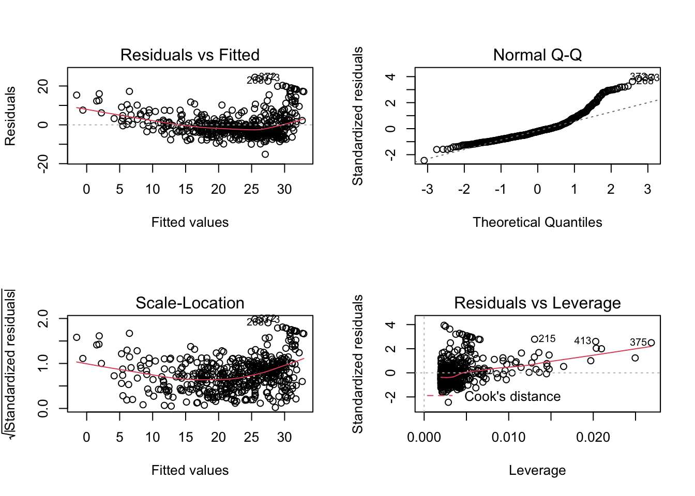

# Linear Regression

## Libraries


```r
library(tidymodels)
```

```
## Registered S3 method overwritten by 'tune':
##   method                   from   
##   required_pkgs.model_spec parsnip
```

```
## ── Attaching packages ────────────────────────────────────── tidymodels 0.1.2 ──
```

```
## ✓ broom     0.7.5           ✓ recipes   0.1.15.9000
## ✓ dials     0.0.9           ✓ rsample   0.0.9      
## ✓ dplyr     1.0.5           ✓ tibble    3.1.0      
## ✓ ggplot2   3.3.3           ✓ tidyr     1.1.3      
## ✓ infer     0.5.4           ✓ tune      0.1.3      
## ✓ modeldata 0.1.0           ✓ workflows 0.2.2      
## ✓ parsnip   0.1.5.9002      ✓ yardstick 0.0.8      
## ✓ purrr     0.3.4
```

```
## ── Conflicts ───────────────────────────────────────── tidymodels_conflicts() ──
## x purrr::discard() masks scales::discard()
## x dplyr::filter()  masks stats::filter()
## x dplyr::lag()     masks stats::lag()
## x recipes::step()  masks stats::step()
```

```r
library(ISLR)
library(MASS) # For Boston data set
```

```
## 
## Attaching package: 'MASS'
```

```
## The following object is masked from 'package:dplyr':
## 
##     select
```

```r
Boston <- as_tibble(Boston)
Carseats <- as_tibble(Carseats)
```

## Simple linear regression


```r
lm_spec <- linear_reg() %>%
  set_mode("regression") %>%
  set_engine("lm")
```


```r
lm_fit <- lm_spec %>%
  fit(medv ~ lstat, data = Boston)
```


```r
names(lm_fit)
```

```
## [1] "lvl"     "spec"    "fit"     "preproc" "elapsed"
```


```r
names(lm_fit$fit)
```

```
##  [1] "coefficients"  "residuals"     "effects"       "rank"         
##  [5] "fitted.values" "assign"        "qr"            "df.residual"  
##  [9] "xlevels"       "call"          "terms"         "model"
```


```r
summary(lm_fit$fit)
```

```
## 
## Call:
## stats::lm(formula = medv ~ lstat, data = data)
## 
## Residuals:
##     Min      1Q  Median      3Q     Max 
## -15.168  -3.990  -1.318   2.034  24.500 
## 
## Coefficients:
##             Estimate Std. Error t value Pr(>|t|)    
## (Intercept) 34.55384    0.56263   61.41   <2e-16 ***
## lstat       -0.95005    0.03873  -24.53   <2e-16 ***
## ---
## Signif. codes:  0 '***' 0.001 '**' 0.01 '*' 0.05 '.' 0.1 ' ' 1
## 
## Residual standard error: 6.216 on 504 degrees of freedom
## Multiple R-squared:  0.5441,	Adjusted R-squared:  0.5432 
## F-statistic: 601.6 on 1 and 504 DF,  p-value: < 2.2e-16
```


```r
tidy(lm_fit)
```

```
## # A tibble: 2 x 5
##   term        estimate std.error statistic   p.value
##   <chr>          <dbl>     <dbl>     <dbl>     <dbl>
## 1 (Intercept)   34.6      0.563       61.4 3.74e-236
## 2 lstat         -0.950    0.0387     -24.5 5.08e- 88
```


```r
glance(lm_fit)
```

```
## # A tibble: 1 x 12
##   r.squared adj.r.squared sigma statistic  p.value    df logLik   AIC   BIC
##       <dbl>         <dbl> <dbl>     <dbl>    <dbl> <dbl>  <dbl> <dbl> <dbl>
## 1     0.544         0.543  6.22      602. 5.08e-88     1 -1641. 3289. 3302.
## # … with 3 more variables: deviance <dbl>, df.residual <int>, nobs <int>
```


```r
predict(lm_fit)
```

```
## Error in predict_numeric(object = object, new_data = new_data, ...): argument "new_data" is missing, with no default
```


```r
predict(lm_fit, new_data = Boston)
```

```
## # A tibble: 506 x 1
##    .pred
##    <dbl>
##  1 29.8 
##  2 25.9 
##  3 30.7 
##  4 31.8 
##  5 29.5 
##  6 29.6 
##  7 22.7 
##  8 16.4 
##  9  6.12
## 10 18.3 
## # … with 496 more rows
```


```r
predict(lm_fit, new_data = Boston, type = "conf_int")
```

```
## # A tibble: 506 x 2
##    .pred_lower .pred_upper
##          <dbl>       <dbl>
##  1       29.0        30.6 
##  2       25.3        26.5 
##  3       29.9        31.6 
##  4       30.8        32.7 
##  5       28.7        30.3 
##  6       28.8        30.4 
##  7       22.2        23.3 
##  8       15.6        17.1 
##  9        4.70        7.54
## 10       17.7        18.9 
## # … with 496 more rows
```


```r
augment(lm_fit, new_data = Boston)
```

```
## # A tibble: 506 x 16
##       crim    zn indus  chas   nox    rm   age   dis   rad   tax ptratio black
##      <dbl> <dbl> <dbl> <int> <dbl> <dbl> <dbl> <dbl> <int> <dbl>   <dbl> <dbl>
##  1 0.00632  18    2.31     0 0.538  6.58  65.2  4.09     1   296    15.3  397.
##  2 0.0273    0    7.07     0 0.469  6.42  78.9  4.97     2   242    17.8  397.
##  3 0.0273    0    7.07     0 0.469  7.18  61.1  4.97     2   242    17.8  393.
##  4 0.0324    0    2.18     0 0.458  7.00  45.8  6.06     3   222    18.7  395.
##  5 0.0690    0    2.18     0 0.458  7.15  54.2  6.06     3   222    18.7  397.
##  6 0.0298    0    2.18     0 0.458  6.43  58.7  6.06     3   222    18.7  394.
##  7 0.0883   12.5  7.87     0 0.524  6.01  66.6  5.56     5   311    15.2  396.
##  8 0.145    12.5  7.87     0 0.524  6.17  96.1  5.95     5   311    15.2  397.
##  9 0.211    12.5  7.87     0 0.524  5.63 100    6.08     5   311    15.2  387.
## 10 0.170    12.5  7.87     0 0.524  6.00  85.9  6.59     5   311    15.2  387.
## # … with 496 more rows, and 4 more variables: lstat <dbl>, medv <dbl>,
## #   .pred <dbl>, .resid <dbl>
```


```r
par(mfrow = c(2, 2))
plot(lm_fit$fit)
```



## Multiple linear regression


```r
lm_fit <- lm_spec %>% 
  fit(medv ~ lstat + age, data = Boston)

lm_fit
```

```
## parsnip model object
## 
## Fit time:  2ms 
## 
## Call:
## stats::lm(formula = medv ~ lstat + age, data = data)
## 
## Coefficients:
## (Intercept)        lstat          age  
##    33.22276     -1.03207      0.03454
```

## Interaction terms


```r
lm_fit <- lm_spec %>%
  fit(medv ~ lstat * age, data = Boston)

lm_fit
```

```
## parsnip model object
## 
## Fit time:  2ms 
## 
## Call:
## stats::lm(formula = medv ~ lstat * age, data = data)
## 
## Coefficients:
## (Intercept)        lstat          age    lstat:age  
##  36.0885359   -1.3921168   -0.0007209    0.0041560
```


```r
rec_spec <- recipe(medv ~ lstat + age, data = Boston) %>%
  step_interact(~ lstat:age)

lm_wf <- workflow() %>%
  add_model(lm_spec) %>%
  add_recipe(rec_spec)

lm_wf %>% fit(Boston)
```

```
## ══ Workflow [trained] ══════════════════════════════════════════════════════════
## Preprocessor: Recipe
## Model: linear_reg()
## 
## ── Preprocessor ────────────────────────────────────────────────────────────────
## 1 Recipe Step
## 
## ● step_interact()
## 
## ── Model ───────────────────────────────────────────────────────────────────────
## 
## Call:
## stats::lm(formula = ..y ~ ., data = data)
## 
## Coefficients:
## (Intercept)        lstat          age  lstat_x_age  
##  36.0885359   -1.3921168   -0.0007209    0.0041560
```

## Non-linear transformations of the predictors


```r
lm_fit <- lm_spec %>%
  fit(medv ~ lstat + I(lstat ^ 2), data = Boston)

lm_fit
```

```
## parsnip model object
## 
## Fit time:  2ms 
## 
## Call:
## stats::lm(formula = medv ~ lstat + I(lstat^2), data = data)
## 
## Coefficients:
## (Intercept)        lstat   I(lstat^2)  
##    42.86201     -2.33282      0.04355
```


```r
rec_spec <- recipe(medv ~ lstat, data = Boston) %>%
  step_mutate(lstat2 = lstat ^ 2)

lm_wf <- workflow() %>%
  add_model(lm_spec) %>%
  add_recipe(rec_spec)

lm_fit2 <- lm_wf %>% fit(Boston)
```


```r
rec_spec <- recipe(medv ~ lstat, data = Boston) %>%
  step_log(lstat)

lm_wf <- workflow() %>%
  add_model(lm_spec) %>%
  add_recipe(rec_spec)

lm_wf %>% fit(Boston)
```

```
## ══ Workflow [trained] ══════════════════════════════════════════════════════════
## Preprocessor: Recipe
## Model: linear_reg()
## 
## ── Preprocessor ────────────────────────────────────────────────────────────────
## 1 Recipe Step
## 
## ● step_log()
## 
## ── Model ───────────────────────────────────────────────────────────────────────
## 
## Call:
## stats::lm(formula = ..y ~ ., data = data)
## 
## Coefficients:
## (Intercept)        lstat  
##       52.12       -12.48
```

## Qualitative predictors


```r
Carseats
```

```
## # A tibble: 400 x 11
##    Sales CompPrice Income Advertising Population Price ShelveLoc   Age Education
##    <dbl>     <dbl>  <dbl>       <dbl>      <dbl> <dbl> <fct>     <dbl>     <dbl>
##  1  9.5        138     73          11        276   120 Bad          42        17
##  2 11.2        111     48          16        260    83 Good         65        10
##  3 10.1        113     35          10        269    80 Medium       59        12
##  4  7.4        117    100           4        466    97 Medium       55        14
##  5  4.15       141     64           3        340   128 Bad          38        13
##  6 10.8        124    113          13        501    72 Bad          78        16
##  7  6.63       115    105           0         45   108 Medium       71        15
##  8 11.8        136     81          15        425   120 Good         67        10
##  9  6.54       132    110           0        108   124 Medium       76        10
## 10  4.69       132    113           0        131   124 Medium       76        17
## # … with 390 more rows, and 2 more variables: Urban <fct>, US <fct>
```


```r
lm_spec %>% 
  fit(Sales ~ . + Income:Advertising + Price:Age, data = Carseats)
```

```
## parsnip model object
## 
## Fit time:  5ms 
## 
## Call:
## stats::lm(formula = Sales ~ . + Income:Advertising + Price:Age, 
##     data = data)
## 
## Coefficients:
##        (Intercept)           CompPrice              Income         Advertising  
##          6.5755654           0.0929371           0.0108940           0.0702462  
##         Population               Price       ShelveLocGood     ShelveLocMedium  
##          0.0001592          -0.1008064           4.8486762           1.9532620  
##                Age           Education            UrbanYes               USYes  
##         -0.0579466          -0.0208525           0.1401597          -0.1575571  
## Income:Advertising           Price:Age  
##          0.0007510           0.0001068
```


```r
rec_spec <- recipe(Sales ~ ., data = Carseats) %>%
  step_dummy(all_nominal_predictors()) %>%
  step_interact(~ Income:Advertising + Price:Age)

lm_wf <- workflow() %>%
  add_model(lm_spec) %>%
  add_recipe(rec_spec)

lm_wf %>% fit(Carseats)
```

```
## ══ Workflow [trained] ══════════════════════════════════════════════════════════
## Preprocessor: Recipe
## Model: linear_reg()
## 
## ── Preprocessor ────────────────────────────────────────────────────────────────
## 2 Recipe Steps
## 
## ● step_dummy()
## ● step_interact()
## 
## ── Model ───────────────────────────────────────────────────────────────────────
## 
## Call:
## stats::lm(formula = ..y ~ ., data = data)
## 
## Coefficients:
##          (Intercept)             CompPrice                Income  
##            6.5755654             0.0929371             0.0108940  
##          Advertising            Population                 Price  
##            0.0702462             0.0001592            -0.1008064  
##                  Age             Education        ShelveLoc_Good  
##           -0.0579466            -0.0208525             4.8486762  
##     ShelveLoc_Medium             Urban_Yes                US_Yes  
##            1.9532620             0.1401597            -0.1575571  
## Income_x_Advertising           Price_x_Age  
##            0.0007510             0.0001068
```

## Writing functions
