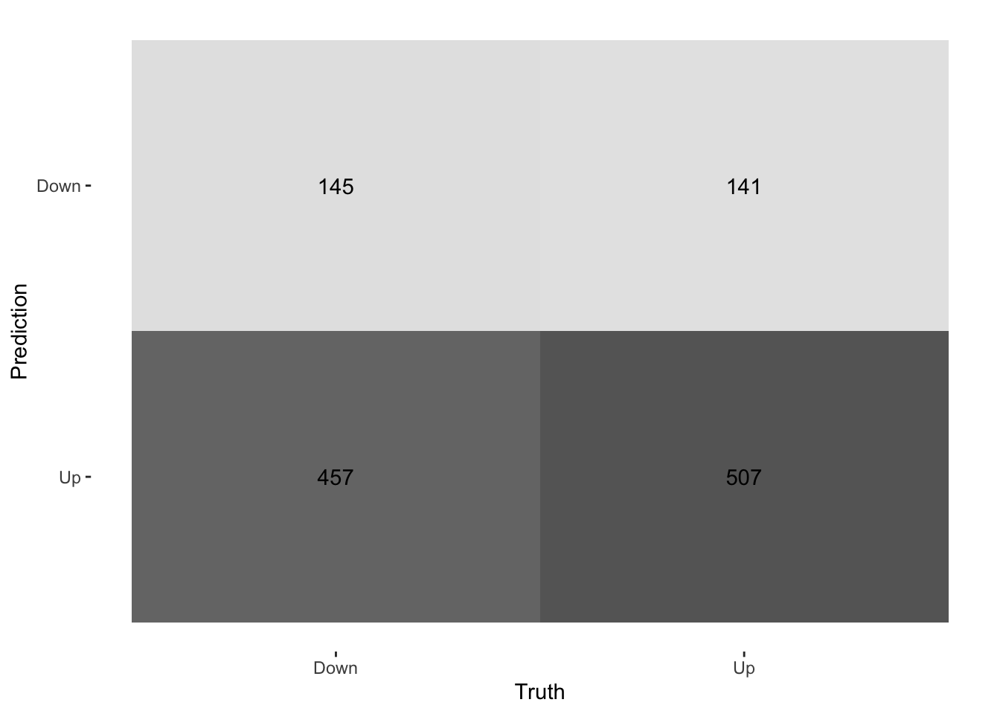

# Classification

This lab will be our first experience with classification models. These models differ from the regression model we saw in the last chapter by the fact that the response variable is a qualitative variable instead of a continuous variable.
This chapter will use [parsnip](https://www.tidymodels.org/start/models/) for model fitting and [recipes and workflows](https://www.tidymodels.org/start/recipes/) to perform the transformations.

## The Stock Market Data

We load the tidymodels for modeling functions, ISlR for data sets, and [discrim](https://discrim.tidymodels.org/) to give us access to discriminant analysis models such as LDA and QDA.


```r
library(tidymodels)
```

```
## Registered S3 method overwritten by 'tune':
##   method                   from   
##   required_pkgs.model_spec parsnip
```

```
## ── Attaching packages ────────────────────────────────────── tidymodels 0.1.3 ──
```

```
## ✓ broom        0.7.6           ✓ recipes      0.1.16.9000
## ✓ dials        0.0.9           ✓ rsample      0.1.0      
## ✓ dplyr        1.0.6           ✓ tibble       3.1.2      
## ✓ ggplot2      3.3.3           ✓ tidyr        1.1.3      
## ✓ infer        0.5.4           ✓ tune         0.1.5      
## ✓ modeldata    0.1.0           ✓ workflows    0.2.2      
## ✓ parsnip      0.1.6           ✓ workflowsets 0.0.2      
## ✓ purrr        0.3.4           ✓ yardstick    0.0.8
```

```
## ── Conflicts ───────────────────────────────────────── tidymodels_conflicts() ──
## x purrr::discard() masks scales::discard()
## x dplyr::filter()  masks stats::filter()
## x dplyr::lag()     masks stats::lag()
## x recipes::step()  masks stats::step()
## • Use tidymodels_prefer() to resolve common conflicts.
```

```r
library(ISLR)
library(discrim)
```

```
## 
## Attaching package: 'discrim'
```

```
## The following object is masked from 'package:dials':
## 
##     smoothness
```


We will be examining the `Smarket` data set for this lab. It contains a number of numeric variables plus a variable called `Direction` which has the two labels `"Up"` and `"Down"`. Before we do on to modeling, let us take a look at the correlation between the variables.

To look at the correlation, we will use the [corrr](https://corrr.tidymodels.org/) package. The `correlate()` function will calculate the correlation matrix between all the variables that it is being fed. We will therefore remove `Direction` as it is not numeric.
Then we pass that to `rplot()` to quickly visualize the correlation matrix. I have also changed the `colours` argument to better see what is going on.


```r
library(corrr)
cor_Smarket <- Smarket %>%
  select(-Direction) %>%
  correlate()
```

```
## 
## Correlation method: 'pearson'
## Missing treated using: 'pairwise.complete.obs'
```

```r
rplot(cor_Smarket, colours = c("indianred2", "black", "skyblue1"))
```

```
## Don't know how to automatically pick scale for object of type noquote. Defaulting to continuous.
```


And we see that these variables are more or less uncorrelated with each other. The other pair is `Year` and `Volume` that is a little correlated.

If you want to create heatmap styled correlation chart you can also create it manually.


```r
library(paletteer)
cor_Smarket %>%
  stretch() %>%
  ggplot(aes(x, y, fill = r)) +
  geom_tile() +
  geom_text(aes(label = as.character(fashion(r)))) +
  scale_fill_paletteer_c("scico::roma", limits = c(-1, 1), direction = -1) +
  theme_minimal()
```


If we plot `Year` against `Volume` we see that there is an upwards trend in `Volume` with time.


```r
ggplot(Smarket, aes(Year, Volume)) +
  geom_jitter(height = 0)
```


## Logistic Regression

Now we will fit a logistic regression model. We will again use the parsnip package, and we will use `logistic_reg()` to create a logistic regression model specification.


```r
lr_spec <- logistic_reg() %>%
  set_engine("glm") %>%
  set_mode("classification")
```

Notice that while I did set the engine and mode, they are just restating the defaults.

We can now fit the model like normal. We want to model the `Direction` of the stock market based on the percentage return from the 5 previous days plus the volume of shares traded.
When fitting a classification with parsnip requires that the response variable is a factor. This is the case for the `Smarket` data set so we don't need to do adjustments.


```r
lr_fit <- lr_spec %>%
  fit(
    Direction ~ Lag1 + Lag2 + Lag3 + Lag4 + Lag5 + Volume,
    data = Smarket
    )

lr_fit
```

```
## parsnip model object
## 
## Fit time:  9ms 
## 
## Call:  stats::glm(formula = Direction ~ Lag1 + Lag2 + Lag3 + Lag4 + 
##     Lag5 + Volume, family = stats::binomial, data = data)
## 
## Coefficients:
## (Intercept)         Lag1         Lag2         Lag3         Lag4         Lag5  
##   -0.126000    -0.073074    -0.042301     0.011085     0.009359     0.010313  
##      Volume  
##    0.135441  
## 
## Degrees of Freedom: 1249 Total (i.e. Null);  1243 Residual
## Null Deviance:	    1731 
## Residual Deviance: 1728 	AIC: 1742
```

this fit is done using the `glm()` function, and it comes with a very handy `summary()` method as well.


```r
lr_fit %>%
  pluck("fit") %>%
  summary()
```

```
## 
## Call:
## stats::glm(formula = Direction ~ Lag1 + Lag2 + Lag3 + Lag4 + 
##     Lag5 + Volume, family = stats::binomial, data = data)
## 
## Deviance Residuals: 
##    Min      1Q  Median      3Q     Max  
## -1.446  -1.203   1.065   1.145   1.326  
## 
## Coefficients:
##              Estimate Std. Error z value Pr(>|z|)
## (Intercept) -0.126000   0.240736  -0.523    0.601
## Lag1        -0.073074   0.050167  -1.457    0.145
## Lag2        -0.042301   0.050086  -0.845    0.398
## Lag3         0.011085   0.049939   0.222    0.824
## Lag4         0.009359   0.049974   0.187    0.851
## Lag5         0.010313   0.049511   0.208    0.835
## Volume       0.135441   0.158360   0.855    0.392
## 
## (Dispersion parameter for binomial family taken to be 1)
## 
##     Null deviance: 1731.2  on 1249  degrees of freedom
## Residual deviance: 1727.6  on 1243  degrees of freedom
## AIC: 1741.6
## 
## Number of Fisher Scoring iterations: 3
```

This lets us see a couple of different things such as; parameter estimates, standard errors, p-values, and model fit statistics. we can use the `tidy()` function to extract some of these model attributes for further analysis or presentation.
 

```r
tidy(lr_fit)
```

```
## # A tibble: 7 x 5
##   term        estimate std.error statistic p.value
##   <chr>          <dbl>     <dbl>     <dbl>   <dbl>
## 1 (Intercept) -0.126      0.241     -0.523   0.601
## 2 Lag1        -0.0731     0.0502    -1.46    0.145
## 3 Lag2        -0.0423     0.0501    -0.845   0.398
## 4 Lag3         0.0111     0.0499     0.222   0.824
## 5 Lag4         0.00936    0.0500     0.187   0.851
## 6 Lag5         0.0103     0.0495     0.208   0.835
## 7 Volume       0.135      0.158      0.855   0.392
```

Predictions are done much the same way. Here we use the model to predict on the data it was trained on.


```r
predict(lr_fit, new_data = Smarket)
```

```
## # A tibble: 1,250 x 1
##    .pred_class
##    <fct>      
##  1 Up         
##  2 Down       
##  3 Down       
##  4 Up         
##  5 Up         
##  6 Up         
##  7 Down       
##  8 Up         
##  9 Up         
## 10 Down       
## # … with 1,240 more rows
```

The result is a tibble with a single column `.pred_class` which will be a factor variable of the same labels as the original training data set.

We can also get back probability predictions, by specifying `type = "prob"`.


```r
predict(lr_fit, new_data = Smarket, type = "prob")
```

```
## # A tibble: 1,250 x 2
##    .pred_Down .pred_Up
##         <dbl>    <dbl>
##  1      0.493    0.507
##  2      0.519    0.481
##  3      0.519    0.481
##  4      0.485    0.515
##  5      0.489    0.511
##  6      0.493    0.507
##  7      0.507    0.493
##  8      0.491    0.509
##  9      0.482    0.518
## 10      0.511    0.489
## # … with 1,240 more rows
```

note that we get back a column for each of the classes. This is a little reductive since we could easily calculate the inverse, but once we get to multi-classification models it becomes quite handy.

Using `augment()` we can add the predictions to the data.frame and then use that to look at model performance metrics. before we calculate the metrics directly, I find it useful to look at the [confusion matrix](https://en.wikipedia.org/wiki/Confusion_matrix). This will show you how well your predictive model is performing by given a table of predicted values against the true value.


```r
augment(lr_fit, new_data = Smarket) %>%
  conf_mat(truth = Direction, estimate = .pred_class)
```

```
##           Truth
## Prediction Down  Up
##       Down  145 141
##       Up    457 507
```

A good performing model would ideally have high numbers along the diagonal (up-left to down-right) with small numbers on the off-diagonal. We see here that the model isn't great, as it tends to predict `"Down"` as `"Up"` more often than it should.

if you want a more visual representation of the confusion matrix you can pipe the result of `conf_mat()` into `autoplot()` to generate a ggplot2 chart.


```r
augment(lr_fit, new_data = Smarket) %>%
  conf_mat(truth = Direction, estimate = .pred_class) %>%
  autoplot(type = "heatmap")
```



We can also calculate various performance metrics. One of the most common metrics is accuracy, which is how often the model predicted correctly as a percentage.


```r
augment(lr_fit, new_data = Smarket) %>%
  accuracy(truth = Direction, estimate = .pred_class)
```

```
## # A tibble: 1 x 3
##   .metric  .estimator .estimate
##   <chr>    <chr>          <dbl>
## 1 accuracy binary         0.522
```

and we see that the accuracy isn't great either which is obvious already looking at the confusion matrix.

We just fit a model and evaluated it on the same data. This doesn't give us that much information about the model performance. Let us instead split up the data, train it on some of it and then evaluate it on the other part of the data. Since we are working with some data that has a time component, it is natural to fit the model using the first year's worth of data and evaluate it on the last year. This would more closely match how such a model would be used in real life.


```r
Smarket_train <- Smarket %>%
  filter(Year != 2005)

Smarket_test <- Smarket %>%
  filter(Year == 2005)
```

Now that we have split the data into `Smarket_train` and `Smarket_test` we can fit a logistic regression model to `Smarket_train` and evaluate it on `Smarket_test` to see how well the model generalizes.


```r
lr_fit2 <- lr_spec %>%
  fit(
    Direction ~ Lag1 + Lag2 + Lag3 + Lag4 + Lag5 + Volume,
    data = Smarket_train
    )
```

And we will evaluate on the testing data set.


```r
augment(lr_fit2, new_data = Smarket_test) %>%
  conf_mat(truth = Direction, estimate = .pred_class) 
```

```
##           Truth
## Prediction Down Up
##       Down   77 97
##       Up     34 44
```

```r
augment(lr_fit2, new_data = Smarket_test) %>%
  accuracy(truth = Direction, estimate = .pred_class) 
```

```
## # A tibble: 1 x 3
##   .metric  .estimator .estimate
##   <chr>    <chr>          <dbl>
## 1 accuracy binary         0.480
```

We see that this model is not more likely to predict `"Down"` rather than `"Up"`. Also, note how the model performs worse than the last model. This is expected since we are evaluating on new data.

We recall that the logistic regression model had underwhelming p-values. Let us see what happens if we remove some of the variables that appear not to be helpful we might achieve a more predictive model since the variables that do not have a relationship with the response will cause an increase in variance without a decrease in bias.


```r
lr_fit3 <- lr_spec %>%
  fit(
    Direction ~ Lag1 + Lag2,
    data = Smarket_train
    )

augment(lr_fit3, new_data = Smarket_test) %>%
  conf_mat(truth = Direction, estimate = .pred_class) 
```

```
##           Truth
## Prediction Down  Up
##       Down   35  35
##       Up     76 106
```

```r
augment(lr_fit3, new_data = Smarket_test) %>%
  accuracy(truth = Direction, estimate = .pred_class) 
```

```
## # A tibble: 1 x 3
##   .metric  .estimator .estimate
##   <chr>    <chr>          <dbl>
## 1 accuracy binary         0.560
```

And we see an increase in performance. The model is still not perfect but it is starting to perform better.

Suppose that we want to predict the returns associated with particular values of `Lag1` and `Lag2`. In particular, we want to predict `Direction` on a day when `Lag1` and `Lag2` equal 1.2 and 1.1, respectively, and on a day when they equal 1.5 and −0.8.

For this we start by creating a tibble corresponding to the scenarios we want to predict for


```r
Smarket_new <- tibble(
  Lag1 = c(1.2, 1.5), 
  Lag2 = c(1.1, -0.8)
)
```

And then we will use `predict()`


```r
predict(
  lr_fit3,
  new_data = Smarket_new, 
  type = "prob"
)
```

```
## # A tibble: 2 x 2
##   .pred_Down .pred_Up
##        <dbl>    <dbl>
## 1      0.521    0.479
## 2      0.504    0.496
```

## Linear Discriminant Analysis

Now we will perform LDA on the `Smarket` data. We will use the `discrim_linear()` function to create a LDA specification. We will continue to use 2 predictors for easy comparison.


```r
lda_spec <- discrim_linear() %>%
  set_mode("classification") %>%
  set_engine("MASS")

lda_fit <- lda_spec %>%
  fit(Direction ~ Lag1 + Lag2, data = Smarket_train)

lda_fit
```

```
## parsnip model object
## 
## Fit time:  4ms 
## Call:
## lda(Direction ~ Lag1 + Lag2, data = data)
## 
## Prior probabilities of groups:
##     Down       Up 
## 0.491984 0.508016 
## 
## Group means:
##             Lag1        Lag2
## Down  0.04279022  0.03389409
## Up   -0.03954635 -0.03132544
## 
## Coefficients of linear discriminants:
##             LD1
## Lag1 -0.6420190
## Lag2 -0.5135293
```

One of the things to look for in the LDA output is the group means. We see that there is a slight difference between the means of the two groups. These suggest that there is a tendency for the previous 2 days' returns to be negative on days when the market increases, and a tendency for the previous day' returns to be positive on days when the market declines.

Predictions are done just the same as with logistic regression


```r
predict(lda_fit, new_data = Smarket_test)
```

```
## # A tibble: 252 x 1
##    .pred_class
##    <fct>      
##  1 Up         
##  2 Up         
##  3 Up         
##  4 Up         
##  5 Up         
##  6 Up         
##  7 Up         
##  8 Up         
##  9 Up         
## 10 Up         
## # … with 242 more rows
```

```r
predict(lda_fit, new_data = Smarket_test, type = "prob")
```

```
## # A tibble: 252 x 2
##    .pred_Down .pred_Up
##         <dbl>    <dbl>
##  1      0.490    0.510
##  2      0.479    0.521
##  3      0.467    0.533
##  4      0.474    0.526
##  5      0.493    0.507
##  6      0.494    0.506
##  7      0.495    0.505
##  8      0.487    0.513
##  9      0.491    0.509
## 10      0.484    0.516
## # … with 242 more rows
```

And we can take a look at the performance. 


```r
augment(lda_fit, new_data = Smarket_test) %>%
  conf_mat(truth = Direction, estimate = .pred_class) 
```

```
##           Truth
## Prediction Down  Up
##       Down   35  35
##       Up     76 106
```

```r
augment(lda_fit, new_data = Smarket_test) %>%
  accuracy(truth = Direction, estimate = .pred_class) 
```

```
## # A tibble: 1 x 3
##   .metric  .estimator .estimate
##   <chr>    <chr>          <dbl>
## 1 accuracy binary         0.560
```

And we see no markedly difference performance between this model and the logistic regression model.

## Quadratic Discriminant Analysis

We will now fit a QDA model. This is first time we are trying to fit a model that doesn't have a direct parsnip function. The QDA model is a special case of the regularized discriminant model. So setting `frac_common_cov = 0` and `frac_identity = 0` we are able to specify a QDA model.

Once we have the model specification fitting the model is just like before.


```r
qda_spec <- discrim_regularized() %>%
  set_mode("classification") %>%
  set_args(frac_common_cov = 0, frac_identity = 0) %>%
  set_engine("klaR")

qda_fit <- qda_spec %>%
  fit(Direction ~ Lag1 + Lag2, data = Smarket_train)
```


```r
augment(qda_fit, new_data = Smarket_test) %>%
  conf_mat(truth = Direction, estimate = .pred_class) 
```

```
##           Truth
## Prediction Down  Up
##       Down   30  20
##       Up     81 121
```

```r
augment(qda_fit, new_data = Smarket_test) %>%
  accuracy(truth = Direction, estimate = .pred_class) 
```

```
## # A tibble: 1 x 3
##   .metric  .estimator .estimate
##   <chr>    <chr>          <dbl>
## 1 accuracy binary         0.599
```

And we are seeing another increase in accuracy. However this model still rarely predicts `"Down'`. This make it appear that the quadratic form assumed by QDA captures the relationship more clearly.

## K-Nearest Neighbors

Lastly let us take a look at a K-Nearest Neighbors model. This is the first model we have looked at that has a hyperparameter we need to specify. I have set it to 3 with `neighbors = 3`. Fitting is done like normal.


```r
knn_spec <- nearest_neighbor(neighbors = 3) %>%
  set_mode("classification") %>%
  set_engine("kknn")

knn_fit <- knn_spec %>%
  fit(Direction ~ Lag1 + Lag2, data = Smarket_train)

knn_fit
```

```
## parsnip model object
## 
## Fit time:  37ms 
## 
## Call:
## kknn::train.kknn(formula = Direction ~ Lag1 + Lag2, data = data,     ks = min_rows(3, data, 5))
## 
## Type of response variable: nominal
## Minimal misclassification: 0.492986
## Best kernel: optimal
## Best k: 3
```

And evaluation is done the same way


```r
augment(knn_fit, new_data = Smarket_test) %>%
  conf_mat(truth = Direction, estimate = .pred_class) 
```

```
##           Truth
## Prediction Down Up
##       Down   43 58
##       Up     68 83
```

```r
augment(knn_fit, new_data = Smarket_test) %>%
  accuracy(truth = Direction, estimate = .pred_class) 
```

```
## # A tibble: 1 x 3
##   .metric  .estimator .estimate
##   <chr>    <chr>          <dbl>
## 1 accuracy binary           0.5
```

It appears that this model is not performing that well.

## An Application to Caravan Insurance Data

We will try using a K-nearest neighbors model in an application to caravan insurance data. This data set includes 85 predictors that measure demographic characteristics for 5822 individuals. The response variable is `Purchase`, which indicates whether or not a given individual purchases a caravan insurance policy. In this data set, only 6% of people purchased caravan insurance.

We want to build a predictive model that uses the demographic characteristics to predict whether an individual is going to purchase a caravan insurance. Before we go on, we split the data set into a training data set and testing data set. (This is a not the proper way this should be done. See next chapter for the correct way.)


```r
Caravan_test <- Caravan[seq_len(1000), ]
Caravan_train <- Caravan[-seq_len(1000), ]
```

Since we are using a K-nearest neighbor model, it is importance that the variables are centered and scaled to make sure that the variables have a uniform influence. We can accomplish this transformation with `step_normalize()`, which does centering and scaling in one go.


```r
rec_spec <- recipe(Purchase ~ ., data = Caravan_train) %>%
  step_normalize(all_numeric_predictors())
```

We will be trying different values of K to see how the number of neighbors affect the model performance. A workflow object is created, with just the recipe added.


```r
Caravan_wf <- workflow() %>%
  add_recipe(rec_spec)
```

Next we create a general KNN model specification.


```r
knn_spec <- nearest_neighbor() %>%
  set_mode("classification") %>%
  set_engine("kknn")
```

We can then use this model specification along with `Caravan_wf` to create 3 full workflow objects for `K = 1,3,5`.


```r
knn1_wf <- Caravan_wf %>%
  add_model(knn_spec %>% set_args(neighbors = 1))

knn3_wf <- Caravan_wf %>%
  add_model(knn_spec %>% set_args(neighbors = 3))

knn5_wf <- Caravan_wf %>%
  add_model(knn_spec %>% set_args(neighbors = 5))
```

With all these workflow specification we can fit all the models one by one.


```r
knn1_fit <- fit(knn1_wf, data = Caravan_train)
knn3_fit <- fit(knn3_wf, data = Caravan_train)
knn5_fit <- fit(knn5_wf, data = Caravan_train)
```

And we can calculate all the confusion matricies.


```r
augment(knn1_fit, new_data = Caravan_test) %>%
  conf_mat(truth = Purchase, estimate = .pred_class)
```

```
##           Truth
## Prediction  No Yes
##        No  874  50
##        Yes  67   9
```


```r
augment(knn3_fit, new_data = Caravan_test) %>%
  conf_mat(truth = Purchase, estimate = .pred_class)
```

```
##           Truth
## Prediction  No Yes
##        No  875  50
##        Yes  66   9
```


```r
augment(knn5_fit, new_data = Caravan_test) %>%
  conf_mat(truth = Purchase, estimate = .pred_class)
```

```
##           Truth
## Prediction  No Yes
##        No  874  50
##        Yes  67   9
```

And it appears that the model performance doesn't change much when changing from 1 to 5.

## Extra - comparing multiple models

This section is new and not part of ISLR. We have fitted a lot of different models in this lab. And we were able to calculate the performance metrics one by one, but it is not ideal if we want to compare the different models. Below is an example of how you can more conveniently calculate performance metrics for multiple models at the same time.

Start of by creating a named list of the fitted models you want to evaluate. I have made sure only to include models that were fitted on the same parameters to make it easier to compare them.


```r
models <- list("logistic regression" = lr_fit3,
               "LDA" = lda_fit,
               "QDA" = qda_fit,
               "KNN" = knn_fit)
```

Next use `imap_dfr()` from the [purrr](https://purrr.tidyverse.org/) package to apply `augment()` to each of the models using the testing data set. `.id = "model"` creates a column named `"model"` that is added to the resulting tibble using the names of `models`.


```r
preds <- imap_dfr(models, augment, 
                  new_data = Smarket_test, .id = "model")

preds %>%
  select(model, Direction, .pred_class, .pred_Down, .pred_Up)
```

```
## # A tibble: 1,008 x 5
##    model               Direction .pred_class .pred_Down .pred_Up
##    <chr>               <fct>     <fct>            <dbl>    <dbl>
##  1 logistic regression Down      Up               0.490    0.510
##  2 logistic regression Down      Up               0.479    0.521
##  3 logistic regression Down      Up               0.467    0.533
##  4 logistic regression Up        Up               0.474    0.526
##  5 logistic regression Down      Up               0.493    0.507
##  6 logistic regression Up        Up               0.494    0.506
##  7 logistic regression Down      Up               0.495    0.505
##  8 logistic regression Up        Up               0.487    0.513
##  9 logistic regression Down      Up               0.491    0.509
## 10 logistic regression Up        Up               0.484    0.516
## # … with 998 more rows
```

we have seen how to use `accuracy()` a lot of times by now, but it is not the only metric to use for classification, and yardstick provides [many more](https://yardstick.tidymodels.org/reference/index.html#section-classification-metrics).
You can combine multiple different metrics together with `metric_set()`


```r
multi_metric <- metric_set(accuracy, sensitivity, specificity)
```

and then the resulting function can be applied to calculate multiple metrics at the same time. All of the yardstick works with grouped tibbles so by calling `group_by(model)` we can calculate the metrics for each of the models in one go.


```r
preds %>%
  group_by(model) %>%
  multi_metric(truth = Direction, estimate = .pred_class)
```

```
## # A tibble: 12 x 4
##    model               .metric  .estimator .estimate
##    <chr>               <chr>    <chr>          <dbl>
##  1 KNN                 accuracy binary         0.5  
##  2 LDA                 accuracy binary         0.560
##  3 logistic regression accuracy binary         0.560
##  4 QDA                 accuracy binary         0.599
##  5 KNN                 sens     binary         0.387
##  6 LDA                 sens     binary         0.315
##  7 logistic regression sens     binary         0.315
##  8 QDA                 sens     binary         0.270
##  9 KNN                 spec     binary         0.589
## 10 LDA                 spec     binary         0.752
## 11 logistic regression spec     binary         0.752
## 12 QDA                 spec     binary         0.858
```

The same technique can be used to create ROC curves.


```r
preds %>%
  group_by(model) %>%
  roc_curve(Direction, .pred_Down) %>%
  autoplot()
```


Here you can't see the LDA because it lies perfectly under the logistic regression.
