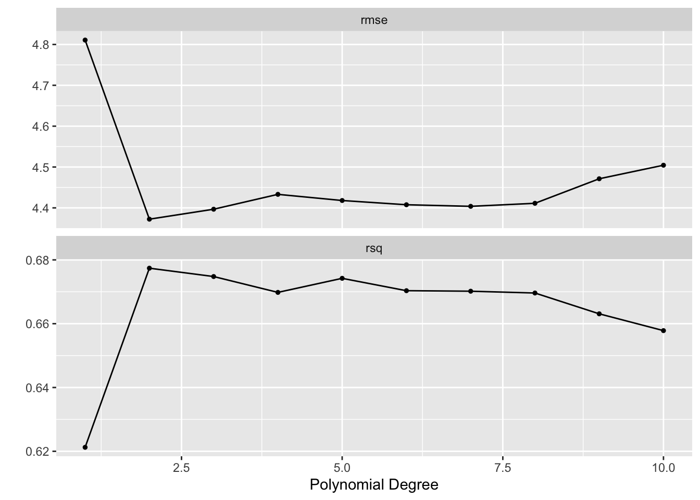

# Resampling Methods

This lab will show us how to perform different resampling techniques. Some of these tasks are quite general and useful in many different areas. The bootstrap being such an example. This chapter introduces a lot of new packages.
This chapter will bring [rsample](https://www.tidymodels.org/start/resampling/) into view for creating resampled data frames as well as [yardstick](https://yardstick.tidymodels.org/) to calculate performance metrics. Lastly, will we also use [tune](https://tune.tidymodels.org/) to fit out models within said resamples. We also see a use of [dials](https://dials.tidymodels.org/) which are used together with tune to select hyperparameter tuning values.


```r
library(tidymodels)
```

```
## Registered S3 method overwritten by 'tune':
##   method                   from   
##   required_pkgs.model_spec parsnip
```

```
## ── Attaching packages ────────────────────────────────────── tidymodels 0.1.3 ──
```

```
## ✓ broom        0.7.6           ✓ recipes      0.1.16.9000
## ✓ dials        0.0.9           ✓ rsample      0.1.0      
## ✓ dplyr        1.0.6           ✓ tibble       3.1.2      
## ✓ ggplot2      3.3.3           ✓ tidyr        1.1.3      
## ✓ infer        0.5.4           ✓ tune         0.1.5      
## ✓ modeldata    0.1.0           ✓ workflows    0.2.2      
## ✓ parsnip      0.1.6           ✓ workflowsets 0.0.2      
## ✓ purrr        0.3.4           ✓ yardstick    0.0.8
```

```
## ── Conflicts ───────────────────────────────────────── tidymodels_conflicts() ──
## x purrr::discard() masks scales::discard()
## x dplyr::filter()  masks stats::filter()
## x dplyr::lag()     masks stats::lag()
## x recipes::step()  masks stats::step()
## • Use tidymodels_prefer() to resolve common conflicts.
```

```r
library(ISLR)

Auto <- tibble(Auto)
```

## The Validation Set Approach

When fitting a model it is often desired to be able to calculate a performance metric to quantify how well the model fits the data. If a model is evaluated on the data it was fit on you are quite likely to get over-optimistic results. It is therefore we split our data into testing and training. This way we can fit the model to data and evaluate it on some other that that is similar.

Splitting of the data is done using random sampling, so it is advised to set a seed before splitting to assure we can reproduce the results.
The `inintial_split()` function takes a data.frame and returns a `rsplit` object. This object contains information about which observations belong to which data set, testing, and training. This is where you would normally set a proportion of data that is used for training and how much is used for evaluation. This is set using the `prop` argument which I set to `0.5` to closely match what happened in ISLR. I'm also setting the `strata` argument. This argument makes sure that both sides of the split have roughly the same distribution for each value of `strata`. If a numeric variable is passed to `strata` then it is binned and distributions are matched within bins.


```r
set.seed(1)
Auto_split <- initial_split(Auto, strata = mpg, prop = 0.5)
Auto_split
```

```
## <Analysis/Assess/Total>
## <194/198/392>
```

The testing and training data sets can be materialized using the `testing()` and `training()` functions respectively.


```r
Auto_train <- training(Auto_split)
Auto_test <- testing(Auto_split)
```

And by looking at `Auto_train` and `Auto_test` we see that the lengths match what we expect.


```r
Auto_train
```

```
## # A tibble: 194 x 9
##      mpg cylinders displacement horsepower weight acceleration  year origin
##    <dbl>     <dbl>        <dbl>      <dbl>  <dbl>        <dbl> <dbl>  <dbl>
##  1    15         8          350        165   3693         11.5    70      1
##  2    16         8          304        150   3433         12      70      1
##  3    14         8          440        215   4312          8.5    70      1
##  4    14         8          455        225   4425         10      70      1
##  5    10         8          307        200   4376         15      70      1
##  6    17         6          250        100   3329         15.5    71      1
##  7    14         8          400        175   4464         11.5    71      1
##  8    14         8          351        153   4154         13.5    71      1
##  9    14         8          318        150   4096         13      71      1
## 10    13         8          400        170   4746         12      71      1
## # … with 184 more rows, and 1 more variable: name <fct>
```

```r
Auto_test
```

```
## # A tibble: 198 x 9
##      mpg cylinders displacement horsepower weight acceleration  year origin
##    <dbl>     <dbl>        <dbl>      <dbl>  <dbl>        <dbl> <dbl>  <dbl>
##  1    18         8          318        150   3436         11      70      1
##  2    17         8          302        140   3449         10.5    70      1
##  3    15         8          429        198   4341         10      70      1
##  4    14         8          454        220   4354          9      70      1
##  5    15         8          390        190   3850          8.5    70      1
##  6    15         8          383        170   3563         10      70      1
##  7    14         8          340        160   3609          8      70      1
##  8    15         8          400        150   3761          9.5    70      1
##  9    14         8          455        225   3086         10      70      1
## 10    22         6          198         95   2833         15.5    70      1
## # … with 188 more rows, and 1 more variable: name <fct>
```

Now that we have a train-test split let us fit some models and evaluate their performance. Before we move on it is important to reiterate that you should only use the testing data set once! Once you have looked at the performance on the testing data set you should not modify your models. If you do you might overfit the model due to data leakage.

Our modeling goal is to predict `mpg` by `horsepower` using a simple linear regression model, and a polynomial regression model. 
First, we set up a linear regression specification.


```r
lm_spec <- linear_reg() %>%
  set_mode("regression") %>%
  set_engine("lm")
```

And we fit it like normal. Note that we are fitting it using `Auto_train`.


```r
lm_fit <- lm_spec %>% 
  fit(mpg ~ horsepower, data = Auto_train)
```

We can now use the `augment()` function to extract the prediction and `rmse()` to calculate the root mean squared error. This will be the testing RMSE since we are evaluating on `Auto_test`.


```r
augment(lm_fit, new_data = Auto_test) %>%
  rmse(truth = mpg, estimate = .pred)
```

```
## # A tibble: 1 x 3
##   .metric .estimator .estimate
##   <chr>   <chr>          <dbl>
## 1 rmse    standard        5.06
```

and we get a RMSE of 5.0583165. This particular value is going to vary depending on what seed number you picked since the random sampling used in splitting the data set will be slightly different.

Using this framework makes it easy for us to calculate the training RMSE


```r
augment(lm_fit, new_data = Auto_train) %>%
  rmse(truth = mpg, estimate = .pred)
```

```
## # A tibble: 1 x 3
##   .metric .estimator .estimate
##   <chr>   <chr>          <dbl>
## 1 rmse    standard        4.74
```

Comparing these two values can give us a look into how generalizable the model is to data it hasn't seen before. We do expect that the training RMSE to be lower than the testing RMSE but if you see a large difference there is an indication of overfitting or a shift between the training data set and testing data set. We don't expect a shift here since the data sets were created with random sampling.

Next we will fit a polynomial regression model. We can use the linear model specification `lm_spec` to add a preprocessing unit with `recipe()` and `step_poly()` to create the polynomial expansion of `horsepower`. we can combine these two with `workflow()` to create a workflow object.


```r
poly_rec <- recipe(mpg ~ horsepower, data = Auto_train) %>%
  step_poly(horsepower, degree = 2)

poly_wf <- workflow() %>%
  add_recipe(poly_rec) %>%
  add_model(lm_spec)

poly_wf
```

```
## ══ Workflow ════════════════════════════════════════════════════════════════════
## Preprocessor: Recipe
## Model: linear_reg()
## 
## ── Preprocessor ────────────────────────────────────────────────────────────────
## 1 Recipe Step
## 
## • step_poly()
## 
## ── Model ───────────────────────────────────────────────────────────────────────
## Linear Regression Model Specification (regression)
## 
## Computational engine: lm
```

We can now fit this model. Again remember to fit it on the training data set `Auto_train`.


```r
poly_fit <- fit(poly_wf, data = Auto_train)
```

The testing RMSE is then calculated as


```r
augment(poly_fit, new_data = Auto_test) %>%
  rmse(truth = mpg, estimate = .pred)
```

```
## # A tibble: 1 x 3
##   .metric .estimator .estimate
##   <chr>   <chr>          <dbl>
## 1 rmse    standard        4.37
```

Which is a little bit lower. So it would appear just from this, that the polynomial regression model has a better fit. Note that we are making decisions using the testing performance metrics, not the training performance metrics.

Lastly, we show below how changing the seed results in a slightly different estimate.


```r
set.seed(2)
Auto_split <- initial_split(Auto)

Auto_train <- training(Auto_split)
Auto_test <- testing(Auto_split)

poly_fit <- fit(poly_wf, data = Auto_train)

augment(poly_fit, new_data = Auto_test) %>%
  rmse(truth = mpg, estimate = .pred)
```

```
## # A tibble: 1 x 3
##   .metric .estimator .estimate
##   <chr>   <chr>          <dbl>
## 1 rmse    standard        4.35
```

## Leave-One-Out Cross-Validation

Leave-One-Out Cross-Validation is not integrated into the broader tidymodels framework. For more information read [here](https://www.tmwr.org/resampling.html#leave-one-out-cross-validation).

## k-Fold Cross-Validation


```r
poly_rec <- recipe(mpg ~ horsepower, data = Auto_train) %>%
  step_poly(horsepower, degree = tune())
```


```r
lm_spec <- linear_reg() %>%
  set_engine("lm")

poly_wf <- workflow() %>%
  add_recipe(poly_rec) %>%
  add_model(lm_spec)

Auto_folds <- vfold_cv(Auto_train, v = 10)

degree_grid <- grid_regular(degree(range = c(1, 10)), levels = 10)

tune_res <- tune_grid(
  object = poly_wf, 
  resamples = Auto_folds, 
  grid = degree_grid
)
```

It can be helpful to add `control = control_grid(verbose = TRUE)` 


```r
autoplot(tune_res)
```




```r
collect_metrics(tune_res)
```

```
## # A tibble: 20 x 7
##    degree .metric .estimator  mean     n std_err .config              
##     <dbl> <chr>   <chr>      <dbl> <int>   <dbl> <chr>                
##  1      1 rmse    standard   4.81     10  0.172  Preprocessor01_Model1
##  2      1 rsq     standard   0.621    10  0.0316 Preprocessor01_Model1
##  3      2 rmse    standard   4.37     10  0.209  Preprocessor02_Model1
##  4      2 rsq     standard   0.677    10  0.0436 Preprocessor02_Model1
##  5      3 rmse    standard   4.40     10  0.217  Preprocessor03_Model1
##  6      3 rsq     standard   0.675    10  0.0446 Preprocessor03_Model1
##  7      4 rmse    standard   4.43     10  0.218  Preprocessor04_Model1
##  8      4 rsq     standard   0.670    10  0.0453 Preprocessor04_Model1
##  9      5 rmse    standard   4.42     10  0.203  Preprocessor05_Model1
## 10      5 rsq     standard   0.674    10  0.0436 Preprocessor05_Model1
## 11      6 rmse    standard   4.41     10  0.189  Preprocessor06_Model1
## 12      6 rsq     standard   0.670    10  0.0423 Preprocessor06_Model1
## 13      7 rmse    standard   4.40     10  0.176  Preprocessor07_Model1
## 14      7 rsq     standard   0.670    10  0.0420 Preprocessor07_Model1
## 15      8 rmse    standard   4.41     10  0.175  Preprocessor08_Model1
## 16      8 rsq     standard   0.670    10  0.0420 Preprocessor08_Model1
## 17      9 rmse    standard   4.47     10  0.207  Preprocessor09_Model1
## 18      9 rsq     standard   0.663    10  0.0445 Preprocessor09_Model1
## 19     10 rmse    standard   4.50     10  0.227  Preprocessor10_Model1
## 20     10 rsq     standard   0.658    10  0.0465 Preprocessor10_Model1
```

```r
show_best(tune_res, metric = "rmse")
```

```
## # A tibble: 5 x 7
##   degree .metric .estimator  mean     n std_err .config              
##    <dbl> <chr>   <chr>      <dbl> <int>   <dbl> <chr>                
## 1      2 rmse    standard    4.37    10   0.209 Preprocessor02_Model1
## 2      3 rmse    standard    4.40    10   0.217 Preprocessor03_Model1
## 3      7 rmse    standard    4.40    10   0.176 Preprocessor07_Model1
## 4      6 rmse    standard    4.41    10   0.189 Preprocessor06_Model1
## 5      8 rmse    standard    4.41    10   0.175 Preprocessor08_Model1
```


```r
best_degree <- select_best(tune_res, metric = "rmse")
```


```r
final_wf <- finalize_workflow(poly_wf, best_degree)

final_wf
```

```
## ══ Workflow ════════════════════════════════════════════════════════════════════
## Preprocessor: Recipe
## Model: linear_reg()
## 
## ── Preprocessor ────────────────────────────────────────────────────────────────
## 1 Recipe Step
## 
## • step_poly()
## 
## ── Model ───────────────────────────────────────────────────────────────────────
## Linear Regression Model Specification (regression)
## 
## Computational engine: lm
```


```r
final_fit <- fit(final_wf, Auto_train)

final_fit
```

```
## ══ Workflow [trained] ══════════════════════════════════════════════════════════
## Preprocessor: Recipe
## Model: linear_reg()
## 
## ── Preprocessor ────────────────────────────────────────────────────────────────
## 1 Recipe Step
## 
## • step_poly()
## 
## ── Model ───────────────────────────────────────────────────────────────────────
## 
## Call:
## stats::lm(formula = ..y ~ ., data = data)
## 
## Coefficients:
##       (Intercept)  horsepower_poly_1  horsepower_poly_2  
##             23.34            -104.85              34.39
```

## The Bootstrap


```r
Portfolio_boots <- bootstraps(Portfolio, times = 1000)

alpha.fn <- function(split) {
  data <- analysis(split)
  X <- data$X
  Y <- data$Y
  
  (var(Y) - cov(X, Y)) / (var(X) + var(Y) - 2 * cov(X, Y))
}

alpha_res <- Portfolio_boots %>%
  mutate(alpha = map_dbl(splits, alpha.fn))

alpha_res
```

```
## # Bootstrap sampling 
## # A tibble: 1,000 x 3
##    splits           id            alpha
##    <list>           <chr>         <dbl>
##  1 <split [100/38]> Bootstrap0001 0.674
##  2 <split [100/41]> Bootstrap0002 0.586
##  3 <split [100/31]> Bootstrap0003 0.701
##  4 <split [100/33]> Bootstrap0004 0.572
##  5 <split [100/35]> Bootstrap0005 0.684
##  6 <split [100/36]> Bootstrap0006 0.530
##  7 <split [100/35]> Bootstrap0007 0.609
##  8 <split [100/37]> Bootstrap0008 0.530
##  9 <split [100/36]> Bootstrap0009 0.619
## 10 <split [100/39]> Bootstrap0010 0.475
## # … with 990 more rows
```


```r
Auto_boots <- bootstraps(Auto)

boot.fn <- function(split) {
  lm_fit <- lm_spec %>% fit(mpg ~ horsepower, data = analysis(split))
  tidy(lm_fit)
}

boot_res <- Auto_boots %>%
  mutate(models = map(splits, boot.fn))

boot_res %>%
  unnest(cols = c(models)) %>%
  group_by(term) %>%
  summarise(mean = mean(estimate),
            sd = sd(estimate))
```

```
## # A tibble: 2 x 3
##   term          mean      sd
##   <chr>        <dbl>   <dbl>
## 1 (Intercept) 39.7   0.691  
## 2 horsepower  -0.156 0.00614
```
