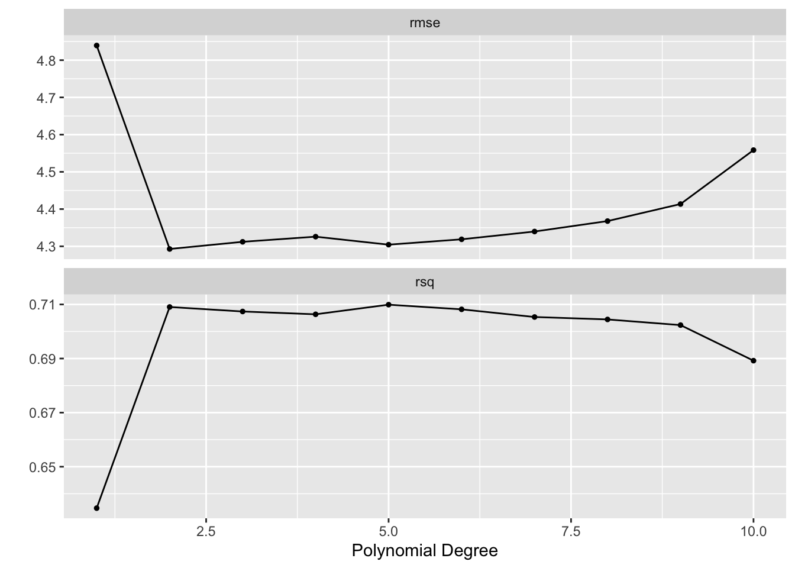

# Resampling Methods


```r
library(tidymodels)
```

```
## ── Attaching packages ────────────────────────────────────── tidymodels 0.1.2 ──
```

```
## ✓ broom     0.7.5           ✓ recipes   0.1.15.9000
## ✓ dials     0.0.9           ✓ rsample   0.0.9      
## ✓ dplyr     1.0.5           ✓ tibble    3.1.0      
## ✓ ggplot2   3.3.3           ✓ tidyr     1.1.3      
## ✓ infer     0.5.4           ✓ tune      0.1.3      
## ✓ modeldata 0.1.0           ✓ workflows 0.2.2      
## ✓ parsnip   0.1.5           ✓ yardstick 0.0.8      
## ✓ purrr     0.3.4
```

```
## ── Conflicts ───────────────────────────────────────── tidymodels_conflicts() ──
## x purrr::discard() masks scales::discard()
## x dplyr::filter()  masks stats::filter()
## x dplyr::lag()     masks stats::lag()
## x recipes::step()  masks stats::step()
```

```r
library(ISLR)

Auto <- as_tibble(Auto)
Portfolio <- as_tibble(Portfolio)
```


## The Validation Set Approach


```r
set.seed(1)
Auto_split <- initial_split(Auto)

Auto_train <- training(Auto_split)
Auto_test <- testing(Auto_split)
```


```r
lm_spec <- linear_reg() %>%
  set_engine("lm")
```


```r
lm_fit <- lm_spec %>% 
  fit(mpg ~ horsepower, data = Auto_train)
```


```r
augment(lm_fit, new_data = Auto_test) %>%
  rmse(truth = mpg, estimate = .pred)
```

```
## # A tibble: 1 x 3
##   .metric .estimator .estimate
##   <chr>   <chr>          <dbl>
## 1 rmse    standard        5.11
```


```r
poly_fit <- lm_spec %>% 
  fit(mpg ~ poly(horsepower, 2), data = Auto_train)
```


```r
augment(poly_fit, new_data = Auto_test) %>%
  rmse(truth = mpg, estimate = .pred)
```

```
## # A tibble: 1 x 3
##   .metric .estimator .estimate
##   <chr>   <chr>          <dbl>
## 1 rmse    standard        4.54
```


```r
poly_rec <- recipe(mpg ~ horsepower, data = Auto_train) %>%
  step_poly(horsepower, degree = 2)

poly_wf <- workflow() %>%
  add_recipe(poly_rec) %>%
  add_model(lm_spec)

poly_fit <- fit(poly_wf, data = Auto_train)
```


```r
augment(poly_fit, new_data = Auto_test) %>%
  rmse(truth = mpg, estimate = .pred)
```

```
## # A tibble: 1 x 3
##   .metric .estimator .estimate
##   <chr>   <chr>          <dbl>
## 1 rmse    standard        4.54
```


```r
set.seed(2)
Auto_split <- initial_split(Auto)

Auto_train <- training(Auto_split)
Auto_test <- testing(Auto_split)
```


```r
poly_fit <- fit(poly_wf, data = Auto_train)

augment(poly_fit, new_data = Auto_test) %>%
  rmse(truth = mpg, estimate = .pred)
```

```
## # A tibble: 1 x 3
##   .metric .estimator .estimate
##   <chr>   <chr>          <dbl>
## 1 rmse    standard        4.66
```

## Leave-One-Out Cross-Validation

Leave-One-Out Cross-Validation is not integrated into the broader tidymodels framework. For more information read [here](https://www.tmwr.org/resampling.html#leave-one-out-cross-validation).

## k-Fold Cross-Validation


```r
poly_rec <- recipe(mpg ~ horsepower, data = Auto_train) %>%
  step_poly(horsepower, degree = tune())
```


```r
lm_spec <- linear_reg() %>%
  set_engine("lm")

poly_wf <- workflow() %>%
  add_recipe(poly_rec) %>%
  add_model(lm_spec)

Auto_folds <- vfold_cv(Auto_train, v = 10)

degree_grid <- grid_regular(degree(range = c(1, 10)), levels = 10)

tune_res <- tune_grid(
  object = poly_wf, 
  resamples = Auto_folds, 
  grid = degree_grid
)
```

It can be helpful to add `control = control_grid(verbose = TRUE)` 


```r
autoplot(tune_res)
```




```r
collect_metrics(tune_res)
```

```
## # A tibble: 20 x 7
##    degree .metric .estimator  mean     n std_err .config              
##     <dbl> <chr>   <chr>      <dbl> <int>   <dbl> <chr>                
##  1      1 rmse    standard   4.84     10  0.194  Preprocessor01_Model1
##  2      1 rsq     standard   0.635    10  0.0209 Preprocessor01_Model1
##  3      2 rmse    standard   4.29     10  0.155  Preprocessor02_Model1
##  4      2 rsq     standard   0.709    10  0.0224 Preprocessor02_Model1
##  5      3 rmse    standard   4.31     10  0.154  Preprocessor03_Model1
##  6      3 rsq     standard   0.707    10  0.0219 Preprocessor03_Model1
##  7      4 rmse    standard   4.33     10  0.152  Preprocessor04_Model1
##  8      4 rsq     standard   0.706    10  0.0217 Preprocessor04_Model1
##  9      5 rmse    standard   4.30     10  0.149  Preprocessor05_Model1
## 10      5 rsq     standard   0.710    10  0.0208 Preprocessor05_Model1
## 11      6 rmse    standard   4.32     10  0.149  Preprocessor06_Model1
## 12      6 rsq     standard   0.708    10  0.0203 Preprocessor06_Model1
## 13      7 rmse    standard   4.34     10  0.152  Preprocessor07_Model1
## 14      7 rsq     standard   0.705    10  0.0203 Preprocessor07_Model1
## 15      8 rmse    standard   4.37     10  0.151  Preprocessor08_Model1
## 16      8 rsq     standard   0.704    10  0.0212 Preprocessor08_Model1
## 17      9 rmse    standard   4.41     10  0.172  Preprocessor09_Model1
## 18      9 rsq     standard   0.702    10  0.0226 Preprocessor09_Model1
## 19     10 rmse    standard   4.56     10  0.158  Preprocessor10_Model1
## 20     10 rsq     standard   0.689    10  0.0198 Preprocessor10_Model1
```

```r
show_best(tune_res, metric = "rmse")
```

```
## # A tibble: 5 x 7
##   degree .metric .estimator  mean     n std_err .config              
##    <dbl> <chr>   <chr>      <dbl> <int>   <dbl> <chr>                
## 1      2 rmse    standard    4.29    10   0.155 Preprocessor02_Model1
## 2      5 rmse    standard    4.30    10   0.149 Preprocessor05_Model1
## 3      3 rmse    standard    4.31    10   0.154 Preprocessor03_Model1
## 4      6 rmse    standard    4.32    10   0.149 Preprocessor06_Model1
## 5      4 rmse    standard    4.33    10   0.152 Preprocessor04_Model1
```


```r
best_degree <- select_best(tune_res, metric = "rmse")
```


```r
final_wf <- finalize_workflow(poly_wf, best_degree)

final_wf
```

```
## ══ Workflow ════════════════════════════════════════════════════════════════════
## Preprocessor: Recipe
## Model: linear_reg()
## 
## ── Preprocessor ────────────────────────────────────────────────────────────────
## 1 Recipe Step
## 
## ● step_poly()
## 
## ── Model ───────────────────────────────────────────────────────────────────────
## Linear Regression Model Specification (regression)
## 
## Computational engine: lm
```


```r
final_fit <- fit(final_wf, Auto_train)

final_fit
```

```
## ══ Workflow [trained] ══════════════════════════════════════════════════════════
## Preprocessor: Recipe
## Model: linear_reg()
## 
## ── Preprocessor ────────────────────────────────────────────────────────────────
## 1 Recipe Step
## 
## ● step_poly()
## 
## ── Model ───────────────────────────────────────────────────────────────────────
## 
## Call:
## stats::lm(formula = ..y ~ ., data = data)
## 
## Coefficients:
##       (Intercept)  horsepower_poly_1  horsepower_poly_2  
##             23.49            -106.32              38.94
```

## The Bootstrap


```r
Portfolio_boots <- bootstraps(Portfolio, times = 1000)

alpha.fn <- function(split) {
  data <- analysis(split)
  X <- data$X
  Y <- data$Y
  
  (var(Y) - cov(X, Y)) / (var(X) + var(Y) - 2 * cov(X, Y))
}

alpha_res <- Portfolio_boots %>%
  mutate(alpha = map_dbl(splits, alpha.fn))

alpha_res
```

```
## # Bootstrap sampling 
## # A tibble: 1,000 x 3
##    splits           id            alpha
##    <list>           <chr>         <dbl>
##  1 <split [100/37]> Bootstrap0001 0.457
##  2 <split [100/38]> Bootstrap0002 0.522
##  3 <split [100/33]> Bootstrap0003 0.482
##  4 <split [100/35]> Bootstrap0004 0.614
##  5 <split [100/35]> Bootstrap0005 0.598
##  6 <split [100/38]> Bootstrap0006 0.624
##  7 <split [100/34]> Bootstrap0007 0.700
##  8 <split [100/40]> Bootstrap0008 0.416
##  9 <split [100/34]> Bootstrap0009 0.540
## 10 <split [100/36]> Bootstrap0010 0.735
## # … with 990 more rows
```


```r
Auto_boots <- bootstraps(Auto)

boot.fn <- function(split) {
  lm_fit <- lm_spec %>% fit(mpg ~ horsepower, data = analysis(split))
  tidy(lm_fit)
}

boot_res <- Auto_boots %>%
  mutate(models = map(splits, boot.fn))

boot_res %>%
  unnest(cols = c(models)) %>%
  group_by(term) %>%
  summarise(mean = mean(estimate),
            sd = sd(estimate))
```

```
## # A tibble: 2 x 3
##   term          mean      sd
##   <chr>        <dbl>   <dbl>
## 1 (Intercept) 39.8   0.718  
## 2 horsepower  -0.156 0.00620
```
