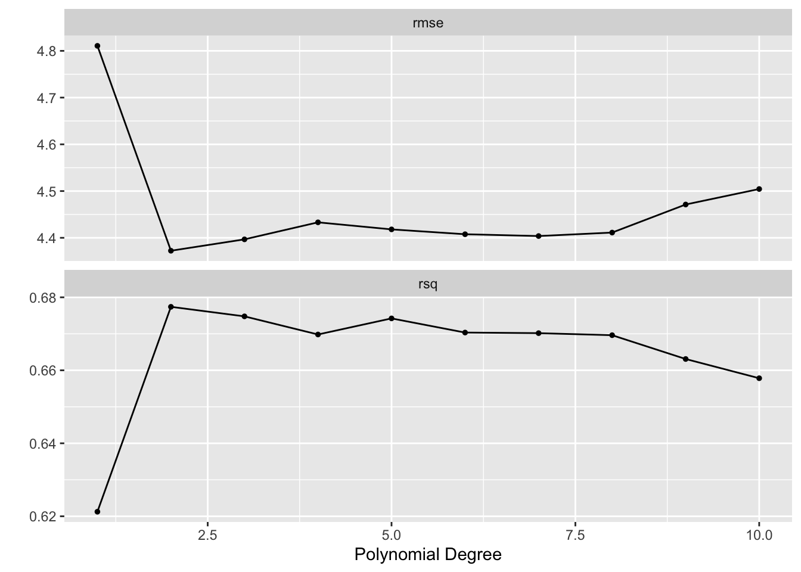

# Resampling Methods


This lab will show us how to perform different resampling techniques. Some of these tasks are quite general and useful in many different areas. The bootstrap being such an example. This chapter introduces a lot of new packages.
This chapter will bring [rsample](https://www.tidymodels.org/start/resampling/) into view for creating resampled data frames as well as [yardstick](https://yardstick.tidymodels.org/) to calculate performance metrics. Finally, we will use [tune](https://tune.tidymodels.org/) to fit our models within resamples and [dials](https://dials.tidymodels.org/) to help with the selection of hyperparameter tuning values.


```r
library(tidymodels)
library(ISLR)

Auto <- tibble(Auto)
Portfolio <- tibble(Portfolio)
```

## The Validation Set Approach

When fitting a model it is often desired to be able to calculate a performance metric to quantify how well the model fits the data. If a model is evaluated on the data it was fit on you are quite likely to get over-optimistic results. It is therefore we split our data into testing and training. This way we can fit the model to data and evaluate it on some other that that is similar.

Splitting of the data is done using random sampling, so it is advised to set a seed before splitting to assure we can reproduce the results.
The `initial_split()` function takes a data.frame and returns a `rsplit` object. This object contains information about which observations belong to which data set, testing, and training. This is where you would normally set a proportion of data that is used for training and how much is used for evaluation. This is set using the `prop` argument which I set to `0.5` to closely match what happened in ISLR. I'm also setting the `strata` argument. This argument makes sure that both sides of the split have roughly the same distribution for each value of `strata`. If a numeric variable is passed to `strata` then it is binned and distributions are matched within bins.


```r
set.seed(1)
Auto_split <- initial_split(Auto, strata = mpg, prop = 0.5)
Auto_split
```

```
## <Training/Testing/Total>
## <194/198/392>
```

The testing and training data sets can be materialized using the `testing()` and `training()` functions respectively.


```r
Auto_train <- training(Auto_split)
Auto_test <- testing(Auto_split)
```

And by looking at `Auto_train` and `Auto_test` we see that the lengths match what we expect.


```r
Auto_train
```

```
## # A tibble: 194 × 9
##      mpg cylinders displacement horsepower weight acceleration  year origin
##    <dbl>     <dbl>        <dbl>      <dbl>  <dbl>        <dbl> <dbl>  <dbl>
##  1    15         8          350        165   3693         11.5    70      1
##  2    16         8          304        150   3433         12      70      1
##  3    14         8          440        215   4312          8.5    70      1
##  4    14         8          455        225   4425         10      70      1
##  5    10         8          307        200   4376         15      70      1
##  6    17         6          250        100   3329         15.5    71      1
##  7    14         8          400        175   4464         11.5    71      1
##  8    14         8          351        153   4154         13.5    71      1
##  9    14         8          318        150   4096         13      71      1
## 10    13         8          400        170   4746         12      71      1
## # … with 184 more rows, and 1 more variable: name <fct>
```

```r
Auto_test
```

```
## # A tibble: 198 × 9
##      mpg cylinders displacement horsepower weight acceleration  year origin
##    <dbl>     <dbl>        <dbl>      <dbl>  <dbl>        <dbl> <dbl>  <dbl>
##  1    18         8          318        150   3436         11      70      1
##  2    17         8          302        140   3449         10.5    70      1
##  3    15         8          429        198   4341         10      70      1
##  4    14         8          454        220   4354          9      70      1
##  5    15         8          390        190   3850          8.5    70      1
##  6    15         8          383        170   3563         10      70      1
##  7    14         8          340        160   3609          8      70      1
##  8    15         8          400        150   3761          9.5    70      1
##  9    14         8          455        225   3086         10      70      1
## 10    22         6          198         95   2833         15.5    70      1
## # … with 188 more rows, and 1 more variable: name <fct>
```

Now that we have a train-test split let us fit some models and evaluate their performance. Before we move on it is important to reiterate that you should only use the testing data set once! Once you have looked at the performance on the testing data set you should not modify your models. If you do you might overfit the model due to data leakage.

Our modeling goal is to predict `mpg` by `horsepower` using a simple linear regression model, and a polynomial regression model. 
First, we set up a linear regression specification.


```r
lm_spec <- linear_reg() %>%
  set_mode("regression") %>%
  set_engine("lm")
```

And we fit it like normal. Note that we are fitting it using `Auto_train`.


```r
lm_fit <- lm_spec %>% 
  fit(mpg ~ horsepower, data = Auto_train)
```

We can now use the `augment()` function to extract the prediction and `rmse()` to calculate the root mean squared error. This will be the testing RMSE since we are evaluating on `Auto_test`.


```r
augment(lm_fit, new_data = Auto_test) %>%
  rmse(truth = mpg, estimate = .pred)
```

```
## # A tibble: 1 × 3
##   .metric .estimator .estimate
##   <chr>   <chr>          <dbl>
## 1 rmse    standard        5.06
```

and we get a RMSE of 5.0583165. This particular value is going to vary depending on what seed number you picked since the random sampling used in splitting the data set will be slightly different.

Using this framework makes it easy for us to calculate the training RMSE


```r
augment(lm_fit, new_data = Auto_train) %>%
  rmse(truth = mpg, estimate = .pred)
```

```
## # A tibble: 1 × 3
##   .metric .estimator .estimate
##   <chr>   <chr>          <dbl>
## 1 rmse    standard        4.74
```

Comparing these two values can give us a look into how generalizable the model is to data it hasn't seen before. We do expect that the training RMSE to be lower than the testing RMSE but if you see a large difference there is an indication of overfitting or a shift between the training data set and testing data set. We don't expect a shift here since the data sets were created with random sampling.

Next we will fit a polynomial regression model. We can use the linear model specification `lm_spec` to add a preprocessing unit with `recipe()` and `step_poly()` to create the polynomial expansion of `horsepower`. we can combine these two with `workflow()` to create a workflow object.


```r
poly_rec <- recipe(mpg ~ horsepower, data = Auto_train) %>%
  step_poly(horsepower, degree = 2)

poly_wf <- workflow() %>%
  add_recipe(poly_rec) %>%
  add_model(lm_spec)

poly_wf
```

```
## ══ Workflow ════════════════════════════════════════════════════════════════════
## Preprocessor: Recipe
## Model: linear_reg()
## 
## ── Preprocessor ────────────────────────────────────────────────────────────────
## 1 Recipe Step
## 
## • step_poly()
## 
## ── Model ───────────────────────────────────────────────────────────────────────
## Linear Regression Model Specification (regression)
## 
## Computational engine: lm
```

We can now fit this model. Again remember to fit it on the training data set `Auto_train`.


```r
poly_fit <- fit(poly_wf, data = Auto_train)
```

The testing RMSE is then calculated as


```r
augment(poly_fit, new_data = Auto_test) %>%
  rmse(truth = mpg, estimate = .pred)
```

```
## # A tibble: 1 × 3
##   .metric .estimator .estimate
##   <chr>   <chr>          <dbl>
## 1 rmse    standard        4.37
```

Which is a little bit lower. So it would appear just from this, that the polynomial regression model has a better fit. Note that we are making decisions using the testing performance metrics, not the training performance metrics.

Lastly, we show below how changing the seed results in a slightly different estimate.


```r
set.seed(2)
Auto_split <- initial_split(Auto)

Auto_train <- training(Auto_split)
Auto_test <- testing(Auto_split)

poly_fit <- fit(poly_wf, data = Auto_train)

augment(poly_fit, new_data = Auto_test) %>%
  rmse(truth = mpg, estimate = .pred)
```

```
## # A tibble: 1 × 3
##   .metric .estimator .estimate
##   <chr>   <chr>          <dbl>
## 1 rmse    standard        4.35
```

## Leave-One-Out Cross-Validation

Leave-One-Out Cross-Validation is not integrated into the broader tidymodels framework. For more information read [here](https://www.tmwr.org/resampling.html#leave-one-out-cross-validation).

## k-Fold Cross-Validation

Earlier we set `degree = 2` to create a second-degree polynomial regression model. But suppose we want to find the best value of `degree` that yields the "closest" fit. This is known as hyperparameter tuning and it is a case where we can use k-Fold Cross-Validation. To use k-Fold Cross-Validation we will be using the `tune` package, and we need 3 things to get it working:

- A parsnip/workflow object with one or more arguments marked for tuning,
- A `vfold_cv` rsample object of the cross-validation resamples,
- A tibble denoting the values of hyperparameter values to be explored.

we are doing the hyperparameter tuning on just one parameter, namely the `degree` argument in `step_poly()`. Creating a new recipe with `degree = tune()` indicated that we intend for `degree` to be tuned.


```r
poly_tuned_rec <- recipe(mpg ~ horsepower, data = Auto_train) %>%
  step_poly(horsepower, degree = tune())

poly_tuned_wf <- workflow() %>%
  add_recipe(poly_tuned_rec) %>%
  add_model(lm_spec)
```

This means that would not be able to fit this workflow right now as the value of `degree` is unspecified, and if we try we get an error:


```r
fit(poly_tuned_wf, data = Auto_train)
```

```
## Error in `recipes::prep()`:
## ! You cannot `prep()` a tuneable recipe. Argument(s) with `tune()`: 'degree'. Do you want to use a tuning function such as `tune_grid()`?
```

The next thing we need to create is the k-Fold data set. This can be done using the `vfold_cv()` function. Note that the function uses `v` instead of *k* which is the terminology of ISLR. we set `v = 10` as a common choice for *k*.


```r
Auto_folds <- vfold_cv(Auto_train, v = 10)
Auto_folds
```

```
## #  10-fold cross-validation 
## # A tibble: 10 × 2
##    splits           id    
##    <list>           <chr> 
##  1 <split [264/30]> Fold01
##  2 <split [264/30]> Fold02
##  3 <split [264/30]> Fold03
##  4 <split [264/30]> Fold04
##  5 <split [265/29]> Fold05
##  6 <split [265/29]> Fold06
##  7 <split [265/29]> Fold07
##  8 <split [265/29]> Fold08
##  9 <split [265/29]> Fold09
## 10 <split [265/29]> Fold10
```

The result is a tibble of `vfold_split`s which is quite similar to the `rsplit` object we saw earlier.

The last thing we need is a tibble of possible values we want to explore. Each of the tunable parameters in tidymodels has an associated function in the [dials package](https://dials.tidymodels.org/reference/index.html). We need to use the `degree()` function here, and we extend the range to have a max of 10. This dials function is then passed to `grid_regular()` to create a regular grid of values.


```r
degree_grid <- grid_regular(degree(range = c(1, 10)), levels = 10)
```

Using `grid_regular()` is a little overkill for this application since the following code would provide the same result. But once you have multiple parameters you want to tune it makes sure that everything is in check and properly named.


```r
degree_grid <- tibble(degree = seq(1, 10))
```

Now that all the necessary objects have been created we can pass them to `tune_grid()` which will fit the models within each fold for each value specified in `degree_grid`.


```r
tune_res <- tune_grid(
  object = poly_tuned_wf, 
  resamples = Auto_folds, 
  grid = degree_grid
)
```

It can be helpful to add `control = control_grid(verbose = TRUE)`, this will print out the progress. Especially helpful when the models take a while to fit. `tune_res` by itself isn't easily readable. Luckily `tune` provides a handful of helper functions.

`autoplot()` gives a visual overview of the performance of different hyperparameter pairs.


```r
autoplot(tune_res)
```



It appears that the biggest jump in performance comes from going to `degree = 2`. Afterward, there might be a little bit of improvement but it isn't as obvious.

The number used for plotting can be extracted directly with `collect_metrics()`. We also get an estimate of the standard error of the performance metric. We get this since we have 10 different estimates, one for each fold.


```r
collect_metrics(tune_res)
```

```
## # A tibble: 20 × 7
##    degree .metric .estimator  mean     n std_err .config              
##     <int> <chr>   <chr>      <dbl> <int>   <dbl> <chr>                
##  1      1 rmse    standard   4.81     10  0.172  Preprocessor01_Model1
##  2      1 rsq     standard   0.621    10  0.0316 Preprocessor01_Model1
##  3      2 rmse    standard   4.37     10  0.209  Preprocessor02_Model1
##  4      2 rsq     standard   0.677    10  0.0436 Preprocessor02_Model1
##  5      3 rmse    standard   4.40     10  0.217  Preprocessor03_Model1
##  6      3 rsq     standard   0.675    10  0.0446 Preprocessor03_Model1
##  7      4 rmse    standard   4.43     10  0.218  Preprocessor04_Model1
##  8      4 rsq     standard   0.670    10  0.0453 Preprocessor04_Model1
##  9      5 rmse    standard   4.42     10  0.203  Preprocessor05_Model1
## 10      5 rsq     standard   0.674    10  0.0436 Preprocessor05_Model1
## 11      6 rmse    standard   4.41     10  0.189  Preprocessor06_Model1
## 12      6 rsq     standard   0.670    10  0.0423 Preprocessor06_Model1
## 13      7 rmse    standard   4.40     10  0.176  Preprocessor07_Model1
## 14      7 rsq     standard   0.670    10  0.0420 Preprocessor07_Model1
## 15      8 rmse    standard   4.41     10  0.175  Preprocessor08_Model1
## 16      8 rsq     standard   0.670    10  0.0420 Preprocessor08_Model1
## 17      9 rmse    standard   4.47     10  0.207  Preprocessor09_Model1
## 18      9 rsq     standard   0.663    10  0.0445 Preprocessor09_Model1
## 19     10 rmse    standard   4.50     10  0.227  Preprocessor10_Model1
## 20     10 rsq     standard   0.658    10  0.0465 Preprocessor10_Model1
```

You can also use `show_best()` to only show the best performing models.


```r
show_best(tune_res, metric = "rmse")
```

```
## # A tibble: 5 × 7
##   degree .metric .estimator  mean     n std_err .config              
##    <int> <chr>   <chr>      <dbl> <int>   <dbl> <chr>                
## 1      2 rmse    standard    4.37    10   0.209 Preprocessor02_Model1
## 2      3 rmse    standard    4.40    10   0.217 Preprocessor03_Model1
## 3      7 rmse    standard    4.40    10   0.176 Preprocessor07_Model1
## 4      6 rmse    standard    4.41    10   0.189 Preprocessor06_Model1
## 5      8 rmse    standard    4.41    10   0.175 Preprocessor08_Model1
```

We did see that the performance plateaued after `degree = 2`. There are a couple of function to select models by more sophisticated rules. `select_by_one_std_err()` and `select_by_pct_loss()`.  Here we use `select_by_one_std_err()` which selects the most simple model that is within one standard error of the numerically optimal results. We need to specify `degree` to tell `select_by_one_std_err()` which direction is more simple.

You want to

- use `desc(you_model_parameter)` if larger values lead to a simpler model
- use `you_model_parameter` if smaller values lead to a simpler model

lower polynomials models are simpler so we ditch `desc()`.


```r
select_by_one_std_err(tune_res, degree, metric = "rmse")
```

```
## # A tibble: 1 × 9
##   degree .metric .estimator  mean     n std_err .config             .best .bound
##    <int> <chr>   <chr>      <dbl> <int>   <dbl> <chr>               <dbl>  <dbl>
## 1      2 rmse    standard    4.37    10   0.209 Preprocessor02_Mod…  4.37   4.58
```

This selected `degree = 2`. And we will use this value since we simpler models sometimes can be very beneficial. Especially if we want to explain what happens in it.


```r
best_degree <- select_by_one_std_err(tune_res, degree, metric = "rmse")
```

This selected value can be now be used to specify the previous unspecified `degree` argument in `poly_wf` using `finalize_workflow()`.


```r
final_wf <- finalize_workflow(poly_wf, best_degree)

final_wf
```

```
## ══ Workflow ════════════════════════════════════════════════════════════════════
## Preprocessor: Recipe
## Model: linear_reg()
## 
## ── Preprocessor ────────────────────────────────────────────────────────────────
## 1 Recipe Step
## 
## • step_poly()
## 
## ── Model ───────────────────────────────────────────────────────────────────────
## Linear Regression Model Specification (regression)
## 
## Computational engine: lm
```

This workflow can now be fitted. And we want to make sure we fit it on the full training data set.


```r
final_fit <- fit(final_wf, Auto_train)

final_fit
```

```
## ══ Workflow [trained] ══════════════════════════════════════════════════════════
## Preprocessor: Recipe
## Model: linear_reg()
## 
## ── Preprocessor ────────────────────────────────────────────────────────────────
## 1 Recipe Step
## 
## • step_poly()
## 
## ── Model ───────────────────────────────────────────────────────────────────────
## 
## Call:
## stats::lm(formula = ..y ~ ., data = data)
## 
## Coefficients:
##       (Intercept)  horsepower_poly_1  horsepower_poly_2  
##             23.34            -104.85              34.39
```

## The Bootstrap


This section illustrates the use of the bootstrap in the simple Section 5.2  of ISLR, as well as on an example involving estimating the accuracy of the linear regression model on the `Auto` data set.

First, we want to look at the accuracy of a statistic of interest. This statistic is justified in ISLR. We want to calculate the metric within many different bootstraps. We start by calculating 1000 bootstraps of the `Portfolio` data set.


```r
Portfolio_boots <- bootstraps(Portfolio, times = 1000)
Portfolio_boots
```

```
## # Bootstrap sampling 
## # A tibble: 1,000 × 2
##    splits           id           
##    <list>           <chr>        
##  1 <split [100/36]> Bootstrap0001
##  2 <split [100/39]> Bootstrap0002
##  3 <split [100/39]> Bootstrap0003
##  4 <split [100/33]> Bootstrap0004
##  5 <split [100/39]> Bootstrap0005
##  6 <split [100/34]> Bootstrap0006
##  7 <split [100/40]> Bootstrap0007
##  8 <split [100/38]> Bootstrap0008
##  9 <split [100/36]> Bootstrap0009
## 10 <split [100/41]> Bootstrap0010
## # … with 990 more rows
```

The result is a tibble of `boot_split` objects. The rsample has constructed these splits in such a way that these 1000 bootstraps take up way less than 1000 times the space as `Portfolio`.

Next, we create a function that takes a `boot_split` object and returns the calculated metric.


```r
alpha.fn <- function(split) {
  data <- analysis(split)
  X <- data$X
  Y <- data$Y
  
  (var(Y) - cov(X, Y)) / (var(X) + var(Y) - 2 * cov(X, Y))
}
```

Now we can use `mutate()` and `map_dbl()` from [dplyr](https://dplyr.tidyverse.org/) and [purrr](https://purrr.tidyverse.org/) respectively to apply `alpha.fn` to each of the bootstraps.


```r
alpha_res <- Portfolio_boots %>%
  mutate(alpha = map_dbl(splits, alpha.fn))

alpha_res
```

```
## # Bootstrap sampling 
## # A tibble: 1,000 × 3
##    splits           id            alpha
##    <list>           <chr>         <dbl>
##  1 <split [100/36]> Bootstrap0001 0.516
##  2 <split [100/39]> Bootstrap0002 0.687
##  3 <split [100/39]> Bootstrap0003 0.599
##  4 <split [100/33]> Bootstrap0004 0.556
##  5 <split [100/39]> Bootstrap0005 0.549
##  6 <split [100/34]> Bootstrap0006 0.619
##  7 <split [100/40]> Bootstrap0007 0.387
##  8 <split [100/38]> Bootstrap0008 0.675
##  9 <split [100/36]> Bootstrap0009 0.538
## 10 <split [100/41]> Bootstrap0010 0.407
## # … with 990 more rows
```

and now we have all the bootstrap sample values. These can now further be analyzed.

In the next example do we want to study the variability of the slope and intercept estimate of the linear regression model. And it follows the same structure. First, we create some bootstraps of the data. Then we create a function that takes a split and returns some values. This function will return a tibble for each bootstrap.


```r
Auto_boots <- bootstraps(Auto)

boot.fn <- function(split) {
  lm_fit <- lm_spec %>% fit(mpg ~ horsepower, data = analysis(split))
  tidy(lm_fit)
}
```

then we use `mutate()` and `map()` to apply the function to each of the bootstraps.


```r
boot_res <- Auto_boots %>%
  mutate(models = map(splits, boot.fn))
```

And we can now `unnest()` and use `group_by()` and `summarise()` to get an estimate of the variability of the slope and intercept in this linear regression model.


```r
boot_res %>%
  unnest(cols = c(models)) %>%
  group_by(term) %>%
  summarise(mean = mean(estimate),
            sd = sd(estimate))
```

```
## # A tibble: 2 × 3
##   term          mean      sd
##   <chr>        <dbl>   <dbl>
## 1 (Intercept) 39.8   0.759  
## 2 horsepower  -0.156 0.00593
```
