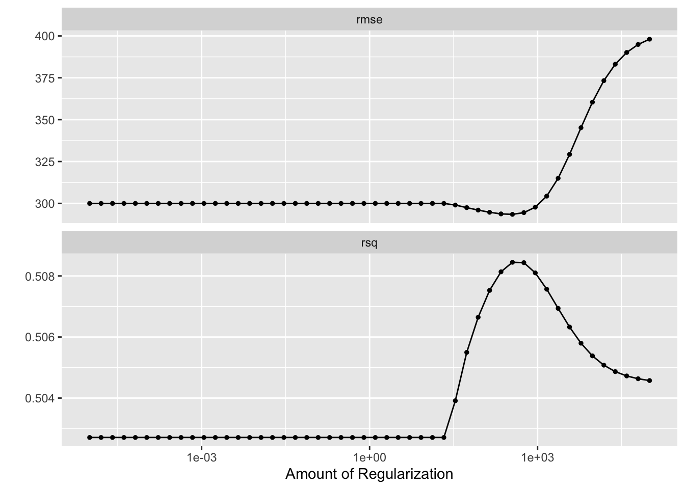
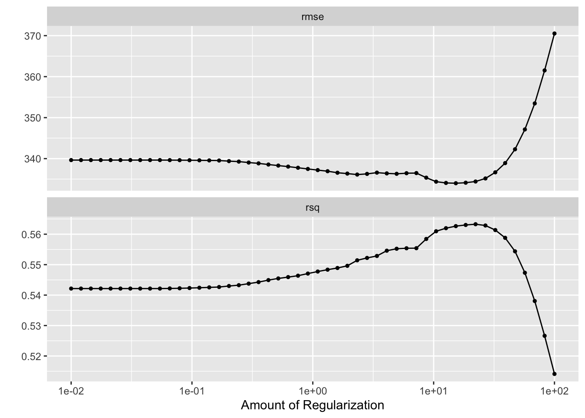
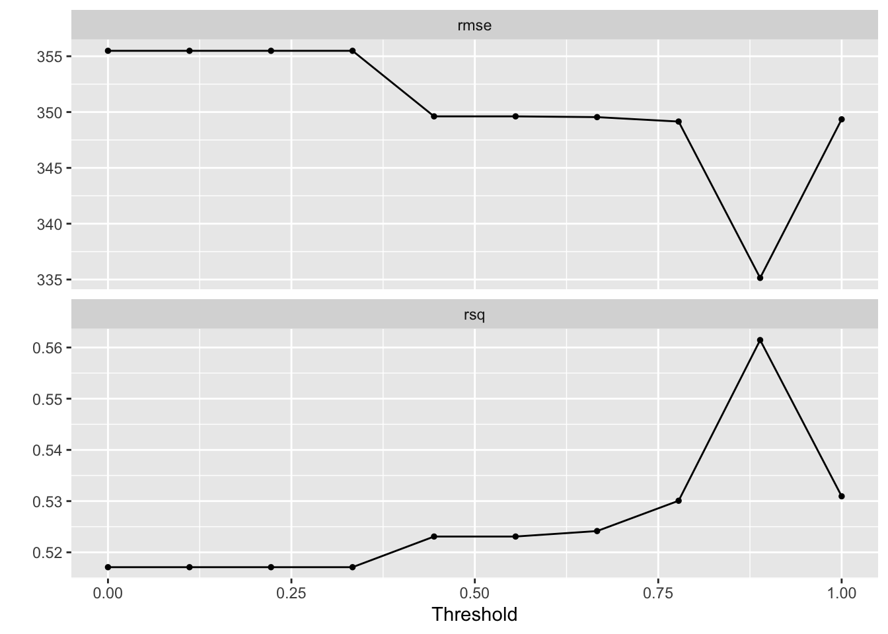
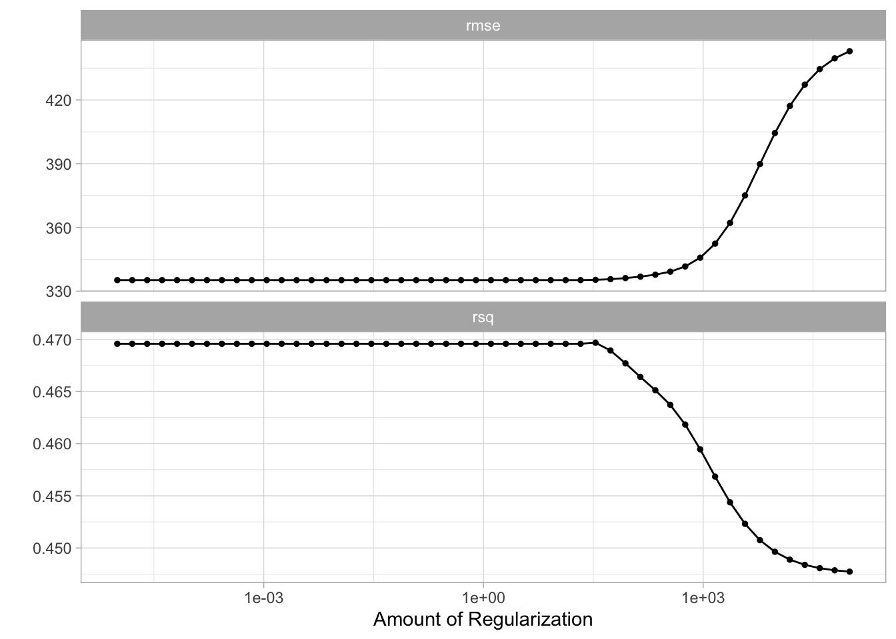

# Linear Model Selection and Regularization


```r
library(tidymodels)
```

```
## ── Attaching packages ────────────────────────────────────── tidymodels 0.1.2 ──
```

```
## ✓ broom     0.7.5           ✓ recipes   0.1.15.9000
## ✓ dials     0.0.9           ✓ rsample   0.0.9      
## ✓ dplyr     1.0.5           ✓ tibble    3.1.0      
## ✓ ggplot2   3.3.3           ✓ tidyr     1.1.3      
## ✓ infer     0.5.4           ✓ tune      0.1.3      
## ✓ modeldata 0.1.0           ✓ workflows 0.2.2      
## ✓ parsnip   0.1.5           ✓ yardstick 0.0.8      
## ✓ purrr     0.3.4
```

```
## ── Conflicts ───────────────────────────────────────── tidymodels_conflicts() ──
## x purrr::discard() masks scales::discard()
## x dplyr::filter()  masks stats::filter()
## x dplyr::lag()     masks stats::lag()
## x recipes::step()  masks stats::step()
```

```r
library(ISLR)

Hitters <- as_tibble(Hitters) %>%
  filter(!is.na(Salary))
```


## Best Subset Selection

tidymodels does not currently support subset selection methods, and it unlikely to include it in the [near future](https://stackoverflow.com/questions/66651033/stepwise-algorithm-in-tidymodels#comment117845482_66651033).

## Forward and Backward Stepwise Selection

tidymodels does not currently support forward and backward stepwise selection methods, and it unlikely to include it in the [near future](https://stackoverflow.com/questions/66651033/stepwise-algorithm-in-tidymodels#comment117845482_66651033).

## Ridge Regression


```r
ridge_spec <- linear_reg(mixture = 0) %>%
  set_engine("glmnet")
```


```r
ridge_fit <- fit(ridge_spec, Salary ~ ., data = Hitters)
```


```r
tidy(ridge_fit, penalty = 11498)
```

```
## Loading required package: Matrix
```

```
## 
## Attaching package: 'Matrix'
```

```
## The following objects are masked from 'package:tidyr':
## 
##     expand, pack, unpack
```

```
## Loaded glmnet 4.1-1
```

```
## # A tibble: 20 x 3
##    term         estimate penalty
##    <chr>           <dbl>   <dbl>
##  1 (Intercept) 407.        11498
##  2 AtBat         0.0370    11498
##  3 Hits          0.138     11498
##  4 HmRun         0.525     11498
##  5 Runs          0.231     11498
##  6 RBI           0.240     11498
##  7 Walks         0.290     11498
##  8 Years         1.11      11498
##  9 CAtBat        0.00314   11498
## 10 CHits         0.0117    11498
## 11 CHmRun        0.0876    11498
## 12 CRuns         0.0234    11498
## 13 CRBI          0.0242    11498
## 14 CWalks        0.0250    11498
## 15 LeagueN       0.0866    11498
## 16 DivisionW    -6.23      11498
## 17 PutOuts       0.0165    11498
## 18 Assists       0.00262   11498
## 19 Errors       -0.0206    11498
## 20 NewLeagueN    0.303     11498
```


```r
tidy(ridge_fit, penalty = 705)
```

```
## # A tibble: 20 x 3
##    term        estimate penalty
##    <chr>          <dbl>   <dbl>
##  1 (Intercept)  54.4        705
##  2 AtBat         0.112      705
##  3 Hits          0.656      705
##  4 HmRun         1.18       705
##  5 Runs          0.937      705
##  6 RBI           0.847      705
##  7 Walks         1.32       705
##  8 Years         2.58       705
##  9 CAtBat        0.0108     705
## 10 CHits         0.0468     705
## 11 CHmRun        0.338      705
## 12 CRuns         0.0937     705
## 13 CRBI          0.0979     705
## 14 CWalks        0.0718     705
## 15 LeagueN      13.7        705
## 16 DivisionW   -54.7        705
## 17 PutOuts       0.119      705
## 18 Assists       0.0161     705
## 19 Errors       -0.704      705
## 20 NewLeagueN    8.61       705
```


```r
tidy(ridge_fit, penalty = 50)
```

```
## # A tibble: 20 x 3
##    term          estimate penalty
##    <chr>            <dbl>   <dbl>
##  1 (Intercept)   48.2          50
##  2 AtBat         -0.354        50
##  3 Hits           1.95         50
##  4 HmRun         -1.29         50
##  5 Runs           1.16         50
##  6 RBI            0.809        50
##  7 Walks          2.71         50
##  8 Years         -6.20         50
##  9 CAtBat         0.00609      50
## 10 CHits          0.107        50
## 11 CHmRun         0.629        50
## 12 CRuns          0.217        50
## 13 CRBI           0.215        50
## 14 CWalks        -0.149        50
## 15 LeagueN       45.9          50
## 16 DivisionW   -118.           50
## 17 PutOuts        0.250        50
## 18 Assists        0.121        50
## 19 Errors        -3.28         50
## 20 NewLeagueN    -9.42         50
```


```r
predict(ridge_fit, new_data = Hitters, penalty = 50)
```

```
## # A tibble: 263 x 1
##     .pred
##     <dbl>
##  1  469. 
##  2  663. 
##  3 1023. 
##  4  505. 
##  5  550. 
##  6  200. 
##  7   79.4
##  8  105. 
##  9  836. 
## 10  865. 
## # … with 253 more rows
```


```r
Hitters_split <- initial_split(Hitters)

Hitters_train <- training(Hitters_split)
Hitters_test <- testing(Hitters_split)

Hitters_fold <- vfold_cv(Hitters_train, v = 10)
```


```r
ridge_recipe <- 
  recipe(formula = Salary ~ ., data = Hitters_train) %>% 
  step_novel(all_nominal(), -all_outcomes()) %>% 
  step_dummy(all_nominal(), -all_outcomes()) %>% 
  step_zv(all_predictors()) %>% 
  step_normalize(all_predictors(), -all_nominal()) 

ridge_spec <- 
  linear_reg(penalty = tune(), mixture = 0) %>% 
  set_mode("regression") %>% 
  set_engine("glmnet") 

ridge_workflow <- 
  workflow() %>% 
  add_recipe(ridge_recipe) %>% 
  add_model(ridge_spec) 

penalty_grid <- grid_regular(penalty(range = c(-5, 5)), levels = 50)

tune_res <- tune_grid(
  ridge_workflow,
  resamples = Hitters_fold, 
  grid = penalty_grid
)

autoplot(tune_res)
```




```r
best_penalty <- select_best(tune_res, metric = "rsq")
```


```r
ridge_final <- finalize_workflow(ridge_workflow, best_penalty)

ridge_final_fit <- fit(ridge_final, data = Hitters_train)

tidy(ridge_final_fit)
```

```
## # A tibble: 20 x 3
##    term        estimate penalty
##    <chr>          <dbl>   <dbl>
##  1 (Intercept)  558.       569.
##  2 AtBat         15.3      569.
##  3 Hits          35.6      569.
##  4 HmRun          9.08     569.
##  5 Runs          24.2      569.
##  6 RBI           30.0      569.
##  7 Walks         29.0      569.
##  8 Years          5.62     569.
##  9 CAtBat        26.0      569.
## 10 CHits         35.5      569.
## 11 CHmRun        26.3      569.
## 12 CRuns         35.3      569.
## 13 CRBI          32.7      569.
## 14 CWalks        16.5      569.
## 15 PutOuts       64.1      569.
## 16 Assists        8.02     569.
## 17 Errors         0.524    569.
## 18 League_N      13.2      569.
## 19 Division_W   -32.7      569.
## 20 NewLeague_N    7.88     569.
```

## The Lasso


```r
lasso_recipe <- 
  recipe(formula = Salary ~ ., data = Hitters_train) %>% 
  step_novel(all_nominal(), -all_outcomes()) %>% 
  step_dummy(all_nominal(), -all_outcomes()) %>% 
  step_zv(all_predictors()) %>% 
  step_normalize(all_predictors(), -all_nominal()) 

lasso_spec <- 
  linear_reg(penalty = tune(), mixture = 1) %>% 
  set_mode("regression") %>% 
  set_engine("glmnet") 

lasso_workflow <- 
  workflow() %>% 
  add_recipe(lasso_recipe) %>% 
  add_model(lasso_spec) 

penalty_grid <- grid_regular(penalty(range = c(-2, 2)), levels = 50)

tune_res <- tune_grid(
  lasso_workflow,
  resamples = Hitters_fold, 
  grid = penalty_grid
)

autoplot(tune_res)
```




```r
best_penalty <- select_best(tune_res, metric = "rsq")
```


```r
lasso_final <- finalize_workflow(lasso_workflow, best_penalty)

lasso_final_fit <- fit(lasso_final, data = Hitters_train)

tidy(lasso_final_fit)
```

```
## # A tibble: 20 x 3
##    term        estimate penalty
##    <chr>          <dbl>   <dbl>
##  1 (Intercept)    558.     47.1
##  2 AtBat            0      47.1
##  3 Hits            55.2    47.1
##  4 HmRun            0      47.1
##  5 Runs             0      47.1
##  6 RBI             38.6    47.1
##  7 Walks           15.1    47.1
##  8 Years            0      47.1
##  9 CAtBat           0      47.1
## 10 CHits            0      47.1
## 11 CHmRun           0      47.1
## 12 CRuns          155.     47.1
## 13 CRBI            13.2    47.1
## 14 CWalks           0      47.1
## 15 PutOuts        107.     47.1
## 16 Assists          0      47.1
## 17 Errors           0      47.1
## 18 League_N         0      47.1
## 19 Division_W     -21.8    47.1
## 20 NewLeague_N      0      47.1
```
## Principal Components Regression


```r
pca_recipe <- 
  recipe(formula = Salary ~ ., data = Hitters_train) %>% 
  step_novel(all_nominal(), -all_outcomes()) %>% 
  step_dummy(all_nominal(), -all_outcomes()) %>% 
  step_zv(all_predictors()) %>% 
  step_normalize(all_predictors(), -all_nominal()) %>%
  step_pca(all_predictors(), threshold = tune())

lm_spec <- 
  linear_reg() %>% 
  set_mode("regression") %>% 
  set_engine("lm") 

pca_workflow <- 
  workflow() %>% 
  add_recipe(pca_recipe) %>% 
  add_model(lm_spec) 

threshold_grid <- grid_regular(threshold(), levels = 10)

tune_res <- tune_grid(
  pca_workflow,
  resamples = Hitters_fold, 
  grid = threshold_grid
)

autoplot(tune_res)
```



```r
best_threshold <- select_best(tune_res, metric = "rmse")
```


```r
pca_final <- finalize_workflow(pca_workflow, best_threshold)

pca_final_fit <- fit(pca_final, data = Hitters_train)

tidy(pca_final_fit)
```

```
## # A tibble: 8 x 5
##   term        estimate std.error statistic  p.value
##   <chr>          <dbl>     <dbl>     <dbl>    <dbl>
## 1 (Intercept)    558.      24.1      23.1  4.76e-57
## 2 PC1            110.       9.05     12.2  1.59e-25
## 3 PC2             32.2     11.8       2.74 6.79e- 3
## 4 PC3            -42.9     17.3      -2.47 1.42e- 2
## 5 PC4            -58.7     19.1      -3.07 2.44e- 3
## 6 PC5             65.4     24.3       2.69 7.89e- 3
## 7 PC6             92.4     26.5       3.49 5.99e- 4
## 8 PC7             43.3     28.4       1.53 1.29e- 1
```

## Partial Least Squares


```r
pls_recipe <- 
  recipe(formula = Salary ~ ., data = Hitters_train) %>% 
  step_novel(all_nominal(), -all_outcomes()) %>% 
  step_dummy(all_nominal(), -all_outcomes()) %>% 
  step_zv(all_predictors()) %>% 
  step_normalize(all_predictors(), -all_nominal()) %>%
  step_pls(all_predictors(), num_comp = tune(), outcome = "Salary")

lm_spec <- 
  linear_reg() %>% 
  set_mode("regression") %>% 
  set_engine("lm") 

pls_workflow <- 
  workflow() %>% 
  add_recipe(pls_recipe) %>% 
  add_model(lm_spec) 

num_comp_grid <- grid_regular(num_comp(c(1, 20)), levels = 10)

tune_res <- tune_grid(
  pls_workflow,
  resamples = Hitters_fold, 
  grid = num_comp_grid
)

autoplot(tune_res)
```



```r
best_threshold <- select_best(tune_res, metric = "rmse")
```


```r
pls_final <- finalize_workflow(pls_workflow, best_threshold)

pls_final_fit <- fit(pls_final, data = Hitters_train)

tidy(pls_final_fit)
```

```
## # A tibble: 16 x 5
##    term        estimate std.error statistic  p.value
##    <chr>          <dbl>     <dbl>     <dbl>    <dbl>
##  1 (Intercept)    558.      22.3     25.0   1.10e-60
##  2 PLS01          120.       8.57    14.0   1.42e-30
##  3 PLS02           86.4     17.0      5.09  8.97e- 7
##  4 PLS03           42.9     14.5      2.96  3.51e- 3
##  5 PLS04           56.2     23.4      2.40  1.74e- 2
##  6 PLS05          129.      41.2      3.13  2.05e- 3
##  7 PLS06           69.1     25.0      2.76  6.33e- 3
##  8 PLS07           58.3     33.0      1.77  7.86e- 2
##  9 PLS08           75.6     42.3      1.79  7.58e- 2
## 10 PLS09           45.8     38.8      1.18  2.39e- 1
## 11 PLS10           67.2     54.0      1.24  2.15e- 1
## 12 PLS11           55.8     44.5      1.25  2.12e- 1
## 13 PLS12           58.1     63.8      0.910 3.64e- 1
## 14 PLS13           48.8     74.2      0.657 5.12e- 1
## 15 PLS14           46.8     90.3      0.518 6.05e- 1
## 16 PLS15           65.1    118.       0.554 5.80e- 1
```
