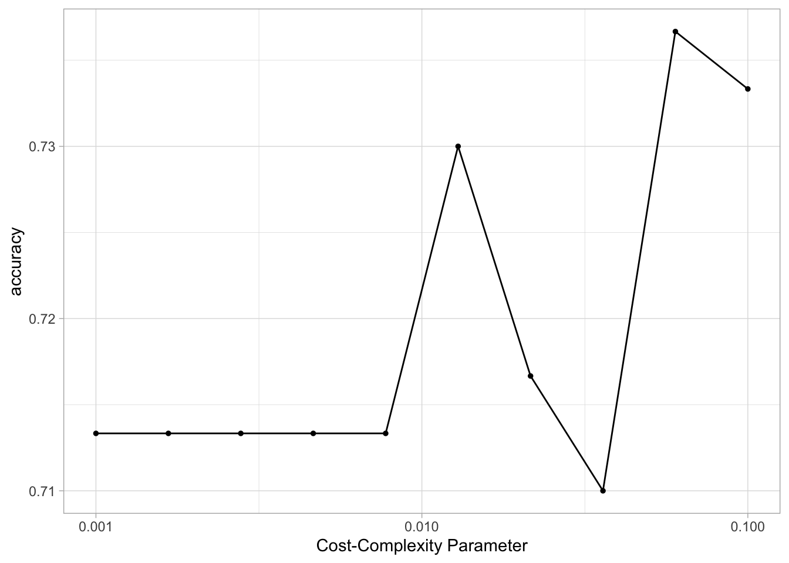
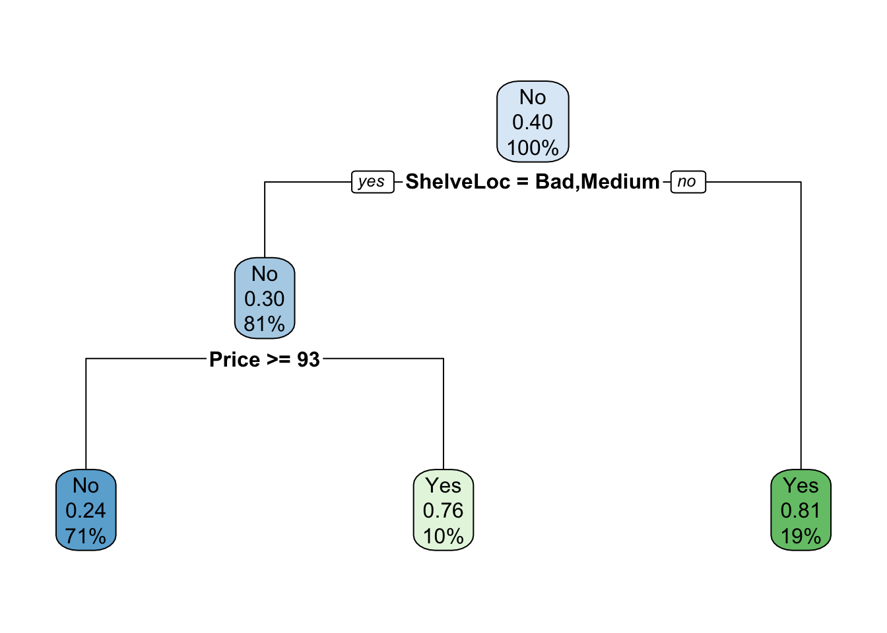
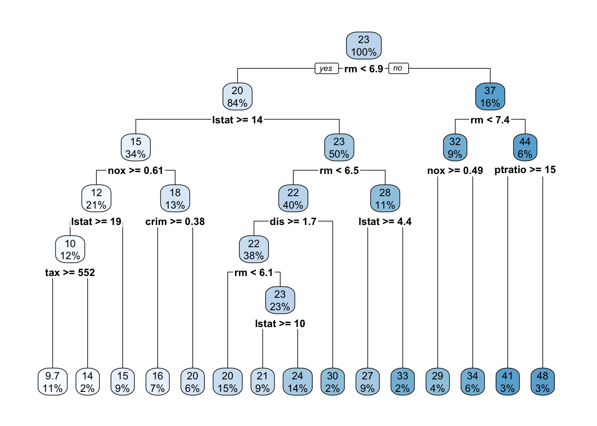

# Tree-Based Methods

This lab will take a look at different tree-based models, in doing so we will explore how changing the hyperparameters can help improve performance. 
This chapter will use [parsnip](https://www.tidymodels.org/start/models/) for model fitting and [recipes and workflows](https://www.tidymodels.org/start/recipes/) to perform the transformations, and [tune and dials](https://www.tidymodels.org/start/tuning/) to tune the hyperparameters of the model. `rpart.plot` is used to visualize the decision trees created using the `rpart` package as engine, and `vip` is used to visualize variable importance for later models.


```r
library(tidymodels)
library(ISLR)
library(rpart.plot)
library(vip)

data("Boston", package = "MASS")

Boston <- as_tibble(Boston)
```

The `Boston` data set contain various statistics for 506 neighborhoods in Boston. We will build a regression model that related the median value of owner-occupied homes (`medv`) as the response with the remaining variables as predictors. 

<div class="infobox">
<p>The <code>Boston</code> data set is quite outdated and contains some really unfortunate variables.</p>
</div>

We will also use the `Carseats` data set from the `ISLR` package to demonstrate a classification model. We create a new variable `High` to denote if `Sales <= 8`, then the `Sales` predictor is removed as it is a perfect predictor of `High`.


```r
Carseats <- as_tibble(Carseats) %>%
  mutate(High = factor(if_else(Sales <= 8, "No", "Yes"))) %>%
  select(-Sales)
```

## Fitting Classification Trees

We will both be fitting a classification and regression tree in this section, so we can save a little bit of typing by creating a general decision tree specification using `rpart` as the engine.


```r
tree_spec <- decision_tree() %>%
  set_engine("rpart")
```

Then this decision tree specification can be used to create a classification decision tree engine. This is a good example of how the flexible composition system created by parsnip can be used to create multiple model specifications.


```r
class_tree_spec <- tree_spec %>%
  set_mode("classification")
```

With both a model specification and our data are we ready to fit the model.


```r
class_tree_fit <- class_tree_spec %>%
  fit(High ~ ., data = Carseats)
```

When we look at the model output we see a quite informative summary of the model. It tries to give a written description of the tree that is created.


```r
class_tree_fit
```

```
## parsnip model object
## 
## Fit time:  16ms 
## n= 400 
## 
## node), split, n, loss, yval, (yprob)
##       * denotes terminal node
## 
##   1) root 400 164 No (0.59000000 0.41000000)  
##     2) ShelveLoc=Bad,Medium 315  98 No (0.68888889 0.31111111)  
##       4) Price>=92.5 269  66 No (0.75464684 0.24535316)  
##         8) Advertising< 13.5 224  41 No (0.81696429 0.18303571)  
##          16) CompPrice< 124.5 96   6 No (0.93750000 0.06250000) *
##          17) CompPrice>=124.5 128  35 No (0.72656250 0.27343750)  
##            34) Price>=109.5 107  20 No (0.81308411 0.18691589)  
##              68) Price>=126.5 65   6 No (0.90769231 0.09230769) *
##              69) Price< 126.5 42  14 No (0.66666667 0.33333333)  
##               138) Age>=49.5 22   2 No (0.90909091 0.09090909) *
##               139) Age< 49.5 20   8 Yes (0.40000000 0.60000000) *
##            35) Price< 109.5 21   6 Yes (0.28571429 0.71428571) *
##         9) Advertising>=13.5 45  20 Yes (0.44444444 0.55555556)  
##          18) Age>=54.5 20   5 No (0.75000000 0.25000000) *
##          19) Age< 54.5 25   5 Yes (0.20000000 0.80000000) *
##       5) Price< 92.5 46  14 Yes (0.30434783 0.69565217)  
##        10) Income< 57 10   3 No (0.70000000 0.30000000) *
##        11) Income>=57 36   7 Yes (0.19444444 0.80555556) *
##     3) ShelveLoc=Good 85  19 Yes (0.22352941 0.77647059)  
##       6) Price>=142.5 12   3 No (0.75000000 0.25000000) *
##       7) Price< 142.5 73  10 Yes (0.13698630 0.86301370) *
```

The `summary()` method provides even more information that can be useful.


```r
class_tree_fit %>%
  extract_fit_engine() %>%
  summary()
```

```
## Call:
## rpart::rpart(formula = High ~ ., data = data)
##   n= 400 
## 
##           CP nsplit rel error    xerror       xstd
## 1 0.28658537      0 1.0000000 1.0000000 0.05997967
## 2 0.10975610      1 0.7134146 0.7134146 0.05547692
## 3 0.04573171      2 0.6036585 0.6219512 0.05315381
## 4 0.03658537      4 0.5121951 0.6219512 0.05315381
## 5 0.02743902      5 0.4756098 0.5914634 0.05226769
## 6 0.02439024      7 0.4207317 0.6158537 0.05298128
## 7 0.01219512      8 0.3963415 0.5731707 0.05170717
## 8 0.01000000     10 0.3719512 0.5365854 0.05051784
## 
## Variable importance
##       Price   ShelveLoc         Age Advertising   CompPrice      Income 
##          34          25          11          11           9           5 
##  Population   Education 
##           3           1 
## 
## Node number 1: 400 observations,    complexity param=0.2865854
##   predicted class=No   expected loss=0.41  P(node) =1
##     class counts:   236   164
##    probabilities: 0.590 0.410 
##   left son=2 (315 obs) right son=3 (85 obs)
##   Primary splits:
##       ShelveLoc   splits as  LRL,       improve=28.991900, (0 missing)
##       Price       < 92.5  to the right, improve=19.463880, (0 missing)
##       Advertising < 6.5   to the left,  improve=17.277980, (0 missing)
##       Age         < 61.5  to the right, improve= 9.264442, (0 missing)
##       Income      < 60.5  to the left,  improve= 7.249032, (0 missing)
## 
## Node number 2: 315 observations,    complexity param=0.1097561
##   predicted class=No   expected loss=0.3111111  P(node) =0.7875
##     class counts:   217    98
##    probabilities: 0.689 0.311 
##   left son=4 (269 obs) right son=5 (46 obs)
##   Primary splits:
##       Price       < 92.5  to the right, improve=15.930580, (0 missing)
##       Advertising < 7.5   to the left,  improve=11.432570, (0 missing)
##       ShelveLoc   splits as  L-R,       improve= 7.543912, (0 missing)
##       Age         < 50.5  to the right, improve= 6.369905, (0 missing)
##       Income      < 60.5  to the left,  improve= 5.984509, (0 missing)
##   Surrogate splits:
##       CompPrice < 95.5  to the right, agree=0.873, adj=0.13, (0 split)
## 
## Node number 3: 85 observations,    complexity param=0.03658537
##   predicted class=Yes  expected loss=0.2235294  P(node) =0.2125
##     class counts:    19    66
##    probabilities: 0.224 0.776 
##   left son=6 (12 obs) right son=7 (73 obs)
##   Primary splits:
##       Price       < 142.5 to the right, improve=7.745608, (0 missing)
##       US          splits as  LR,        improve=5.112440, (0 missing)
##       Income      < 35    to the left,  improve=4.529433, (0 missing)
##       Advertising < 6     to the left,  improve=3.739996, (0 missing)
##       Education   < 15.5  to the left,  improve=2.565856, (0 missing)
##   Surrogate splits:
##       CompPrice < 154.5 to the right, agree=0.882, adj=0.167, (0 split)
## 
## Node number 4: 269 observations,    complexity param=0.04573171
##   predicted class=No   expected loss=0.2453532  P(node) =0.6725
##     class counts:   203    66
##    probabilities: 0.755 0.245 
##   left son=8 (224 obs) right son=9 (45 obs)
##   Primary splits:
##       Advertising < 13.5  to the left,  improve=10.400090, (0 missing)
##       Age         < 49.5  to the right, improve= 8.083998, (0 missing)
##       ShelveLoc   splits as  L-R,       improve= 7.023150, (0 missing)
##       CompPrice   < 124.5 to the left,  improve= 6.749986, (0 missing)
##       Price       < 126.5 to the right, improve= 5.646063, (0 missing)
## 
## Node number 5: 46 observations,    complexity param=0.02439024
##   predicted class=Yes  expected loss=0.3043478  P(node) =0.115
##     class counts:    14    32
##    probabilities: 0.304 0.696 
##   left son=10 (10 obs) right son=11 (36 obs)
##   Primary splits:
##       Income      < 57    to the left,  improve=4.000483, (0 missing)
##       ShelveLoc   splits as  L-R,       improve=3.189762, (0 missing)
##       Advertising < 9.5   to the left,  improve=1.388592, (0 missing)
##       Price       < 80.5  to the right, improve=1.388592, (0 missing)
##       Age         < 64.5  to the right, improve=1.172885, (0 missing)
## 
## Node number 6: 12 observations
##   predicted class=No   expected loss=0.25  P(node) =0.03
##     class counts:     9     3
##    probabilities: 0.750 0.250 
## 
## Node number 7: 73 observations
##   predicted class=Yes  expected loss=0.1369863  P(node) =0.1825
##     class counts:    10    63
##    probabilities: 0.137 0.863 
## 
## Node number 8: 224 observations,    complexity param=0.02743902
##   predicted class=No   expected loss=0.1830357  P(node) =0.56
##     class counts:   183    41
##    probabilities: 0.817 0.183 
##   left son=16 (96 obs) right son=17 (128 obs)
##   Primary splits:
##       CompPrice   < 124.5 to the left,  improve=4.881696, (0 missing)
##       Age         < 49.5  to the right, improve=3.960418, (0 missing)
##       ShelveLoc   splits as  L-R,       improve=3.654633, (0 missing)
##       Price       < 126.5 to the right, improve=3.234428, (0 missing)
##       Advertising < 6.5   to the left,  improve=2.371276, (0 missing)
##   Surrogate splits:
##       Price      < 115.5 to the left,  agree=0.741, adj=0.396, (0 split)
##       Age        < 50.5  to the right, agree=0.634, adj=0.146, (0 split)
##       Population < 405   to the right, agree=0.629, adj=0.135, (0 split)
##       Education  < 11.5  to the left,  agree=0.585, adj=0.031, (0 split)
##       Income     < 22.5  to the left,  agree=0.580, adj=0.021, (0 split)
## 
## Node number 9: 45 observations,    complexity param=0.04573171
##   predicted class=Yes  expected loss=0.4444444  P(node) =0.1125
##     class counts:    20    25
##    probabilities: 0.444 0.556 
##   left son=18 (20 obs) right son=19 (25 obs)
##   Primary splits:
##       Age       < 54.5  to the right, improve=6.722222, (0 missing)
##       CompPrice < 121.5 to the left,  improve=4.629630, (0 missing)
##       ShelveLoc splits as  L-R,       improve=3.250794, (0 missing)
##       Income    < 99.5  to the left,  improve=3.050794, (0 missing)
##       Price     < 127   to the right, improve=2.933429, (0 missing)
##   Surrogate splits:
##       Population  < 363.5 to the left,  agree=0.667, adj=0.25, (0 split)
##       Income      < 39    to the left,  agree=0.644, adj=0.20, (0 split)
##       Advertising < 17.5  to the left,  agree=0.644, adj=0.20, (0 split)
##       CompPrice   < 106.5 to the left,  agree=0.622, adj=0.15, (0 split)
##       Price       < 135.5 to the right, agree=0.622, adj=0.15, (0 split)
## 
## Node number 10: 10 observations
##   predicted class=No   expected loss=0.3  P(node) =0.025
##     class counts:     7     3
##    probabilities: 0.700 0.300 
## 
## Node number 11: 36 observations
##   predicted class=Yes  expected loss=0.1944444  P(node) =0.09
##     class counts:     7    29
##    probabilities: 0.194 0.806 
## 
## Node number 16: 96 observations
##   predicted class=No   expected loss=0.0625  P(node) =0.24
##     class counts:    90     6
##    probabilities: 0.938 0.062 
## 
## Node number 17: 128 observations,    complexity param=0.02743902
##   predicted class=No   expected loss=0.2734375  P(node) =0.32
##     class counts:    93    35
##    probabilities: 0.727 0.273 
##   left son=34 (107 obs) right son=35 (21 obs)
##   Primary splits:
##       Price     < 109.5 to the right, improve=9.764582, (0 missing)
##       ShelveLoc splits as  L-R,       improve=6.320022, (0 missing)
##       Age       < 49.5  to the right, improve=2.575061, (0 missing)
##       Income    < 108.5 to the right, improve=1.799546, (0 missing)
##       CompPrice < 143.5 to the left,  improve=1.741982, (0 missing)
## 
## Node number 18: 20 observations
##   predicted class=No   expected loss=0.25  P(node) =0.05
##     class counts:    15     5
##    probabilities: 0.750 0.250 
## 
## Node number 19: 25 observations
##   predicted class=Yes  expected loss=0.2  P(node) =0.0625
##     class counts:     5    20
##    probabilities: 0.200 0.800 
## 
## Node number 34: 107 observations,    complexity param=0.01219512
##   predicted class=No   expected loss=0.1869159  P(node) =0.2675
##     class counts:    87    20
##    probabilities: 0.813 0.187 
##   left son=68 (65 obs) right son=69 (42 obs)
##   Primary splits:
##       Price     < 126.5 to the right, improve=2.9643900, (0 missing)
##       CompPrice < 147.5 to the left,  improve=2.2337090, (0 missing)
##       ShelveLoc splits as  L-R,       improve=2.2125310, (0 missing)
##       Age       < 49.5  to the right, improve=2.1458210, (0 missing)
##       Income    < 60.5  to the left,  improve=0.8025853, (0 missing)
##   Surrogate splits:
##       CompPrice   < 129.5 to the right, agree=0.664, adj=0.143, (0 split)
##       Advertising < 3.5   to the right, agree=0.664, adj=0.143, (0 split)
##       Population  < 53.5  to the right, agree=0.645, adj=0.095, (0 split)
##       Age         < 77.5  to the left,  agree=0.636, adj=0.071, (0 split)
##       US          splits as  RL,        agree=0.626, adj=0.048, (0 split)
## 
## Node number 35: 21 observations
##   predicted class=Yes  expected loss=0.2857143  P(node) =0.0525
##     class counts:     6    15
##    probabilities: 0.286 0.714 
## 
## Node number 68: 65 observations
##   predicted class=No   expected loss=0.09230769  P(node) =0.1625
##     class counts:    59     6
##    probabilities: 0.908 0.092 
## 
## Node number 69: 42 observations,    complexity param=0.01219512
##   predicted class=No   expected loss=0.3333333  P(node) =0.105
##     class counts:    28    14
##    probabilities: 0.667 0.333 
##   left son=138 (22 obs) right son=139 (20 obs)
##   Primary splits:
##       Age         < 49.5  to the right, improve=5.4303030, (0 missing)
##       CompPrice   < 137.5 to the left,  improve=2.1000000, (0 missing)
##       Advertising < 5.5   to the left,  improve=1.8666670, (0 missing)
##       ShelveLoc   splits as  L-R,       improve=1.4291670, (0 missing)
##       Population  < 382   to the right, improve=0.8578431, (0 missing)
##   Surrogate splits:
##       Income      < 46.5  to the left,  agree=0.595, adj=0.15, (0 split)
##       Education   < 12.5  to the left,  agree=0.595, adj=0.15, (0 split)
##       CompPrice   < 131.5 to the right, agree=0.571, adj=0.10, (0 split)
##       Advertising < 5.5   to the left,  agree=0.571, adj=0.10, (0 split)
##       Population  < 221.5 to the left,  agree=0.571, adj=0.10, (0 split)
## 
## Node number 138: 22 observations
##   predicted class=No   expected loss=0.09090909  P(node) =0.055
##     class counts:    20     2
##    probabilities: 0.909 0.091 
## 
## Node number 139: 20 observations
##   predicted class=Yes  expected loss=0.4  P(node) =0.05
##     class counts:     8    12
##    probabilities: 0.400 0.600
```


Once the tree gets more than a couple of nodes it can become hard to read the printed diagram. The `rpart.plot` package provides functions to let us easily visualize the decision tree. As the name implies, it only works with `rpart` trees.


```r
class_tree_fit %>%
  extract_fit_engine() %>%
  rpart.plot()
```


We can see that the most important variable to predict high sales appears to be shelving location as it forms the first node.

The training accuracy of this model is 85%


```r
augment(class_tree_fit, new_data = Carseats) %>%
  accuracy(truth = High, estimate = .pred_class)
```

```
## # A tibble: 1 × 3
##   .metric  .estimator .estimate
##   <chr>    <chr>          <dbl>
## 1 accuracy binary         0.848
```

Let us take a look at the confusion matrix to see if the balance is there


```r
augment(class_tree_fit, new_data = Carseats) %>%
  conf_mat(truth = High, estimate = .pred_class)
```

```
##           Truth
## Prediction  No Yes
##        No  200  25
##        Yes  36 139
```

And the model appears to work well overall. But this model was fit on the whole data set so we only get the training accuracy which could be misleading if the model is overfitting. Let us redo the fitting by creating a validation split and fit the model on the training data set.


```r
set.seed(1234)
Carseats_split <- initial_split(Carseats)

Carseats_train <- training(Carseats_split)
Carseats_test <- testing(Carseats_split)
```

Now we can fit the model on the training data set.


```r
class_tree_fit <- fit(class_tree_spec, High ~ ., data = Carseats_train)
```

Let us take a look at the confusion matrix for the training data set and testing data set.


```r
augment(class_tree_fit, new_data = Carseats_train) %>%
  conf_mat(truth = High, estimate = .pred_class)
```

```
##           Truth
## Prediction  No Yes
##        No  159  21
##        Yes  21  99
```

The training data set performs well as we would expect


```r
augment(class_tree_fit, new_data = Carseats_test) %>%
  conf_mat(truth = High, estimate = .pred_class)
```

```
##           Truth
## Prediction No Yes
##        No  41   8
##        Yes 15  36
```

but the testing data set doesn't perform just as well and get a smaller accuracy of 77%


```r
augment(class_tree_fit, new_data = Carseats_test) %>%
  accuracy(truth = High, estimate = .pred_class)
```

```
## # A tibble: 1 × 3
##   .metric  .estimator .estimate
##   <chr>    <chr>          <dbl>
## 1 accuracy binary          0.77
```

Let us try to tune the `cost_complexity` of the decision tree to find a more optimal complexity. We use the `class_tree_spec` object and use the `set_args()` function to specify that we want to tune `cost_complexity`. This is then passed directly into the workflow object to avoid creating an intermediate object.


```r
class_tree_wf <- workflow() %>%
  add_model(class_tree_spec %>% set_args(cost_complexity = tune())) %>%
  add_formula(High ~ .)
```

To be able to tune the variable we need 2 more objects. S `resamples` object, we will use a k-fold cross-validation data set, and a `grid` of values to try. Since we are only tuning 1 hyperparameter it is fine to stay with a regular grid.


```r
set.seed(1234)
Carseats_fold <- vfold_cv(Carseats_train)

param_grid <- grid_regular(cost_complexity(range = c(-3, -1)), levels = 10)

tune_res <- tune_grid(
  class_tree_wf, 
  resamples = Carseats_fold, 
  grid = param_grid, 
  metrics = metric_set(accuracy)
)
```

using `autoplot()` shows which values of `cost_complexity` appear to produce the highest accuracy


```r
autoplot(tune_res)
```



We can now select the best performing value with `select_best()`, finalize the workflow by updating the value of `cost_complexity` and fit the model on the full training data set.


```r
best_complexity <- select_best(tune_res)

class_tree_final <- finalize_workflow(class_tree_wf, best_complexity)

class_tree_final_fit <- fit(class_tree_final, data = Carseats_train)
class_tree_final_fit
```

```
## ══ Workflow [trained] ══════════════════════════════════════════════════════════
## Preprocessor: Formula
## Model: decision_tree()
## 
## ── Preprocessor ────────────────────────────────────────────────────────────────
## High ~ .
## 
## ── Model ───────────────────────────────────────────────────────────────────────
## n= 300 
## 
## node), split, n, loss, yval, (yprob)
##       * denotes terminal node
## 
## 1) root 300 120 No (0.6000000 0.4000000)  
##   2) ShelveLoc=Bad,Medium 242  73 No (0.6983471 0.3016529)  
##     4) Price>=92.5 213  51 No (0.7605634 0.2394366) *
##     5) Price< 92.5 29   7 Yes (0.2413793 0.7586207) *
##   3) ShelveLoc=Good 58  11 Yes (0.1896552 0.8103448) *
```

At last, we can visualize the model, and we see that the better-performing model is less complex than the original model we fit. 


```r
class_tree_final_fit %>%
  extract_fit_engine() %>%
  rpart.plot()
```



## Fitting Regression Trees

We will now show how we fit a regression tree. This is very similar to what we saw in the last section. The main difference here is that the response we are looking at will be continuous instead of categorical. We can reuse `tree_spec` as a base for the regression decision tree specification.


```r
reg_tree_spec <- tree_spec %>%
  set_mode("regression")
```

We are using the `Boston` data set here so we will do a validation split here.


```r
set.seed(1234)
Boston_split <- initial_split(Boston)

Boston_train <- training(Boston_split)
Boston_test <- testing(Boston_split)
```

fitting the model to the training data set


```r
reg_tree_fit <- fit(reg_tree_spec, medv ~ ., Boston_train)
reg_tree_fit
```

```
## parsnip model object
## 
## Fit time:  11ms 
## n= 379 
## 
## node), split, n, deviance, yval
##       * denotes terminal node
## 
##  1) root 379 32622.9500 22.54802  
##    2) rm< 6.941 320 13602.3100 19.86281  
##      4) lstat>=14.395 129  2582.1090 14.51550  
##        8) nox>=0.607 80   984.7339 12.35875  
##         16) lstat>=19.34 47   388.6332 10.35957 *
##         17) lstat< 19.34 33   140.7188 15.20606 *
##        9) nox< 0.607 49   617.6939 18.03673 *
##      5) lstat< 14.395 191  4840.3640 23.47435  
##       10) rm< 6.543 151  2861.3990 22.21192  
##         20) dis>=1.68515 144  1179.5970 21.82083 *
##         21) dis< 1.68515 7  1206.6970 30.25714 *
##       11) rm>=6.543 40   829.8560 28.24000 *
##    3) rm>=6.941 59  4199.1020 37.11186  
##      6) rm< 7.437 35  1012.4100 32.08286 *
##      7) rm>=7.437 24  1010.6200 44.44583  
##       14) ptratio>=15.4 12   585.0767 40.71667 *
##       15) ptratio< 15.4 12    91.7825 48.17500 *
```


```r
augment(reg_tree_fit, new_data = Boston_test) %>%
  rmse(truth = medv, estimate = .pred)
```

```
## # A tibble: 1 × 3
##   .metric .estimator .estimate
##   <chr>   <chr>          <dbl>
## 1 rmse    standard        4.78
```

and the `rpart.plot()` function works for the regression decision tree as well


```r
reg_tree_fit %>%
  extract_fit_engine() %>%
  rpart.plot()
```


Notice how the result is a numeric variable instead of a class.

Now let us again try to tune the `cost_complexity` to find the best performing model.


```r
reg_tree_wf <- workflow() %>%
  add_model(reg_tree_spec %>% set_args(cost_complexity = tune())) %>%
  add_formula(medv ~ .)

set.seed(1234)
Boston_fold <- vfold_cv(Boston_train)

param_grid <- grid_regular(cost_complexity(range = c(-4, -1)), levels = 10)

tune_res <- tune_grid(
  reg_tree_wf, 
  resamples = Boston_fold, 
  grid = param_grid
)
```

And it appears that higher complexity works are to be preferred according to our cross-validation


```r
autoplot(tune_res)
```


We select the best-performing model according to `"rmse"` and fit the final model on the whole training data set.


```r
best_complexity <- select_best(tune_res, metric = "rmse")

reg_tree_final <- finalize_workflow(reg_tree_wf, best_complexity)

reg_tree_final_fit <- fit(reg_tree_final, data = Boston_train)
reg_tree_final_fit
```

```
## ══ Workflow [trained] ══════════════════════════════════════════════════════════
## Preprocessor: Formula
## Model: decision_tree()
## 
## ── Preprocessor ────────────────────────────────────────────────────────────────
## medv ~ .
## 
## ── Model ───────────────────────────────────────────────────────────────────────
## n= 379 
## 
## node), split, n, deviance, yval
##       * denotes terminal node
## 
##  1) root 379 32622.95000 22.54802  
##    2) rm< 6.941 320 13602.31000 19.86281  
##      4) lstat>=14.395 129  2582.10900 14.51550  
##        8) nox>=0.607 80   984.73390 12.35875  
##         16) lstat>=19.34 47   388.63320 10.35957  
##           32) tax>=551.5 40   243.94980  9.67750 *
##           33) tax< 551.5 7    19.73714 14.25714 *
##         17) lstat< 19.34 33   140.71880 15.20606 *
##        9) nox< 0.607 49   617.69390 18.03673  
##         18) crim>=0.381565 25   313.20000 16.20000 *
##         19) crim< 0.381565 24   132.30000 19.95000 *
##      5) lstat< 14.395 191  4840.36400 23.47435  
##       10) rm< 6.543 151  2861.39900 22.21192  
##         20) dis>=1.68515 144  1179.59700 21.82083  
##           40) rm< 6.062 56   306.22860 20.28571 *
##           41) rm>=6.062 88   657.41950 22.79773  
##             82) lstat>=9.98 35    98.32686 21.02571 *
##             83) lstat< 9.98 53   376.61550 23.96792 *
##         21) dis< 1.68515 7  1206.69700 30.25714 *
##       11) rm>=6.543 40   829.85600 28.24000  
##         22) lstat>=4.44 33   274.06180 27.15455 *
##         23) lstat< 4.44 7   333.61710 33.35714 *
##    3) rm>=6.941 59  4199.10200 37.11186  
##      6) rm< 7.437 35  1012.41000 32.08286  
##       12) nox>=0.4885 14   673.46930 28.89286 *
##       13) nox< 0.4885 21   101.49810 34.20952 *
##      7) rm>=7.437 24  1010.62000 44.44583  
##       14) ptratio>=15.4 12   585.07670 40.71667 *
##       15) ptratio< 15.4 12    91.78250 48.17500 *
```

Visualizing the model reveals a much more complex tree than what we saw in the last section.


```r
reg_tree_final_fit %>%
  extract_fit_engine() %>%
  rpart.plot()
```



## Bagging and Random Forests

Here we apply bagging and random forests to the `Boston` data set. We will be using the `randomForest` package as the engine. A bagging model is the same as a random forest where `mtry` is equal to the number of predictors. We can specify the `mtry` to be `.cols()` which means that the number of columns in the predictor matrix is used. This is useful if you want to make the specification more general and useable to many different data sets. `.cols()` is one of many [descriptors](https://parsnip.tidymodels.org/reference/descriptors.html) in the parsnip package.
We also set `importance = TRUE` in `set_engine()` to tell the engine to save the information regarding variable importance. This is needed for this engine if we want to use the `vip` package later.


```r
bagging_spec <- rand_forest(mtry = .cols()) %>%
  set_engine("randomForest", importance = TRUE) %>%
  set_mode("regression")
```

We fit the model like normal


```r
bagging_fit <- fit(bagging_spec, medv ~ ., data = Boston_train)
```

and we take a look at the testing performance. Which we see is an improvement over the decision tree.


```r
augment(bagging_fit, new_data = Boston_test) %>%
  rmse(truth = medv, estimate = .pred)
```

```
## # A tibble: 1 × 3
##   .metric .estimator .estimate
##   <chr>   <chr>          <dbl>
## 1 rmse    standard        3.43
```

We can also create a quick scatterplot between the true and predicted value to see if we can make any diagnostics.


```r
augment(bagging_fit, new_data = Boston_test) %>%
  ggplot(aes(medv, .pred)) +
  geom_abline() +
  geom_point(alpha = 0.5)
```


There isn't anything weird going on here so we are happy. Next, let us take a look at the variable importance


```r
vip(bagging_fit)
```


Next, let us take a look at a random forest. By default, `randomForest()` `p / 3` variables when building a random forest of regression trees, and `sqrt(p)` variables when building a random forest of classification trees. Here we use `mtry = 6`.


```r
rf_spec <- rand_forest(mtry = 6) %>%
  set_engine("randomForest", importance = TRUE) %>%
  set_mode("regression")
```

and fitting the model like normal


```r
rf_fit <- fit(rf_spec, medv ~ ., data = Boston_train)
```

this model has a slightly better performance than the bagging model


```r
augment(rf_fit, new_data = Boston_test) %>%
  rmse(truth = medv, estimate = .pred)
```

```
## # A tibble: 1 × 3
##   .metric .estimator .estimate
##   <chr>   <chr>          <dbl>
## 1 rmse    standard        3.26
```

We can likewise plot the true value against the predicted value


```r
augment(rf_fit, new_data = Boston_test) %>%
  ggplot(aes(medv, .pred)) +
  geom_abline() +
  geom_point(alpha = 0.5)
```


it looks fine. No discernable difference between this chart and the one we created for the bagging model. 

The variable importance plot is also quite similar to what we saw for the bagging model which isn't surprising. 


```r
vip(rf_fit)
```


you would normally want to perform hyperparameter tuning for the random forest model to get the best out of your forest. This exercise is left for the reader.

## Boosting

We will now fit a boosted tree model. The `xgboost` packages give a good implementation of boosted trees. It has many parameters to tune and we know that setting `trees` too high can lead to overfitting. Nevertheless, let us try fitting a boosted tree. We set `tree = 5000` to grow 5000 trees with a maximal depth of 4 by setting `tree_depth = 4`.


```r
boost_spec <- boost_tree(trees = 5000, tree_depth = 4) %>%
  set_engine("xgboost") %>%
  set_mode("regression")
```

fitting the model like normal


```r
boost_fit <- fit(boost_spec, medv ~ ., data = Boston_train)
```

and the `rmse` is a little high in this case which is properly because we didn't tune any of the parameters.


```r
augment(boost_fit, new_data = Boston_test) %>%
  rmse(truth = medv, estimate = .pred)
```

```
## # A tibble: 1 × 3
##   .metric .estimator .estimate
##   <chr>   <chr>          <dbl>
## 1 rmse    standard        3.34
```

We can look at the scatterplot and we don't see anything weird going on.


```r
augment(boost_fit, new_data = Boston_test) %>%
  ggplot(aes(medv, .pred)) +
  geom_abline() +
  geom_point(alpha = 0.5)
```


You would normally want to perform hyperparameter tuning for the boosted tree model to get the best out of your model. This exercise is left for the reader. Look at the [Iterative search](https://www.tmwr.org/iterative-search.html) chapter of [Tidy Modeling with R](https://www.tmwr.org/) for inspiration.

## Bayesian Additive Regression Trees

This section is WIP.
