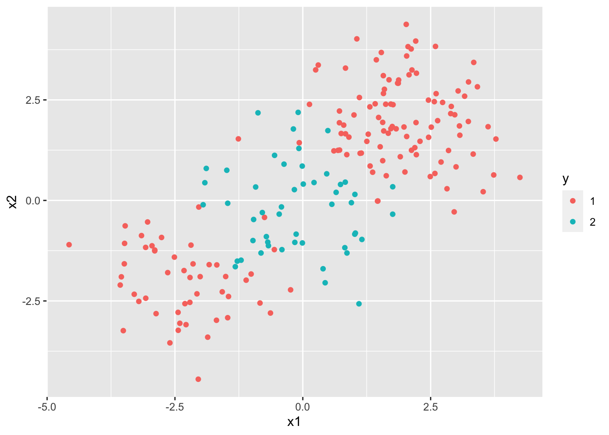
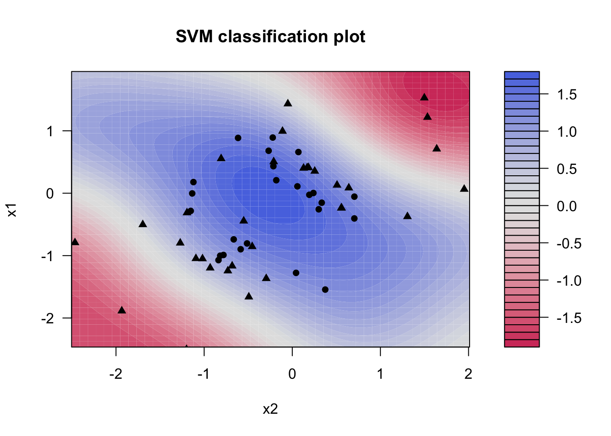
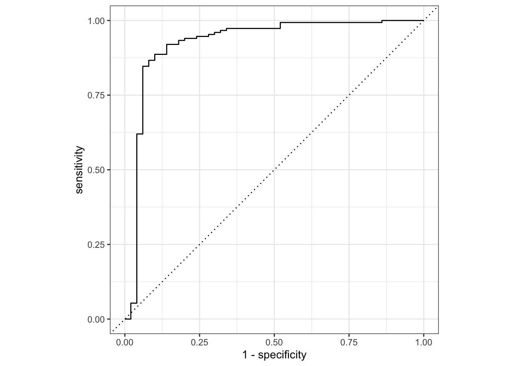

# Support Vector Machines

This lab will take a look at support vector machines, in doing so we will explore how changing the hyperparameters can help improve performance. 
This chapter will use [parsnip](https://www.tidymodels.org/start/models/) for model fitting and [recipes and workflows](https://www.tidymodels.org/start/recipes/) to perform the transformations, and [tune and dials](https://www.tidymodels.org/start/tuning/) to tune the hyperparameters of the model.


```r
library(tidymodels)
library(ISLR)
```

## Support Vector Classifier

Let us start by creating a synthetic data set. We will use some normally distributed data with an added offset to create 2 separate classes.


```r
set.seed(1)
sim_data <- tibble(
  x1 = rnorm(40),
  x2 = rnorm(40),
  y  = factor(rep(c(-1, 1), 20))
) %>%
  mutate(x1 = ifelse(y == 1, x1 + 1.5, x1),
         x2 = ifelse(y == 1, x2 + 1.5, x2))
```

PLotting it shows that we are having two slightly overlapping classes


```r
ggplot(sim_data, aes(x1, x2, color = y)) +
  geom_point()
```


We can then create a linear SVM specification by setting `degree = 1` in a polynomial SVM model. We furthermore set `scaled = FALSE` in `set_engine()` to have the engine scale the data for us. Once we get to it later we can be performing this scaling in a recipe instead. 


```r
svm_linear_spec <- svm_poly(degree = 1) %>%
  set_mode("classification") %>%
  set_engine("kernlab", scaled = FALSE)
```

Taking the specification, we can add a specific `cost` of 10 before fitting the model to the data. Using `set_args()` allows us to set the `cost` argument without modifying the model specification.


```r
svm_linear_fit <- svm_linear_spec %>% 
  set_args(cost = 10) %>%
  fit(y ~ ., data = sim_data)

svm_linear_fit
```

```
## parsnip model object
## 
## Fit time:  770ms 
## Support Vector Machine object of class "ksvm" 
## 
## SV type: C-svc  (classification) 
##  parameter : cost C = 10 
## 
## Polynomial kernel function. 
##  Hyperparameters : degree =  1  scale =  1  offset =  1 
## 
## Number of Support Vectors : 17 
## 
## Objective Function Value : -152.0188 
## Training error : 0.125 
## Probability model included.
```

The `kernlab` models can be visualized using the `plot()` function if you load the `kernlab` package. 


```r
library(kernlab)
```

```
## 
## Attaching package: 'kernlab'
```

```
## The following object is masked from 'package:purrr':
## 
##     cross
```

```
## The following object is masked from 'package:ggplot2':
## 
##     alpha
```

```
## The following object is masked from 'package:scales':
## 
##     alpha
```

```r
plot(svm_linear_fit$fit)
```


what if we instead used a smaller value of the `cost` parameter?


```r
svm_linear_fit <- svm_linear_spec %>% 
  set_args(cost = 0.1) %>%
  fit(y ~ ., data = sim_data)

svm_linear_fit
```

```
## parsnip model object
## 
## Fit time:  28ms 
## Support Vector Machine object of class "ksvm" 
## 
## SV type: C-svc  (classification) 
##  parameter : cost C = 0.1 
## 
## Polynomial kernel function. 
##  Hyperparameters : degree =  1  scale =  1  offset =  1 
## 
## Number of Support Vectors : 25 
## 
## Objective Function Value : -2.0376 
## Training error : 0.15 
## Probability model included.
```

Now that a smaller value of the cost parameter is being used, we obtain a larger number of support vectors, because the margin is now wider.

Let us set up a `tune_grid()` section to find the value of `cost` that leads to the highest accuracy for the SVM model.


```r
svm_linear_wf <- workflow() %>%
  add_model(svm_linear_spec %>% set_args(cost = tune())) %>%
  add_formula(y ~ .)

set.seed(1234)
sim_data_fold <- vfold_cv(sim_data, strata = y)

param_grid <- grid_regular(cost(), levels = 10)

tune_res <- tune_grid(
  svm_linear_wf, 
  resamples = sim_data_fold, 
  grid = param_grid
)

autoplot(tune_res)
```


using the `tune_res` object and `select_best()` function allows us to find the value of `cost` that gives the best cross-validated accuracy. Finalize the workflow with `finalize_workflow()` and fit the new workflow on the data set.


```r
best_cost <- select_best(tune_res, metric = "accuracy")

svm_linear_final <- finalize_workflow(svm_linear_wf, best_cost)

svm_linear_fit <- svm_linear_final %>% fit(sim_data)
```

We can now generate a different data set to act as the test data set. We will make sure that it is generated using the same model but with a different seed.


```r
set.seed(2)
sim_data_test <- tibble(
  x1 = rnorm(20),
  x2 = rnorm(20),
  y  = factor(rep(c(-1, 1), 10))
) %>%
  mutate(x1 = ifelse(y == 1, x1 + 1.5, x1),
         x2 = ifelse(y == 1, x2 + 1.5, x2))
```

and accessing the model on this testing data set shows us that the model still performs very well.


```r
augment(svm_linear_fit, new_data = sim_data_test) %>%
  conf_mat(truth = y, estimate = .pred_class)
```

```
##           Truth
## Prediction -1 1
##         -1  9 2
##         1   1 8
```

## Support Vector Machine

We will now see how we can fit an SVM using a non-linear kernel. Let us start by generating some data, but this time generate with a non-linear class boundary.


```r
set.seed(1)
sim_data2 <- tibble(
  x1 = rnorm(200) + rep(c(2, -2, 0), c(100, 50, 50)),
  x2 = rnorm(200) + rep(c(2, -2, 0), c(100, 50, 50)),
  y  = factor(rep(c(1, 2), c(150, 50)))
)

sim_data2 %>%
  ggplot(aes(x1, x2, color = y)) +
  geom_point()
```



We will try an SVM with a radial basis function. Such a kernel would allow us to capture the non-linearity in our data.


```r
svm_rbf_spec <- svm_rbf() %>%
  set_mode("classification") %>%
  set_engine("kernlab")
```

fitting the model


```r
svm_rbf_fit <- svm_rbf_spec %>%
  fit(y ~ ., data = sim_data2)
```

and plotting reveals that the model was able o separate the two classes, even though they were non-linearly separated.


```r
plot(svm_rbf_fit$fit)
```



But let us see how well this model generalizes to new data from the same generating process. 


```r
set.seed(2)
sim_data2_test <- tibble(
  x1 = rnorm(200) + rep(c(2, -2, 0), c(100, 50, 50)),
  x2 = rnorm(200) + rep(c(2, -2, 0), c(100, 50, 50)),
  y  = factor(rep(c(1, 2), c(150, 50)))
)
```

And it works well!


```r
augment(svm_rbf_fit, new_data = sim_data2_test) %>%
  conf_mat(truth = y, estimate = .pred_class)
```

```
##           Truth
## Prediction   1   2
##          1 135   9
##          2  15  41
```

## ROC Curves

ROC curves can easily be created using the `roc_curve()` from the yardstick package. We use this function much the same way as we have done using the `accuracy()` function, but the main difference is that we pass the predicted class probability to `estimate` instead of passing the predicted class.


```r
augment(svm_rbf_fit, new_data = sim_data2_test) %>%
  roc_curve(truth = y, estimate = .pred_1)
```

```
## # A tibble: 202 x 3
##    .threshold specificity sensitivity
##         <dbl>       <dbl>       <dbl>
##  1  -Inf             0          1    
##  2     0.0130        0          1    
##  3     0.0131        0.02       1    
##  4     0.0137        0.04       1    
##  5     0.0150        0.04       0.993
##  6     0.0155        0.06       0.993
##  7     0.0158        0.08       0.993
##  8     0.0168        0.1        0.993
##  9     0.0174        0.12       0.993
## 10     0.0175        0.14       0.993
## # … with 192 more rows
```

This produces the different values of `specificity` and `sensitivity` for each threshold. We can get a quick visualization by passing the results of `roc_curve()` into `autoplot()`


```r
augment(svm_rbf_fit, new_data = sim_data2_test) %>%
  roc_curve(truth = y, estimate = .pred_1) %>%
  autoplot()
```



A common metric is t calculate the area under this curve. This can be done using the `roc_auc()` function (`_auc` stands for **a**rea **u**nder **c**urve).


```r
augment(svm_rbf_fit, new_data = sim_data2_test) %>%
  roc_auc(truth = y, estimate = .pred_1)
```

```
## # A tibble: 1 x 3
##   .metric .estimator .estimate
##   <chr>   <chr>          <dbl>
## 1 roc_auc binary         0.907
```

## Application to Gene Expression Data

We now examine the Khan data set, which consists of several tissue samples corresponding to four distinct types of small round blue cell tumors. For each tissue sample, gene expression measurements are available. The data set comes in the `Khan` list which we will wrangle a little bit to create two tibbles, 1 for the training data and 1 for the testing data.


```r
Khan_train <- bind_cols(
  y = factor(Khan$ytrain),
  as_tibble(Khan$xtrain)
)
```

```
## Warning: The `x` argument of `as_tibble.matrix()` must have unique column names if `.name_repair` is omitted as of tibble 2.0.0.
## Using compatibility `.name_repair`.
```

```r
Khan_test <- bind_cols(
  y = factor(Khan$ytest),
  as_tibble(Khan$xtest)
)
```


looking at the dimensions of the training data reveals that we have 63 observations with 20308 gene expression measurements.


```r
dim(Khan_train)
```

```
## [1]   63 2309
```

There is a very large number of predictors compared to the number of rows. This indicates that a linear kernel as the added flexibility we would get from a polynomial or radial kernel is unnecessary.


```r
khan_fit <- svm_linear_spec %>%
  set_args(cost = 10) %>%
  fit(y ~ ., data = Khan_train)
```

Let us take a look at the training confusion matrix. And look, we get a perfect confusion matrix. We are getting this because the hyperplane was able to fully separate the classes.


```r
augment(khan_fit, new_data = Khan_train) %>%
  conf_mat(truth = y, estimate = .pred_class)
```

```
##           Truth
## Prediction  1  2  3  4
##          1  8  0  0  0
##          2  0 23  0  0
##          3  0  0 12  0
##          4  0  0  0 20
```

But remember we don't measure the performance by how well it performs on the training data set. We measure the performance of a model on how well it performs on the testing data set, so let us look at the testing confusion matrix


```r
augment(khan_fit, new_data = Khan_test) %>%
  conf_mat(truth = y, estimate = .pred_class)
```

```
##           Truth
## Prediction 1 2 3 4
##          1 3 0 0 0
##          2 0 6 2 0
##          3 0 0 4 0
##          4 0 0 0 5
```

And it performs fairly well. A couple of misclassification but nothing too bad.
