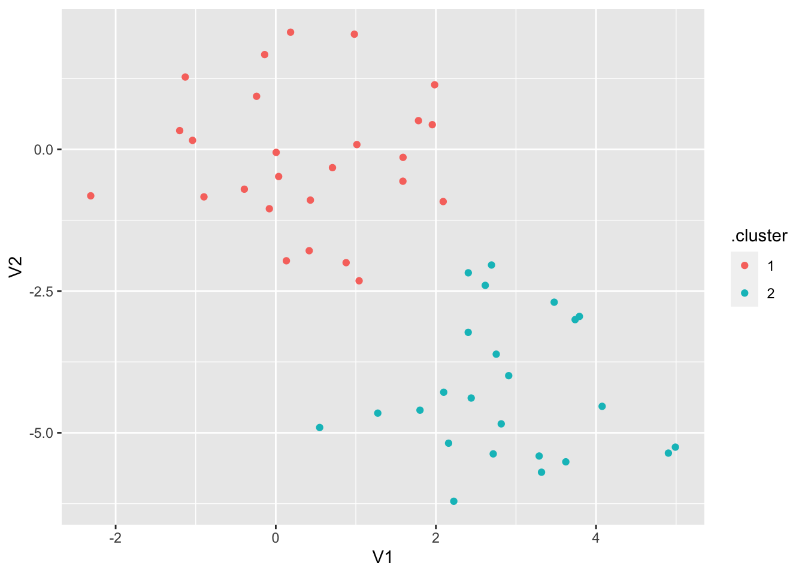
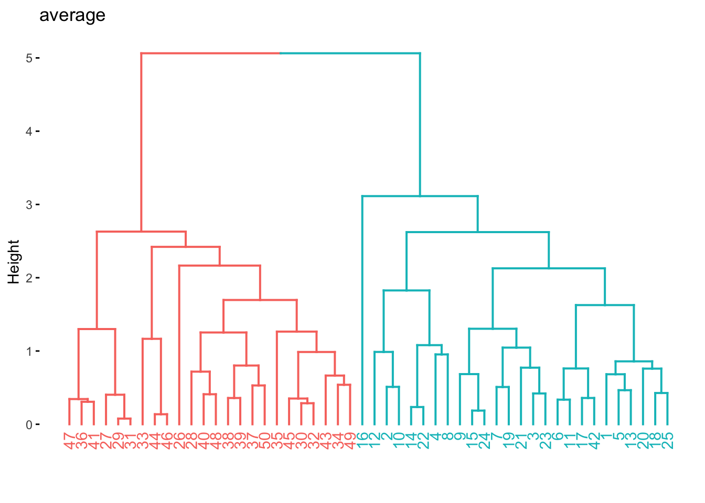
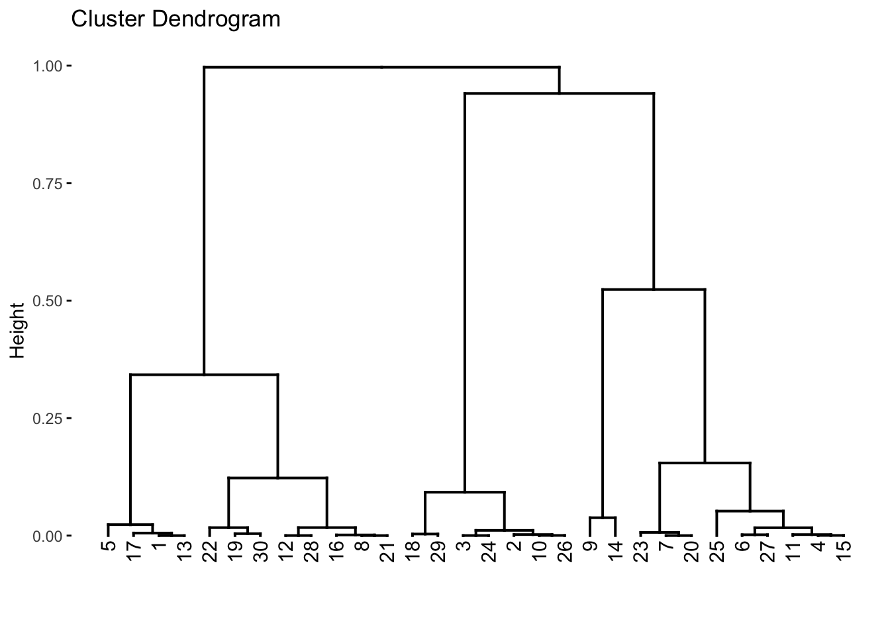
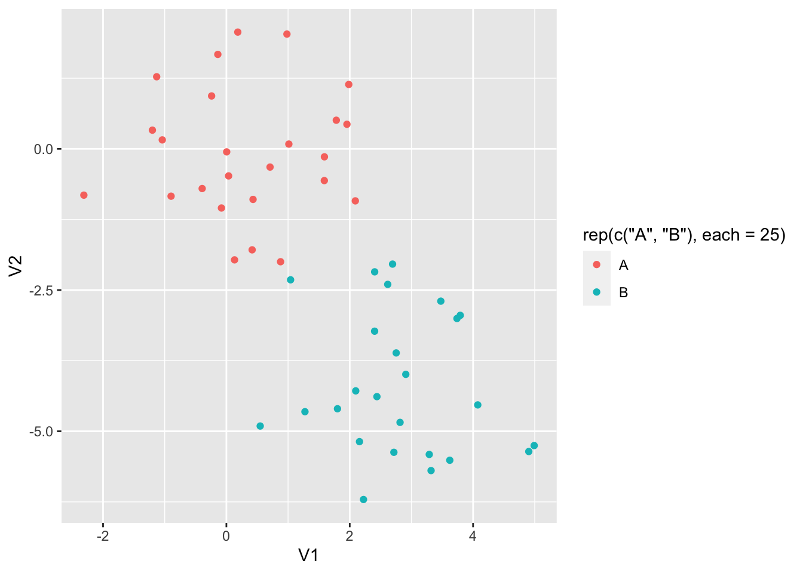
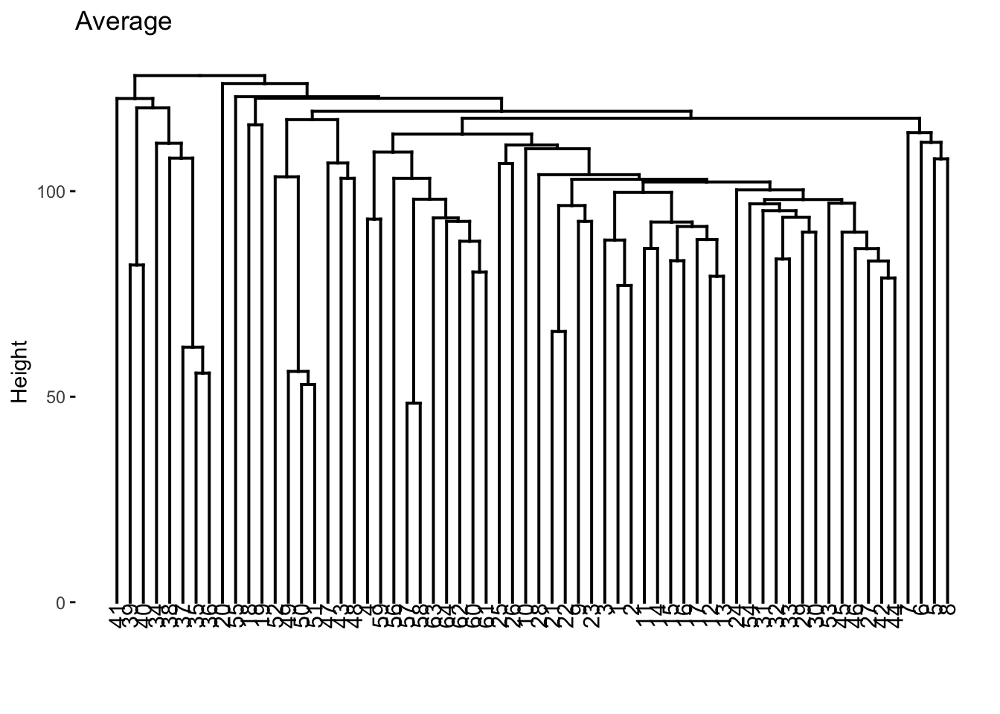

# Unsupervised Learning

This final chapter talks about unsupervised learning. This is broken into two parts. Dimensionality reduction and clustering. One downside at this moment is that clustering is not well integrated into tidymodels at this time. But we are still able to use some of the features in tidymodels.


```r
library(tidymodels)
```

```
## Registered S3 method overwritten by 'tune':
##   method                   from   
##   required_pkgs.model_spec parsnip
```

```
## ── Attaching packages ────────────────────────────────────── tidymodels 0.1.3 ──
```

```
## ✓ broom        0.7.6           ✓ recipes      0.1.16.9000
## ✓ dials        0.0.9           ✓ rsample      0.1.0      
## ✓ dplyr        1.0.6           ✓ tibble       3.1.2      
## ✓ ggplot2      3.3.3           ✓ tidyr        1.1.3      
## ✓ infer        0.5.4           ✓ tune         0.1.5      
## ✓ modeldata    0.1.0           ✓ workflows    0.2.2      
## ✓ parsnip      0.1.6           ✓ workflowsets 0.0.2      
## ✓ purrr        0.3.4           ✓ yardstick    0.0.8
```

```
## ── Conflicts ───────────────────────────────────────── tidymodels_conflicts() ──
## x purrr::discard() masks scales::discard()
## x dplyr::filter()  masks stats::filter()
## x dplyr::lag()     masks stats::lag()
## x recipes::step()  masks stats::step()
## • Use tidymodels_prefer() to resolve common conflicts.
```

```r
library(tidyverse)
```

```
## ── Attaching packages ─────────────────────────────────────── tidyverse 1.3.1 ──
```

```
## ✓ readr   1.4.0     ✓ forcats 0.5.1
## ✓ stringr 1.4.0
```

```
## ── Conflicts ────────────────────────────────────────── tidyverse_conflicts() ──
## x readr::col_factor() masks scales::col_factor()
## x purrr::discard()    masks scales::discard()
## x dplyr::filter()     masks stats::filter()
## x stringr::fixed()    masks recipes::fixed()
## x dplyr::lag()        masks stats::lag()
## x readr::spec()       masks yardstick::spec()
```

```r
library(magrittr)
```

```
## 
## Attaching package: 'magrittr'
```

```
## The following object is masked from 'package:tidyr':
## 
##     extract
```

```
## The following object is masked from 'package:purrr':
## 
##     set_names
```

```r
library(factoextra)
```

```
## Welcome! Want to learn more? See two factoextra-related books at https://goo.gl/ve3WBa
```

```r
library(patchwork)
library(proxy)
```

```
## 
## Attaching package: 'proxy'
```

```
## The following objects are masked from 'package:stats':
## 
##     as.dist, dist
```

```
## The following object is masked from 'package:base':
## 
##     as.matrix
```

## Principal Components Analysis


```r
usarrests <- as_tibble(USArrests, rownames = "state")
glimpse(usarrests)
```

```
## Rows: 50
## Columns: 5
## $ state    <chr> "Alabama", "Alaska", "Arizona", "Arkansas", "California", "Co…
## $ Murder   <dbl> 13.2, 10.0, 8.1, 8.8, 9.0, 7.9, 3.3, 5.9, 15.4, 17.4, 5.3, 2.…
## $ Assault  <int> 236, 263, 294, 190, 276, 204, 110, 238, 335, 211, 46, 120, 24…
## $ UrbanPop <int> 58, 48, 80, 50, 91, 78, 77, 72, 80, 60, 83, 54, 83, 65, 57, 6…
## $ Rape     <dbl> 21.2, 44.5, 31.0, 19.5, 40.6, 38.7, 11.1, 15.8, 31.9, 25.8, 2…
```


```r
# scale before applyig PCA
set.seed(1)
pca_recipe <- recipe(~., data = usarrests) %>%
  step_scale(all_numeric()) %>%
  step_pca(all_numeric(), id = "pca") %>%
  prep()

usarrests %>%
  column_to_rownames("state") %>%
  prcomp(scale = TRUE) %>%
  fviz_pca_biplot(title = "Biplot PCA on usarrests")
```


```r
# loadings
tidy(pca_recipe, type = "coef", id = "pca")
```

```
## # A tibble: 16 x 4
##    terms      value component id   
##    <chr>      <dbl> <chr>     <chr>
##  1 Murder   -0.319  PC1       pca  
##  2 Assault  -0.368  PC1       pca  
##  3 UrbanPop -0.774  PC1       pca  
##  4 Rape     -0.405  PC1       pca  
##  5 Murder   -0.579  PC2       pca  
##  6 Assault  -0.484  PC2       pca  
##  7 UrbanPop  0.603  PC2       pca  
##  8 Rape     -0.258  PC2       pca  
##  9 Murder    0.418  PC3       pca  
## 10 Assault   0.197  PC3       pca  
## 11 UrbanPop  0.188  PC3       pca  
## 12 Rape     -0.867  PC3       pca  
## 13 Murder   -0.624  PC4       pca  
## 14 Assault   0.769  PC4       pca  
## 15 UrbanPop -0.0381 PC4       pca  
## 16 Rape     -0.134  PC4       pca
```

```r
tidy(pca_recipe, type = "coef", id = "pca") %>%
  pivot_wider(
    id_cols = "terms",
    names_from = "component",
    values_from = "value"
  )
```

```
## # A tibble: 4 x 5
##   terms       PC1    PC2    PC3     PC4
##   <chr>     <dbl>  <dbl>  <dbl>   <dbl>
## 1 Murder   -0.319 -0.579  0.418 -0.624 
## 2 Assault  -0.368 -0.484  0.197  0.769 
## 3 UrbanPop -0.774  0.603  0.188 -0.0381
## 4 Rape     -0.405 -0.258 -0.867 -0.134
```

```r
# variance
tidy(pca_recipe, type = "variance", id = "pca")
```

```
## # A tibble: 16 x 4
##    terms                         value component id   
##    <chr>                         <dbl>     <int> <chr>
##  1 variance                     35.7           1 pca  
##  2 variance                      1.47          2 pca  
##  3 variance                      0.394         3 pca  
##  4 variance                      0.180         4 pca  
##  5 cumulative variance          35.7           1 pca  
##  6 cumulative variance          37.1           2 pca  
##  7 cumulative variance          37.5           3 pca  
##  8 cumulative variance          37.7           4 pca  
##  9 percent variance             94.6           1 pca  
## 10 percent variance              3.90          2 pca  
## 11 percent variance              1.05          3 pca  
## 12 percent variance              0.478         4 pca  
## 13 cumulative percent variance  94.6           1 pca  
## 14 cumulative percent variance  98.5           2 pca  
## 15 cumulative percent variance  99.5           3 pca  
## 16 cumulative percent variance 100             4 pca
```

```r
tidy(pca_recipe, type = "variance", id = "pca") %>%
  pivot_wider(
    id_cols = "terms",
    names_from = "component",
    names_prefix = "PC_",
    values_from = "value"
  )
```

```
## # A tibble: 4 x 5
##   terms                        PC_1  PC_2   PC_3    PC_4
##   <chr>                       <dbl> <dbl>  <dbl>   <dbl>
## 1 variance                     35.7  1.47  0.394   0.180
## 2 cumulative variance          35.7 37.1  37.5    37.7  
## 3 percent variance             94.6  3.90  1.05    0.478
## 4 cumulative percent variance  94.6 98.5  99.5   100
```

```r
# cumulative varianvce plot
tidy(pca_recipe, type = "variance", id = "pca") %>%
  filter(terms == "cumulative variance") %>%
  ggplot(aes(component, value)) +
  geom_point() +
  geom_line() +
  ylim(c(0, 100)) +
  ylab("Cumulative variance")
```


```r
# on the direct PCA object
usarrests_pca <- usarrests %>%
  select(-state) %>%
  prcomp(scale = TRUE)

tidy(usarrests_pca)
```

```
## # A tibble: 200 x 3
##      row    PC  value
##    <int> <dbl>  <dbl>
##  1     1     1 -0.976
##  2     1     2  1.12 
##  3     1     3 -0.440
##  4     1     4  0.155
##  5     2     1 -1.93 
##  6     2     2  1.06 
##  7     2     3  2.02 
##  8     2     4 -0.434
##  9     3     1 -1.75 
## 10     3     2 -0.738
## # … with 190 more rows
```

```r
augment(usarrests_pca)
```

```
## # A tibble: 50 x 5
##    .rownames .fittedPC1 .fittedPC2 .fittedPC3 .fittedPC4
##    <chr>          <dbl>      <dbl>      <dbl>      <dbl>
##  1 1            -0.976      1.12      -0.440     0.155  
##  2 2            -1.93       1.06       2.02     -0.434  
##  3 3            -1.75      -0.738      0.0542   -0.826  
##  4 4             0.140      1.11       0.113    -0.181  
##  5 5            -2.50      -1.53       0.593    -0.339  
##  6 6            -1.50      -0.978      1.08      0.00145
##  7 7             1.34      -1.08      -0.637    -0.117  
##  8 8            -0.0472    -0.322     -0.711    -0.873  
##  9 9            -2.98       0.0388    -0.571    -0.0953 
## 10 10           -1.62       1.27      -0.339     1.07   
## # … with 40 more rows
```

## Kmeans Clustering

The `kmeans()` function can be used to perform K-means clustering in R. But before we get to that let us create a synthetic data set that we know has groups.


```r
set.seed(2)

x_df <- tibble(
  V1 = rnorm(n = 50, mean = rep(c(0, 3), each = 25)),
  V2 = rnorm(n = 50, mean = rep(c(0, -4), each = 25))
)
```

And we can plot it with ggplot2 to see that the groups are really there. Note that we didn't include this grouping information in `x_df` as we are trying to emulate a situation where we don't know of the possible underlying clusters.


```r
x_df %>%
  ggplot(aes(V1, V2, color = rep(c("A", "B"), each = 25))) +
  geom_point()
```


the `kmeans()` functions takes a matrix or data.frame and `centers` which is the number of clusters we want `kmeans()` to find. We also set `nstart = 20`, this allows the algorithm to have multiple initial starting positions, which we use in the hope of finding global maxima instead of local maxima.


```r
set.seed(1234)
res_kmeans <- kmeans(x_df, centers = 3, nstart = 20)
```

This fitted model has a lot of different kinds of information.


```r
res_kmeans
```

```
## K-means clustering with 3 clusters of sizes 11, 23, 16
## 
## Cluster means:
##          V1          V2
## 1 2.5355362 -2.48605364
## 2 0.2339095  0.04414551
## 3 2.8241300 -5.01221675
## 
## Clustering vector:
##  [1] 2 2 2 2 2 2 2 2 2 2 2 2 2 2 2 2 1 2 2 2 1 2 2 2 2 3 1 1 1 3 1 3 3 3 3 1 3 3
## [39] 3 1 1 1 3 3 3 3 1 3 3 3
## 
## Within cluster sum of squares by cluster:
## [1] 14.56698 54.84869 26.98215
##  (between_SS / total_SS =  76.8 %)
## 
## Available components:
## 
## [1] "cluster"      "centers"      "totss"        "withinss"     "tot.withinss"
## [6] "betweenss"    "size"         "iter"         "ifault"
```

And we can use [broom](https://broom.tidymodels.org/) functions to extract information in tidy formats. The `tidy()` function returns information for each cluster, including their position, size and within-cluster sum-of-squares.


```r
tidy(res_kmeans)
```

```
## # A tibble: 3 x 5
##      V1      V2  size withinss cluster
##   <dbl>   <dbl> <int>    <dbl> <fct>  
## 1 2.54  -2.49      11     14.6 1      
## 2 0.234  0.0441    23     54.8 2      
## 3 2.82  -5.01      16     27.0 3
```

The `glance()` function returns model wise metrics. One of these is `tot.withinss` which is the total within-cluster sum-of-squares that we seek to minimize when we perform K-means clustering.


```r
glance(res_kmeans)
```

```
## # A tibble: 1 x 4
##   totss tot.withinss betweenss  iter
##   <dbl>        <dbl>     <dbl> <int>
## 1  416.         96.4      320.     2
```

Lastly, we can see what cluster each observation belongs to by using `augment()` which "predict" which cluster a given observation belongs to.


```r
augment(res_kmeans, data = x_df)
```

```
## # A tibble: 50 x 3
##         V1     V2 .cluster
##      <dbl>  <dbl> <fct>   
##  1 -0.897  -0.838 2       
##  2  0.185   2.07  2       
##  3  1.59   -0.562 2       
##  4 -1.13    1.28  2       
##  5 -0.0803 -1.05  2       
##  6  0.132  -1.97  2       
##  7  0.708  -0.323 2       
##  8 -0.240   0.936 2       
##  9  1.98    1.14  2       
## 10 -0.139   1.67  2       
## # … with 40 more rows
```

we can visualize the result of `augment()` to see how well the clustering performed.


```r
augment(res_kmeans, data = x_df) %>%
  ggplot(aes(V1, V2, color = .cluster)) +
  geom_point()
```


This is all well and good, but it would be nice if we could try out a number of different clusters and then find the best one. We will use the `mutate()` and `map()` combo to fit multiple models and extract information from them. We remember to set a seed to ensure reproducibility.


```r
set.seed(1234)
multi_kmeans <- tibble(k = 1:10) %>%
  mutate(
    model = purrr::map(k, ~ kmeans(x_df, centers = .x, nstart = 20)),
    tot.withinss = purrr::map_dbl(model, ~ glance(.x)$tot.withinss)
  )

multi_kmeans
```

```
## # A tibble: 10 x 3
##        k model    tot.withinss
##    <int> <list>          <dbl>
##  1     1 <kmeans>        416. 
##  2     2 <kmeans>        127. 
##  3     3 <kmeans>         96.4
##  4     4 <kmeans>         73.4
##  5     5 <kmeans>         57.4
##  6     6 <kmeans>         42.4
##  7     7 <kmeans>         32.4
##  8     8 <kmeans>         27.9
##  9     9 <kmeans>         23.5
## 10    10 <kmeans>         20.3
```

Now that we have the total within-cluster sum-of-squares we can plot them against `k` so we can use the [elbow method](https://en.wikipedia.org/wiki/Elbow_method_(clustering)) to find the optimal number of clusters.


```r
multi_kmeans %>%
  ggplot(aes(k, tot.withinss)) +
  geom_point() +
  geom_line()
```


We see an elbow at `k = 2` which makes us happy since the data set is specifically created to have 2 clusters. We can now extract the model where `k = 2` from `multi_kmeans`.


```r
final_kmeans <- multi_kmeans %>%
  filter(k == 2) %>%
  pull(model) %>%
  pluck(1)
```

And we can finish by visualizing the clusters it found.


```r
augment(final_kmeans, data = x_df) %>%
  ggplot(aes(V1, V2, color = .cluster)) +
  geom_point()
```



## Hierarchical Clustering

The `hclust()` function is one way to perform hierarchical clustering in R. It only needs one input and that is a dissimilarity structure as produced by `dist()`. Furthermore, we can specify a couple of things, including the agglomeration method. Let us cluster this data in a couple of different ways to see how the choice of agglomeration method changes the clustering. 


```r
res_hclust_complete <- x_df %>%
  dist() %>%
  hclust(method = "complete")

res_hclust_average <- x_df %>%
  dist() %>%
  hclust(method = "average")

res_hclust_single <- x_df %>%
  dist() %>%
  hclust(method = "single")
```

the [factoextra](https://rpkgs.datanovia.com/factoextra/index.html) provides functions (`fviz_dend()`) to visualize the clustering created using `hclust()`. We use `fviz_dend()` to show the dendrogram.


```r
fviz_dend(res_hclust_complete, main = "complete", k = 2)
```


```r
fviz_dend(res_hclust_average, main = "average", k = 2)
```



```r
fviz_dend(res_hclust_single, main = "single", k = 2)
```


If we don't know the importance of the different predictors in data set it could be beneficial to scale the data such that each variable has the same influence. We can perform scaling by using `scale()` before `dist()`.


```r
x_df %>%
  scale() %>%
  dist() %>%
  hclust(method = "complete") %>%
  fviz_dend(k = 2)
```


Another way of calculating distances is based on correlation. This only makes sense if has 3 or more variables.


```r
# correlation based distance
set.seed(2)
x <- matrix(rnorm(30 * 3), ncol = 3)

x %>%
  proxy::dist(method = "correlation") %>%
  hclust(method = "complete") %>%
  fviz_dend()
```



## PCA on the NCI60 Data


```r
data(NCI60, package = "ISLR")
nci60 <- NCI60$data %>%
  as_tibble() %>%
  set_colnames(., paste0("V_", 1:ncol(.))) %>%
  mutate(label = factor(NCI60$labs)) %>%
  relocate(label)

nci60 %>%
  count(label, sort = TRUE)
```

```
## # A tibble: 14 x 2
##    label           n
##    <fct>       <int>
##  1 NSCLC           9
##  2 RENAL           9
##  3 MELANOMA        8
##  4 BREAST          7
##  5 COLON           7
##  6 LEUKEMIA        6
##  7 OVARIAN         6
##  8 CNS             5
##  9 PROSTATE        2
## 10 K562A-repro     1
## 11 K562B-repro     1
## 12 MCF7A-repro     1
## 13 MCF7D-repro     1
## 14 UNKNOWN         1
```

```r
nci60_pca <- prcomp(nci60 %>% select(-label), scale = TRUE)
tidy(nci60_pca)
```

```
## # A tibble: 4,096 x 3
##      row    PC   value
##    <int> <dbl>   <dbl>
##  1     1     1 -19.7  
##  2     1     2   3.53 
##  3     1     3  -9.74 
##  4     1     4   0.818
##  5     1     5 -12.5  
##  6     1     6   7.41 
##  7     1     7 -14.1  
##  8     1     8   3.17 
##  9     1     9 -21.8  
## 10     1    10  20.2  
## # … with 4,086 more rows
```

```r
augment(nci60_pca)
```

```
## # A tibble: 64 x 65
##    .rownames .fittedPC1 .fittedPC2 .fittedPC3 .fittedPC4 .fittedPC5 .fittedPC6
##    <chr>          <dbl>      <dbl>      <dbl>      <dbl>      <dbl>      <dbl>
##  1 1              -19.7       3.53     -9.74       0.818     -12.5       7.41 
##  2 2              -22.9       6.39    -13.4       -5.59       -7.97      3.69 
##  3 3              -27.2       2.45     -3.51       1.33      -12.5      17.2  
##  4 4              -42.5      -9.69     -0.883     -3.42      -41.9      27.0  
##  5 5              -55.0      -5.16    -20.9      -15.7       -10.4      12.9  
##  6 6              -27.0       6.73    -21.6      -13.7         7.93      0.707
##  7 7              -31.2       3.83    -30.1      -41.3        10.3     -16.9  
##  8 8              -22.2      10.3     -18.6       -6.90       -5.48     11.6  
##  9 9              -14.2      16.0     -19.6       -6.51       -3.77     -7.96 
## 10 10             -29.5      23.8      -5.84       9.94        3.42     11.6  
## # … with 54 more rows, and 58 more variables: .fittedPC7 <dbl>,
## #   .fittedPC8 <dbl>, .fittedPC9 <dbl>, .fittedPC10 <dbl>, .fittedPC11 <dbl>,
## #   .fittedPC12 <dbl>, .fittedPC13 <dbl>, .fittedPC14 <dbl>, .fittedPC15 <dbl>,
## #   .fittedPC16 <dbl>, .fittedPC17 <dbl>, .fittedPC18 <dbl>, .fittedPC19 <dbl>,
## #   .fittedPC20 <dbl>, .fittedPC21 <dbl>, .fittedPC22 <dbl>, .fittedPC23 <dbl>,
## #   .fittedPC24 <dbl>, .fittedPC25 <dbl>, .fittedPC26 <dbl>, .fittedPC27 <dbl>,
## #   .fittedPC28 <dbl>, .fittedPC29 <dbl>, .fittedPC30 <dbl>, .fittedPC31 <dbl>,
## #   .fittedPC32 <dbl>, .fittedPC33 <dbl>, .fittedPC34 <dbl>, .fittedPC35 <dbl>,
## #   .fittedPC36 <dbl>, .fittedPC37 <dbl>, .fittedPC38 <dbl>, .fittedPC39 <dbl>,
## #   .fittedPC40 <dbl>, .fittedPC41 <dbl>, .fittedPC42 <dbl>, .fittedPC43 <dbl>,
## #   .fittedPC44 <dbl>, .fittedPC45 <dbl>, .fittedPC46 <dbl>, .fittedPC47 <dbl>,
## #   .fittedPC48 <dbl>, .fittedPC49 <dbl>, .fittedPC50 <dbl>, .fittedPC51 <dbl>,
## #   .fittedPC52 <dbl>, .fittedPC53 <dbl>, .fittedPC54 <dbl>, .fittedPC55 <dbl>,
## #   .fittedPC56 <dbl>, .fittedPC57 <dbl>, .fittedPC58 <dbl>, .fittedPC59 <dbl>,
## #   .fittedPC60 <dbl>, .fittedPC61 <dbl>, .fittedPC62 <dbl>, .fittedPC63 <dbl>,
## #   .fittedPC64 <dbl>
```

```r
pc_first_three <- augment(nci60_pca) %>%
  select(c(.fittedPC1, .fittedPC2, .fittedPC3)) %>%
  mutate(label = factor(NCI60$labs))

wrap_plots(
  pc_first_three %>%
    ggplot(aes(.fittedPC1, .fittedPC2, color = label)) +
    geom_point(size = 5, alpha = 0.5) +
    scale_color_discrete(guide = FALSE),
  pc_first_three %>%
    ggplot(aes(.fittedPC1, .fittedPC3, color = label)) +
    geom_point(size = 5, alpha = 0.5)
)
```



```r
summary(nci60_pca)$importance %>%
  t() %>%
  as_tibble(.name_repair = "universal") %>%
  rowid_to_column() %>%
  select(-Standard.deviation) %>%
  pivot_longer(cols = -rowid) %>%
  ggplot(aes(rowid, value)) +
  geom_point() +
  geom_line() +
  facet_wrap(name ~ ., scales = "free") +
  xlab("Principal Component")
```

```
## New names:
## * `Standard deviation` -> Standard.deviation
## * `Proportion of Variance` -> Proportion.of.Variance
## * `Cumulative Proportion` -> Cumulative.Proportion
```


## Clustering on nci60 dataset

Let us now see what happens if we perform clustering on the `nci60` data set. Before we start it would be good if we create a scaled version of this data set. We can use the recipes package to perform those transformations. 


```r
nci60_scaled <- recipe(~ ., data = nci60) %>%
  step_rm(label) %>%
  step_normalize(all_predictors()) %>%
  prep() %>%
  bake(new_data = NULL)
```

Now we start by fitting multiple hierarchical clustering models using different agglomeration methods.


```r
nci60_complete <- nci60_scaled %>%
    dist() %>%
    hclust(method = "complete")

nci60_average <- nci60_scaled %>%
    dist() %>%
    hclust(method = "average")

nci60_single <- nci60_scaled %>%
    dist() %>%
    hclust(method = "single")
```

We then visualize them to see if any of them have some good natural separations.


```r
fviz_dend(nci60_complete, main = "Complete")
```


```r
fviz_dend(nci60_average, main = "Average")
```



```r
fviz_dend(nci60_single, main = "Single")
```


We now color according to `k = 4` and we get the following separations.


```r
nci60_complete %>%
  fviz_dend(k = 4, main = "hclust(complete) on nci60")
```


We now take the clustering id extracted with `cutree` and calculate which Label is the most common within each cluster.


```r
tibble(
  label = nci60$label,
  cluster_id = cutree(nci60_complete, k = 4)
) %>%
  count(label, cluster_id) %>%
  group_by(cluster_id) %>%
  mutate(prop = n / sum(n)) %>%
  slice_max(n = 1, order_by = prop) %>%
  ungroup()
```

```
## # A tibble: 6 x 4
##   label    cluster_id     n  prop
##   <fct>         <int> <int> <dbl>
## 1 MELANOMA          1     8 0.2  
## 2 NSCLC             1     8 0.2  
## 3 RENAL             1     8 0.2  
## 4 BREAST            2     3 0.429
## 5 LEUKEMIA          3     6 0.75 
## 6 COLON             4     5 0.556
```

We can also see what happens if we try to fit a K-means clustering. We liked 4 clusters from earlier so let's stick with that.


```r
set.seed(2)
res_kmeans_scaled <- kmeans(nci60_scaled, centers = 4, nstart = 50)
```

We can again use `tidy()` to extract cluster information, note that we only look at `cluster`, `size`, and `withinss` as there are thousands of other variables denoting the location of the cluster.


```r
tidy(res_kmeans_scaled) %>%
  select(cluster, size, withinss)
```

```
## # A tibble: 4 x 3
##   cluster  size withinss
##   <fct>   <int>    <dbl>
## 1 1          20  108801.
## 2 2          27  154545.
## 3 3           9   37150.
## 4 4           8   44071.
```

lastly, let us see how the two different methods we used compare against each other. Let us save the cluster ids in `cluster_kmeans` and `cluster_hclust` and then use `conf_mat()` in a different way to quickly generate a heatmap between the two methods.


```r
cluster_kmeans <- res_kmeans_scaled$cluster
cluster_hclust <- cutree(nci60_complete, k = 4)

tibble(
  kmeans = factor(cluster_kmeans),
  hclust = factor(cluster_hclust)
) %>%
  conf_mat(kmeans, hclust) %>%
  autoplot(type = "heatmap")
```


There is not a lot of agreement between labels which makes sense, since the labels themselves are arbitrarily added. What is important is that they tend to agree quite a lot (the confusion matrix is sparse).

One last thing that is sometimes useful is to perform dimensionality reduction before using the clustering method. Let us use the recipes package to calculate the PCA of `nci60` and keep the 5 first components. (we could have started with `nci60` too if we added `step_rm()` and `step_normalize()`).


```r
nci60_pca <- recipe(~., nci60_scaled) %>%
  step_pca(all_predictors(), num_comp = 5) %>%
  prep() %>%
  bake(new_data = NULL)
```

We can now use `hclust()` on this reduced data set, and sometimes we get quite good results since the clustering method doesn't have to work in high dimensions.


```r
nci60_pca %>%
  dist() %>%
  hclust() %>%
  fviz_dend(k = 4, main = "hclust on first five PCs")
```


