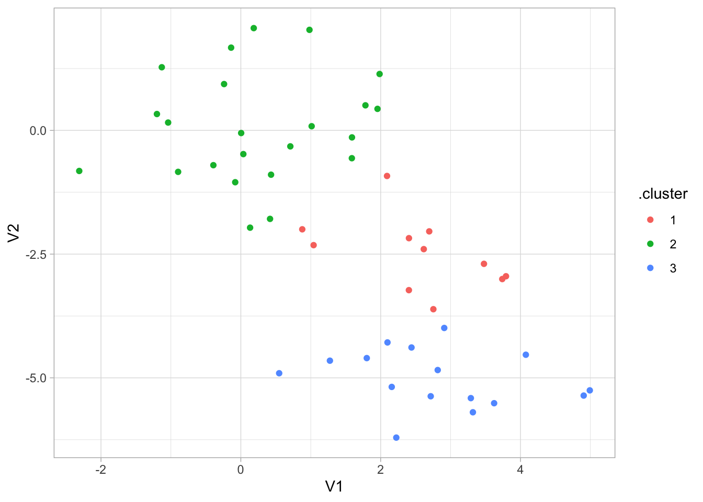
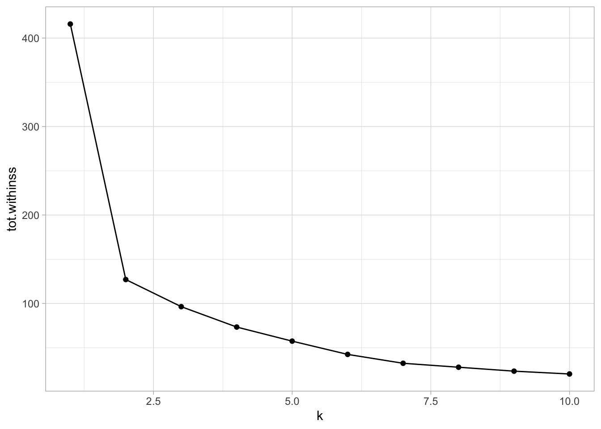
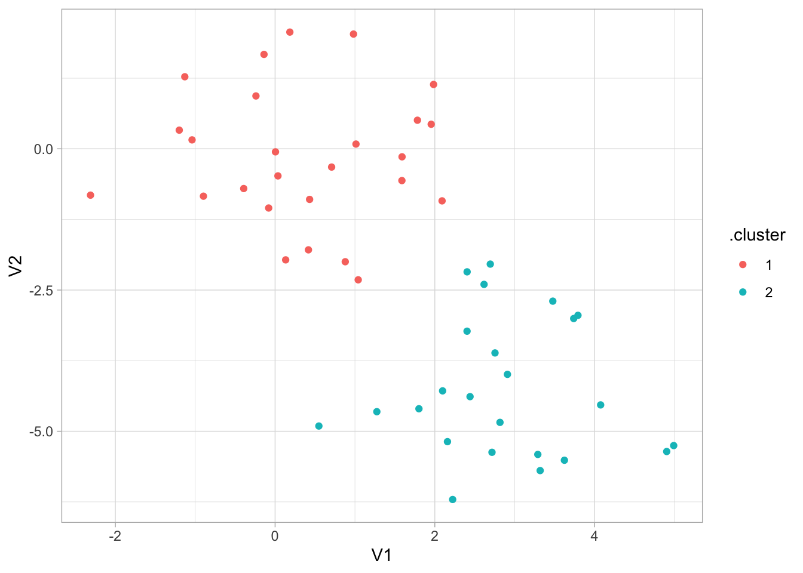
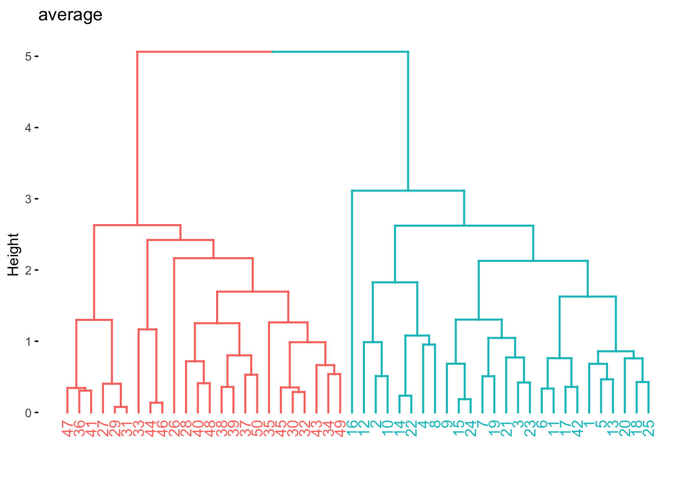
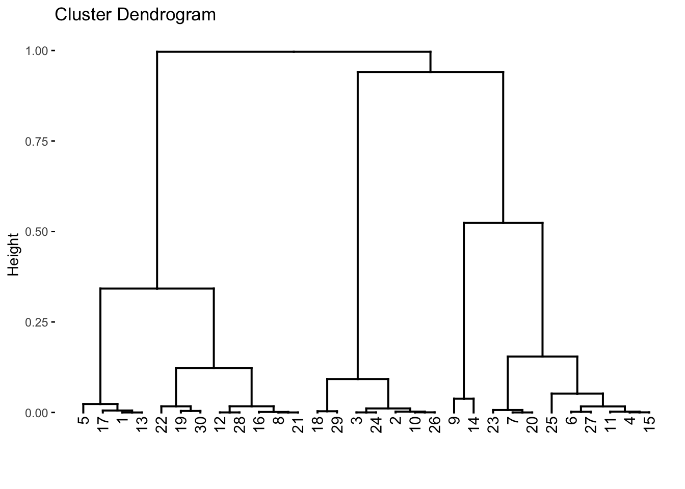
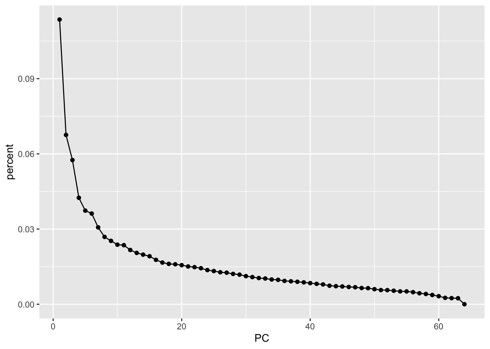
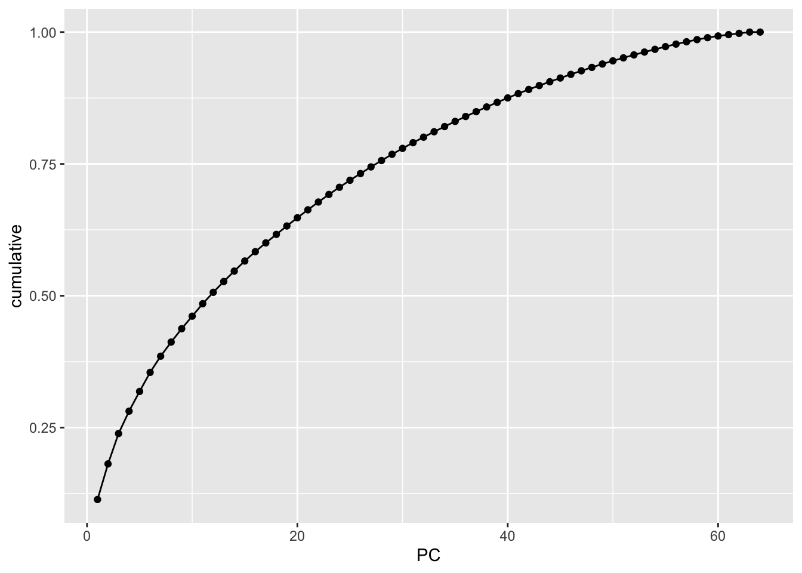
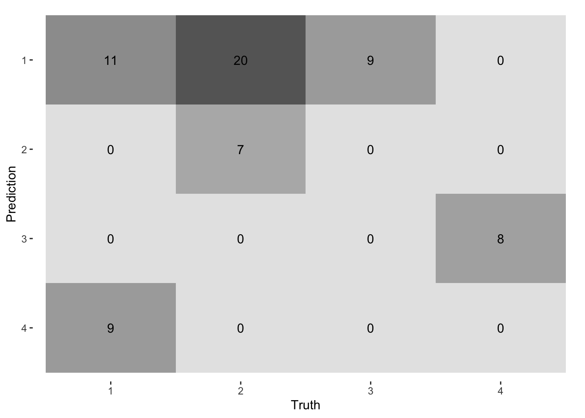

# Unsupervised Learning


This final chapter talks about unsupervised learning. This is broken into two parts. Dimensionality reduction and clustering. One downside at this moment is that clustering is not well integrated into tidymodels at this time. But we are still able to use some of the features in tidymodels.


```r
library(tidymodels)
library(tidyverse)
library(magrittr)
library(factoextra)
library(patchwork)
library(proxy)
library(ISLR)
```

## Principal Components Analysis

This section will be used to explore the `USArrests` data set using PCA. Before we move on, let is turn `USArrests` into a tibble and move the rownames into a column.


```r
USArrests <- as_tibble(USArrests, rownames = "state")
USArrests
```

```
## # A tibble: 50 × 5
##    state       Murder Assault UrbanPop  Rape
##    <chr>        <dbl>   <int>    <int> <dbl>
##  1 Alabama       13.2     236       58  21.2
##  2 Alaska        10       263       48  44.5
##  3 Arizona        8.1     294       80  31  
##  4 Arkansas       8.8     190       50  19.5
##  5 California     9       276       91  40.6
##  6 Colorado       7.9     204       78  38.7
##  7 Connecticut    3.3     110       77  11.1
##  8 Delaware       5.9     238       72  15.8
##  9 Florida       15.4     335       80  31.9
## 10 Georgia       17.4     211       60  25.8
## # … with 40 more rows
```

Notice how the mean of each of the variables is quite different. if we were to apply PCA directly to the data set then `Murder` would have a very small influence.


```r
USArrests %>%
  select(-state) %>%
  map_dfr(mean)
```

```
## # A tibble: 1 × 4
##   Murder Assault UrbanPop  Rape
##    <dbl>   <dbl>    <dbl> <dbl>
## 1   7.79    171.     65.5  21.2
```

We will show how to perform PCA in two different ways in this section. First, by using `prcomp()` directly, using `broom` to extract the information we need, and secondly by using recipes.
`prcomp()` Takes 1 required argument `x` which much be a fully numeric data.frame or matrix. Then we pass that to `prcomp()`. We also set `scale = TRUE` in `prcomp()` which will perform the scaling we need.


```r
USArrests_pca <- USArrests %>%
  select(-state) %>%
  prcomp(scale = TRUE)

USArrests_pca
```

```
## Standard deviations (1, .., p=4):
## [1] 1.5748783 0.9948694 0.5971291 0.4164494
## 
## Rotation (n x k) = (4 x 4):
##                 PC1        PC2        PC3         PC4
## Murder   -0.5358995  0.4181809 -0.3412327  0.64922780
## Assault  -0.5831836  0.1879856 -0.2681484 -0.74340748
## UrbanPop -0.2781909 -0.8728062 -0.3780158  0.13387773
## Rape     -0.5434321 -0.1673186  0.8177779  0.08902432
```

now we can use our favorite broom function to extract information from this `prcomp` object. 
We start with `tidy()`. `tidy()` can be used to extract a couple of different things, see `?broom:::tidy.prcomp()` for more information. `tidy()` will by default extract the scores of a PCA object in long tidy format. The score of is the location of the observation in PCA space. So we can 


```r
tidy(USArrests_pca)
```

```
## # A tibble: 200 × 3
##      row    PC  value
##    <int> <dbl>  <dbl>
##  1     1     1 -0.976
##  2     1     2  1.12 
##  3     1     3 -0.440
##  4     1     4  0.155
##  5     2     1 -1.93 
##  6     2     2  1.06 
##  7     2     3  2.02 
##  8     2     4 -0.434
##  9     3     1 -1.75 
## 10     3     2 -0.738
## # … with 190 more rows
```

We can also explicitly say we want the scores by setting `matrix = "scores"`.


```r
tidy(USArrests_pca, matrix = "scores")
```

```
## # A tibble: 200 × 3
##      row    PC  value
##    <int> <dbl>  <dbl>
##  1     1     1 -0.976
##  2     1     2  1.12 
##  3     1     3 -0.440
##  4     1     4  0.155
##  5     2     1 -1.93 
##  6     2     2  1.06 
##  7     2     3  2.02 
##  8     2     4 -0.434
##  9     3     1 -1.75 
## 10     3     2 -0.738
## # … with 190 more rows
```

Next, we can get the loadings of the PCA.


```r
tidy(USArrests_pca, matrix = "loadings")
```

```
## # A tibble: 16 × 3
##    column      PC   value
##    <chr>    <dbl>   <dbl>
##  1 Murder       1 -0.536 
##  2 Murder       2  0.418 
##  3 Murder       3 -0.341 
##  4 Murder       4  0.649 
##  5 Assault      1 -0.583 
##  6 Assault      2  0.188 
##  7 Assault      3 -0.268 
##  8 Assault      4 -0.743 
##  9 UrbanPop     1 -0.278 
## 10 UrbanPop     2 -0.873 
## 11 UrbanPop     3 -0.378 
## 12 UrbanPop     4  0.134 
## 13 Rape         1 -0.543 
## 14 Rape         2 -0.167 
## 15 Rape         3  0.818 
## 16 Rape         4  0.0890
```

This information tells us how each variable contributes to each principal component. If you don't have too many principal components you can visualize the contribution without filtering


```r
tidy(USArrests_pca, matrix = "loadings") %>%
  ggplot(aes(value, column)) +
  facet_wrap(~ PC) +
  geom_col()
```


Lastly, we can set `matrix = "eigenvalues"` and get back the explained standard deviation for each PC including as a percent and cumulative which is quite handy for plotting.


```r
tidy(USArrests_pca, matrix = "eigenvalues")
```

```
## # A tibble: 4 × 4
##      PC std.dev percent cumulative
##   <dbl>   <dbl>   <dbl>      <dbl>
## 1     1   1.57   0.620       0.620
## 2     2   0.995  0.247       0.868
## 3     3   0.597  0.0891      0.957
## 4     4   0.416  0.0434      1
```

If we want to see how the percent standard deviation explained drops off for each PC we can easily get that by using `tidy()` with `matrix = "eigenvalues"`.


```r
tidy(USArrests_pca, matrix = "eigenvalues") %>%
  ggplot(aes(PC, percent)) +
  geom_col()
```


Lastly, we have the `augment()` function which will give you back the fitted PC transformation if you apply it to the `prcomp()` object directly


```r
augment(USArrests_pca)
```

```
## # A tibble: 50 × 5
##    .rownames .fittedPC1 .fittedPC2 .fittedPC3 .fittedPC4
##    <chr>          <dbl>      <dbl>      <dbl>      <dbl>
##  1 1            -0.976      1.12      -0.440     0.155  
##  2 2            -1.93       1.06       2.02     -0.434  
##  3 3            -1.75      -0.738      0.0542   -0.826  
##  4 4             0.140      1.11       0.113    -0.181  
##  5 5            -2.50      -1.53       0.593    -0.339  
##  6 6            -1.50      -0.978      1.08      0.00145
##  7 7             1.34      -1.08      -0.637    -0.117  
##  8 8            -0.0472    -0.322     -0.711    -0.873  
##  9 9            -2.98       0.0388    -0.571    -0.0953 
## 10 10           -1.62       1.27      -0.339     1.07   
## # … with 40 more rows
```

and will apply this transformation to new data by passing the new data to `newdata`


```r
augment(USArrests_pca, newdata = USArrests[1:5, ])
```

```
## # A tibble: 5 × 10
##   .rownames state Murder Assault UrbanPop  Rape .fittedPC1 .fittedPC2 .fittedPC3
##   <chr>     <chr>  <dbl>   <int>    <int> <dbl>      <dbl>      <dbl>      <dbl>
## 1 1         Alab…   13.2     236       58  21.2     -0.976      1.12     -0.440 
## 2 2         Alas…   10       263       48  44.5     -1.93       1.06      2.02  
## 3 3         Ariz…    8.1     294       80  31       -1.75      -0.738     0.0542
## 4 4         Arka…    8.8     190       50  19.5      0.140      1.11      0.113 
## 5 5         Cali…    9       276       91  40.6     -2.50      -1.53      0.593 
## # … with 1 more variable: .fittedPC4 <dbl>
```

If you are using PCA as a preprocessing method I recommend you use recipes to apply the PCA transformation. This is a good way of doing it since recipe will correctly apply the same transformation to new data that the recipe is used on.

We `step_normalize()` to make sure all the variables are on the same scale. By using `all_numeric()` we are able to apply PCA on the variables we want without having to remove `state`. We are also setting an `id` for `step_pca()` to make it easier to `tidy()` later.


```r
pca_rec <- recipe(~., data = USArrests) %>%
  step_normalize(all_numeric()) %>%
  step_pca(all_numeric(), id = "pca") %>%
  prep()
```

By calling `bake(new_data = NULL)` we can get the fitted PC transformation of our numerical variables


```r
pca_rec %>%
  bake(new_data = NULL)
```

```
## # A tibble: 50 × 5
##    state           PC1     PC2     PC3      PC4
##    <fct>         <dbl>   <dbl>   <dbl>    <dbl>
##  1 Alabama     -0.976   1.12   -0.440   0.155  
##  2 Alaska      -1.93    1.06    2.02   -0.434  
##  3 Arizona     -1.75   -0.738   0.0542 -0.826  
##  4 Arkansas     0.140   1.11    0.113  -0.181  
##  5 California  -2.50   -1.53    0.593  -0.339  
##  6 Colorado    -1.50   -0.978   1.08    0.00145
##  7 Connecticut  1.34   -1.08   -0.637  -0.117  
##  8 Delaware    -0.0472 -0.322  -0.711  -0.873  
##  9 Florida     -2.98    0.0388 -0.571  -0.0953 
## 10 Georgia     -1.62    1.27   -0.339   1.07   
## # … with 40 more rows
```

but we can also supply our own data to `new_data`.


```r
pca_rec %>%
  bake(new_data = USArrests[40:45, ])
```

```
## # A tibble: 6 × 5
##   state             PC1    PC2    PC3     PC4
##   <fct>           <dbl>  <dbl>  <dbl>   <dbl>
## 1 South Carolina -1.31   1.91  -0.298 -0.130 
## 2 South Dakota    1.97   0.815  0.385 -0.108 
## 3 Tennessee      -0.990  0.852  0.186  0.646 
## 4 Texas          -1.34  -0.408 -0.487  0.637 
## 5 Utah            0.545 -1.46   0.291 -0.0815
## 6 Vermont         2.77   1.39   0.833 -0.143
```

We can get back the same information as we could for `prcomp()` but we have to specify the slightly different inside `tidy()`. Here `id = "pca"` refers to the second step of `pca_rec`. We get the `scores` with `type = "coef"`


```r
tidy(pca_rec, id = "pca", type = "coef")
```

```
## # A tibble: 16 × 4
##    terms      value component id   
##    <chr>      <dbl> <chr>     <chr>
##  1 Murder   -0.536  PC1       pca  
##  2 Assault  -0.583  PC1       pca  
##  3 UrbanPop -0.278  PC1       pca  
##  4 Rape     -0.543  PC1       pca  
##  5 Murder    0.418  PC2       pca  
##  6 Assault   0.188  PC2       pca  
##  7 UrbanPop -0.873  PC2       pca  
##  8 Rape     -0.167  PC2       pca  
##  9 Murder   -0.341  PC3       pca  
## 10 Assault  -0.268  PC3       pca  
## 11 UrbanPop -0.378  PC3       pca  
## 12 Rape      0.818  PC3       pca  
## 13 Murder    0.649  PC4       pca  
## 14 Assault  -0.743  PC4       pca  
## 15 UrbanPop  0.134  PC4       pca  
## 16 Rape      0.0890 PC4       pca
```

And the eigenvalues with `type = "variance"`.


```r
tidy(pca_rec, id = "pca", type = "variance")
```

```
## # A tibble: 16 × 4
##    terms                         value component id   
##    <chr>                         <dbl>     <int> <chr>
##  1 variance                      2.48          1 pca  
##  2 variance                      0.990         2 pca  
##  3 variance                      0.357         3 pca  
##  4 variance                      0.173         4 pca  
##  5 cumulative variance           2.48          1 pca  
##  6 cumulative variance           3.47          2 pca  
##  7 cumulative variance           3.83          3 pca  
##  8 cumulative variance           4             4 pca  
##  9 percent variance             62.0           1 pca  
## 10 percent variance             24.7           2 pca  
## 11 percent variance              8.91          3 pca  
## 12 percent variance              4.34          4 pca  
## 13 cumulative percent variance  62.0           1 pca  
## 14 cumulative percent variance  86.8           2 pca  
## 15 cumulative percent variance  95.7           3 pca  
## 16 cumulative percent variance 100             4 pca
```

Sometimes you don't want to get back all the principal components of the data. We can either specify how many components we want with `num_comp` (or `rank.` in `prcomp()`)


```r
recipe(~., data = USArrests) %>%
  step_normalize(all_numeric()) %>%
  step_pca(all_numeric(), num_comp = 3) %>%
  prep() %>%
  bake(new_data = NULL)
```

```
## # A tibble: 50 × 4
##    state           PC1     PC2     PC3
##    <fct>         <dbl>   <dbl>   <dbl>
##  1 Alabama     -0.976   1.12   -0.440 
##  2 Alaska      -1.93    1.06    2.02  
##  3 Arizona     -1.75   -0.738   0.0542
##  4 Arkansas     0.140   1.11    0.113 
##  5 California  -2.50   -1.53    0.593 
##  6 Colorado    -1.50   -0.978   1.08  
##  7 Connecticut  1.34   -1.08   -0.637 
##  8 Delaware    -0.0472 -0.322  -0.711 
##  9 Florida     -2.98    0.0388 -0.571 
## 10 Georgia     -1.62    1.27   -0.339 
## # … with 40 more rows
```

or using a `threshold` to specify how many components to keep by the variance explained. So by setting `threshold = 0.7` `step_pca()` will generate enough principal components to explain 70% of the variance.


```r
recipe(~., data = USArrests) %>%
  step_normalize(all_numeric()) %>%
  step_pca(all_numeric(), threshold = 0.7) %>%
  prep() %>%
  bake(new_data = NULL)
```

```
## # A tibble: 50 × 3
##    state           PC1     PC2
##    <fct>         <dbl>   <dbl>
##  1 Alabama     -0.976   1.12  
##  2 Alaska      -1.93    1.06  
##  3 Arizona     -1.75   -0.738 
##  4 Arkansas     0.140   1.11  
##  5 California  -2.50   -1.53  
##  6 Colorado    -1.50   -0.978 
##  7 Connecticut  1.34   -1.08  
##  8 Delaware    -0.0472 -0.322 
##  9 Florida     -2.98    0.0388
## 10 Georgia     -1.62    1.27  
## # … with 40 more rows
```

## Matrix Completion

This section is WIP.

## Kmeans Clustering

The `kmeans()` function can be used to perform K-means clustering in R. But before we get to that let us create a synthetic data set that we know has groups.


```r
set.seed(2)

x_df <- tibble(
  V1 = rnorm(n = 50, mean = rep(c(0, 3), each = 25)),
  V2 = rnorm(n = 50, mean = rep(c(0, -4), each = 25))
)
```

And we can plot it with ggplot2 to see that the groups are really there. Note that we didn't include this grouping information in `x_df` as we are trying to emulate a situation where we don't know of the possible underlying clusters.


```r
x_df %>%
  ggplot(aes(V1, V2, color = rep(c("A", "B"), each = 25))) +
  geom_point()
```


the `kmeans()` functions takes a matrix or data.frame and `centers` which is the number of clusters we want `kmeans()` to find. We also set `nstart = 20`, this allows the algorithm to have multiple initial starting positions, which we use in the hope of finding global maxima instead of local maxima.


```r
set.seed(1234)
res_kmeans <- kmeans(x_df, centers = 3, nstart = 20)
```

This fitted model has a lot of different kinds of information.


```r
res_kmeans
```

```
## K-means clustering with 3 clusters of sizes 11, 23, 16
## 
## Cluster means:
##          V1          V2
## 1 2.5355362 -2.48605364
## 2 0.2339095  0.04414551
## 3 2.8241300 -5.01221675
## 
## Clustering vector:
##  [1] 2 2 2 2 2 2 2 2 2 2 2 2 2 2 2 2 1 2 2 2 1 2 2 2 2 3 1 1 1 3 1 3 3 3 3 1 3 3
## [39] 3 1 1 1 3 3 3 3 1 3 3 3
## 
## Within cluster sum of squares by cluster:
## [1] 14.56698 54.84869 26.98215
##  (between_SS / total_SS =  76.8 %)
## 
## Available components:
## 
## [1] "cluster"      "centers"      "totss"        "withinss"     "tot.withinss"
## [6] "betweenss"    "size"         "iter"         "ifault"
```

And we can use [broom](https://broom.tidymodels.org/) functions to extract information in tidy formats. The `tidy()` function returns information for each cluster, including their position, size and within-cluster sum-of-squares.


```r
tidy(res_kmeans)
```

```
## # A tibble: 3 × 5
##      V1      V2  size withinss cluster
##   <dbl>   <dbl> <int>    <dbl> <fct>  
## 1 2.54  -2.49      11     14.6 1      
## 2 0.234  0.0441    23     54.8 2      
## 3 2.82  -5.01      16     27.0 3
```

The `glance()` function returns model wise metrics. One of these is `tot.withinss` which is the total within-cluster sum-of-squares that we seek to minimize when we perform K-means clustering.


```r
glance(res_kmeans)
```

```
## # A tibble: 1 × 4
##   totss tot.withinss betweenss  iter
##   <dbl>        <dbl>     <dbl> <int>
## 1  416.         96.4      320.     2
```

Lastly, we can see what cluster each observation belongs to by using `augment()` which "predict" which cluster a given observation belongs to.


```r
augment(res_kmeans, data = x_df)
```

```
## # A tibble: 50 × 3
##         V1     V2 .cluster
##      <dbl>  <dbl> <fct>   
##  1 -0.897  -0.838 2       
##  2  0.185   2.07  2       
##  3  1.59   -0.562 2       
##  4 -1.13    1.28  2       
##  5 -0.0803 -1.05  2       
##  6  0.132  -1.97  2       
##  7  0.708  -0.323 2       
##  8 -0.240   0.936 2       
##  9  1.98    1.14  2       
## 10 -0.139   1.67  2       
## # … with 40 more rows
```

we can visualize the result of `augment()` to see how well the clustering performed.


```r
augment(res_kmeans, data = x_df) %>%
  ggplot(aes(V1, V2, color = .cluster)) +
  geom_point()
```



This is all well and good, but it would be nice if we could try out a number of different clusters and then find the best one. We will use the `mutate()` and `map()` combo to fit multiple models and extract information from them. We remember to set a seed to ensure reproducibility.


```r
set.seed(1234)
multi_kmeans <- tibble(k = 1:10) %>%
  mutate(
    model = purrr::map(k, ~ kmeans(x_df, centers = .x, nstart = 20)),
    tot.withinss = purrr::map_dbl(model, ~ glance(.x)$tot.withinss)
  )

multi_kmeans
```

```
## # A tibble: 10 × 3
##        k model    tot.withinss
##    <int> <list>          <dbl>
##  1     1 <kmeans>        416. 
##  2     2 <kmeans>        127. 
##  3     3 <kmeans>         96.4
##  4     4 <kmeans>         73.4
##  5     5 <kmeans>         57.4
##  6     6 <kmeans>         42.4
##  7     7 <kmeans>         32.4
##  8     8 <kmeans>         27.9
##  9     9 <kmeans>         23.5
## 10    10 <kmeans>         20.3
```

Now that we have the total within-cluster sum-of-squares we can plot them against `k` so we can use the [elbow method](https://en.wikipedia.org/wiki/Elbow_method_(clustering)) to find the optimal number of clusters.


```r
multi_kmeans %>%
  ggplot(aes(k, tot.withinss)) +
  geom_point() +
  geom_line()
```



We see an elbow at `k = 2` which makes us happy since the data set is specifically created to have 2 clusters. We can now extract the model where `k = 2` from `multi_kmeans`.


```r
final_kmeans <- multi_kmeans %>%
  filter(k == 2) %>%
  pull(model) %>%
  pluck(1)
```

And we can finish by visualizing the clusters it found.


```r
augment(final_kmeans, data = x_df) %>%
  ggplot(aes(V1, V2, color = .cluster)) +
  geom_point()
```



## Hierarchical Clustering

The `hclust()` function is one way to perform hierarchical clustering in R. It only needs one input and that is a dissimilarity structure as produced by `dist()`. Furthermore, we can specify a couple of things, including the agglomeration method. Let us cluster this data in a couple of different ways to see how the choice of agglomeration method changes the clustering. 


```r
res_hclust_complete <- x_df %>%
  dist() %>%
  hclust(method = "complete")

res_hclust_average <- x_df %>%
  dist() %>%
  hclust(method = "average")

res_hclust_single <- x_df %>%
  dist() %>%
  hclust(method = "single")
```

the [factoextra](https://rpkgs.datanovia.com/factoextra/index.html) provides functions (`fviz_dend()`) to visualize the clustering created using `hclust()`. We use `fviz_dend()` to show the dendrogram.


```r
fviz_dend(res_hclust_complete, main = "complete", k = 2)
```

```
## Warning: `guides(<scale> = FALSE)` is deprecated. Please use `guides(<scale> =
## "none")` instead.
```


```r
fviz_dend(res_hclust_average, main = "average", k = 2)
```

```
## Warning: `guides(<scale> = FALSE)` is deprecated. Please use `guides(<scale> =
## "none")` instead.
```



```r
fviz_dend(res_hclust_single, main = "single", k = 2)
```

```
## Warning: `guides(<scale> = FALSE)` is deprecated. Please use `guides(<scale> =
## "none")` instead.
```


If we don't know the importance of the different predictors in data set it could be beneficial to scale the data such that each variable has the same influence. We can perform scaling by using `scale()` before `dist()`.


```r
x_df %>%
  scale() %>%
  dist() %>%
  hclust(method = "complete") %>%
  fviz_dend(k = 2)
```

```
## Warning: `guides(<scale> = FALSE)` is deprecated. Please use `guides(<scale> =
## "none")` instead.
```


Another way of calculating distances is based on correlation. This only makes sense if has 3 or more variables.


```r
# correlation based distance
set.seed(2)
x <- matrix(rnorm(30 * 3), ncol = 3)

x %>%
  proxy::dist(method = "correlation") %>%
  hclust(method = "complete") %>%
  fviz_dend()
```

```
## Warning: `guides(<scale> = FALSE)` is deprecated. Please use `guides(<scale> =
## "none")` instead.
```



## PCA on the NCI60 Data

We will now explore the `NCI60` data set. It is genomic data set, containing cancer cell line microarray data, which consists of 6830 gene expression measurements on 64 cancer cell lines. The data comes as a list containing a matrix and its labels. We do a little work to turn the data into a tibble we will use for the rest of the chapter.


```r
data(NCI60, package = "ISLR")
nci60 <- NCI60$data %>%
  as_tibble() %>%
  set_colnames(., paste0("V_", 1:ncol(.))) %>%
  mutate(label = factor(NCI60$labs)) %>%
  relocate(label)
```

We do not expect to use the `label` variable doing the analysis since we are emulating an unsupervised analysis. Since we are an exploratory task we will be fine with using `prcomp()` since we don't need to apply these transformations to anything else. We remove `label` and remember to set `scale = TRUE` to perform scaling of all the variables.


```r
nci60_pca <- nci60 %>%
  select(-label) %>%
  prcomp(scale = TRUE)
```

For visualization purposes, we will now join up the labels into the result of `augment(nci60_pca)` so we can visualize how close similar labeled points are to each other.


```r
nci60_pcs <- bind_cols(
  augment(nci60_pca),
  nci60 %>% select(label)
)
```

We have 14 different labels, so we will make use of the `"Polychrome 36"` palette to help us better differentiate between the labels.


```r
colors <- unname(palette.colors(n = 14, palette = "Polychrome 36"))
```

o we can plot the different PCs against each other. It is a good idea to compare the first PCs against each other since they carry the most information. We will just compare the pairs 1-2 and 1-3 but you can do more yourself. It tends to be a good idea to stop once interesting things appear in the plots.


```r
nci60_pcs %>%
  ggplot(aes(.fittedPC1, .fittedPC2, color = label)) +
  geom_point() +
  scale_color_manual(values = colors)
```


We see there is some local clustering of the different cancer types which is promising, it is not perfect but let us see what happens when we compare PC1 against PC3 now. 


```r
nci60_pcs %>%
  ggplot(aes(.fittedPC1, .fittedPC3, color = label)) +
  geom_point() +
  scale_color_manual(values = colors)
```


Lastly, we will plot the variance explained of each principal component. We can use `tidy()` with `matrix = "eigenvalues"` to accomplish this easily, so we start with the percentage of each PC


```r
tidy(nci60_pca, matrix = "eigenvalues") %>%
  ggplot(aes(PC, percent)) +
  geom_point() +
  geom_line()
```



with the first PC having a little more than 10% and a fairly fast drop. 

And we can get the cumulative variance explained just the same.


```r
tidy(nci60_pca, matrix = "eigenvalues") %>%
  ggplot(aes(PC, cumulative)) +
  geom_point() +
  geom_line()
```



## Clustering on nci60 dataset

Let us now see what happens if we perform clustering on the `nci60` data set. Before we start it would be good if we create a scaled version of this data set. We can use the recipes package to perform those transformations. 


```r
nci60_scaled <- recipe(~ ., data = nci60) %>%
  step_rm(label) %>%
  step_normalize(all_predictors()) %>%
  prep() %>%
  bake(new_data = NULL)
```

Now we start by fitting multiple hierarchical clustering models using different agglomeration methods.


```r
nci60_complete <- nci60_scaled %>%
    dist() %>%
    hclust(method = "complete")

nci60_average <- nci60_scaled %>%
    dist() %>%
    hclust(method = "average")

nci60_single <- nci60_scaled %>%
    dist() %>%
    hclust(method = "single")
```

We then visualize them to see if any of them have some good natural separations.


```r
fviz_dend(nci60_complete, main = "Complete")
```

```
## Warning: `guides(<scale> = FALSE)` is deprecated. Please use `guides(<scale> =
## "none")` instead.
```


```r
fviz_dend(nci60_average, main = "Average")
```

```
## Warning: `guides(<scale> = FALSE)` is deprecated. Please use `guides(<scale> =
## "none")` instead.
```


```r
fviz_dend(nci60_single, main = "Single")
```

```
## Warning: `guides(<scale> = FALSE)` is deprecated. Please use `guides(<scale> =
## "none")` instead.
```


We now color according to `k = 4` and we get the following separations.


```r
nci60_complete %>%
  fviz_dend(k = 4, main = "hclust(complete) on nci60")
```

```
## Warning: `guides(<scale> = FALSE)` is deprecated. Please use `guides(<scale> =
## "none")` instead.
```


We now take the clustering id extracted with `cutree` and calculate which Label is the most common within each cluster.


```r
tibble(
  label = nci60$label,
  cluster_id = cutree(nci60_complete, k = 4)
) %>%
  count(label, cluster_id) %>%
  group_by(cluster_id) %>%
  mutate(prop = n / sum(n)) %>%
  slice_max(n = 1, order_by = prop) %>%
  ungroup()
```

```
## # A tibble: 6 × 4
##   label    cluster_id     n  prop
##   <fct>         <int> <int> <dbl>
## 1 MELANOMA          1     8 0.2  
## 2 NSCLC             1     8 0.2  
## 3 RENAL             1     8 0.2  
## 4 BREAST            2     3 0.429
## 5 LEUKEMIA          3     6 0.75 
## 6 COLON             4     5 0.556
```

We can also see what happens if we try to fit a K-means clustering. We liked 4 clusters from earlier so let's stick with that.


```r
set.seed(2)
res_kmeans_scaled <- kmeans(nci60_scaled, centers = 4, nstart = 50)
```

We can again use `tidy()` to extract cluster information, note that we only look at `cluster`, `size`, and `withinss` as there are thousands of other variables denoting the location of the cluster.


```r
tidy(res_kmeans_scaled) %>%
  select(cluster, size, withinss)
```

```
## # A tibble: 4 × 3
##   cluster  size withinss
##   <fct>   <int>    <dbl>
## 1 1          20  108801.
## 2 2          27  154545.
## 3 3           9   37150.
## 4 4           8   44071.
```

lastly, let us see how the two different methods we used compare against each other. Let us save the cluster ids in `cluster_kmeans` and `cluster_hclust` and then use `conf_mat()` in a different way to quickly generate a heatmap between the two methods.


```r
cluster_kmeans <- res_kmeans_scaled$cluster
cluster_hclust <- cutree(nci60_complete, k = 4)

tibble(
  kmeans = factor(cluster_kmeans),
  hclust = factor(cluster_hclust)
) %>%
  conf_mat(kmeans, hclust) %>%
  autoplot(type = "heatmap")
```



There is not a lot of agreement between labels which makes sense, since the labels themselves are arbitrarily added. What is important is that they tend to agree quite a lot (the confusion matrix is sparse).

One last thing that is sometimes useful is to perform dimensionality reduction before using the clustering method. Let us use the recipes package to calculate the PCA of `nci60` and keep the 5 first components. (we could have started with `nci60` too if we added `step_rm()` and `step_normalize()`).


```r
nci60_pca <- recipe(~., nci60_scaled) %>%
  step_pca(all_predictors(), num_comp = 5) %>%
  prep() %>%
  bake(new_data = NULL)
```

We can now use `hclust()` on this reduced data set, and sometimes we get quite good results since the clustering method doesn't have to work in high dimensions.


```r
nci60_pca %>%
  dist() %>%
  hclust() %>%
  fviz_dend(k = 4, main = "hclust on first five PCs")
```

```
## Warning: `guides(<scale> = FALSE)` is deprecated. Please use `guides(<scale> =
## "none")` instead.
```


